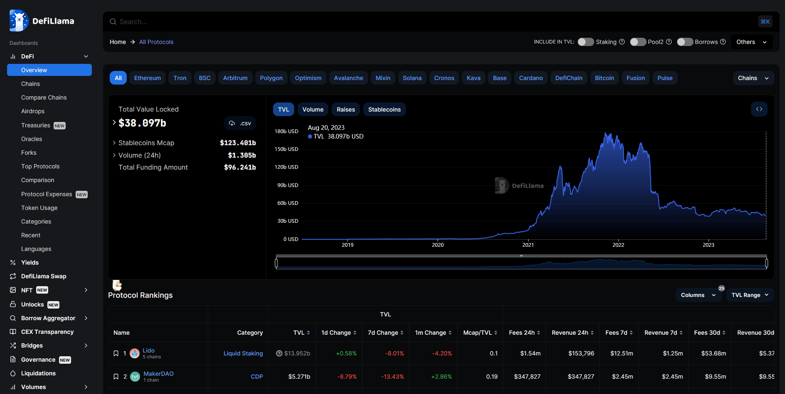
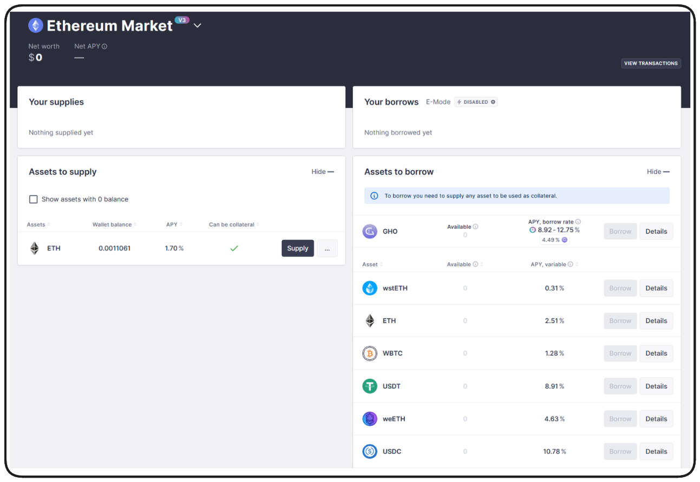
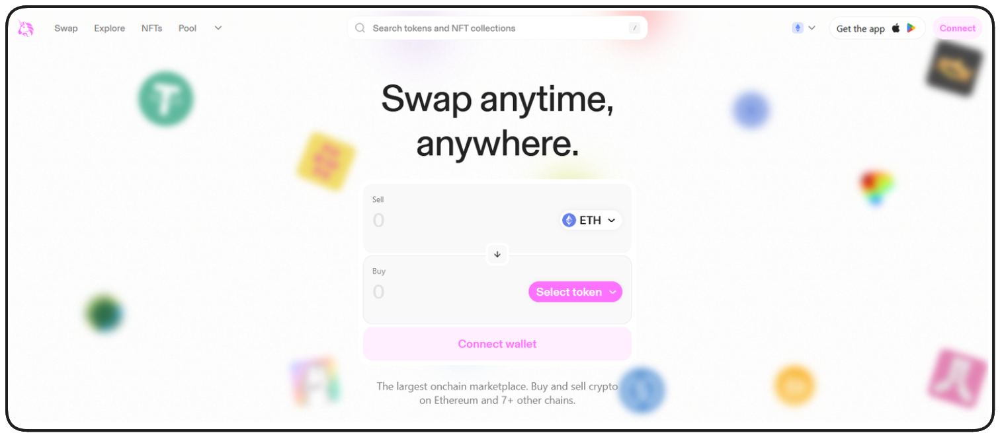
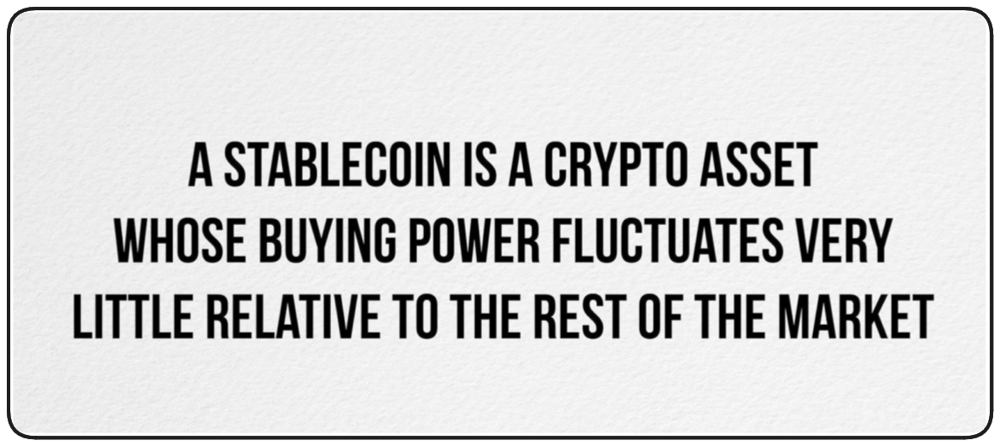
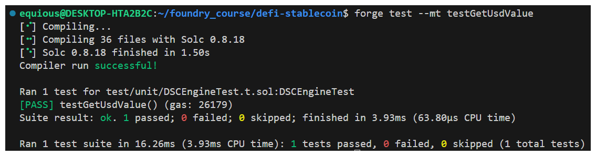
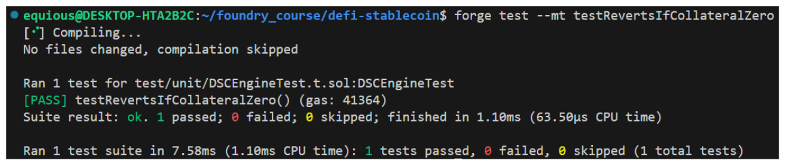

# DEFI - StableCoin

## DeFi Introduction

Decentralized Finance (DeFi) is an enormous ecosystem, we couldn't hope to offer an exhaustive coverage of everything available, but we are going to provide a thorough rundown of what DeFi is, why it's popular and some of the most popular dApps out there.

A good starting place is **[DeFi Llama](https://defillama.com/)**. This website aggregates data from major DeFi protocols and provides a snapshot of what's happening in the space.



DeFi Llama demonstrates the size of various DeFi protocols by ranking them by Total Value Locked (TVL). Some of the biggest include:

**Lido:** Liquid Staking platform. Liquid staking provides the benefits of traditional staking while unlocking the value of staked assets for use as collateral.

**MakerDAO:** Collateralized Debt Position (CDP) protocol for making stablecoins. (This is what we'll be doing in this section!)

**AAVE:** Borrowing/Lending protocol, similar to a decentralized bank.

**Curve Finance:** Decentralized Exchange (DEX), specialized for working with stablecoins.

**Uniswap:** General purposes Decentralized Exchange for swapping tokens and various digital assets.

The beauty of DeFi is that it provides access to sophisticated financial instruments within a decentralized context.

Some additional places that are great to learn about DeFi include:

-   **[Bankless](https://www.bankless.com/)**
-   **[Metamask Learn](https://learn.metamask.io/)**

### AAVE

I often encourage people to go checkout AAVE and Uniswap to get a feel for what these protocols can offer.

**[AAVE](https://aave.com/)**, as mentioned, is a decentralized borrowing and lending platform. By logging into the dApp by connecting a wallet, users can see assets they hold which can be offered as collateral and assets available to borrow.



Each asset has it's own calculated Annual Percentage Yield (APY) which effectively represents the interest a lender to the protocol would make on deposits of a given asset.

### Uniswap

Another massively popular protocol that I like to bring to people's attention is **[Uniswap](https://uniswap.org/)**.



Uniswap is a decentralized exchange which allows users to swap tokens for any other token.

Unfortunately, not all of these DeFi protocols work on testnets, but I do have a few videos for you to watch to gain a deeper understanding and context of how things work:

-   **[Leveraged Trading in DeFi](https://www.youtube.com/watch?v=TmNGAvI-RUA)**
-   **[Become a DeFi QUANT](https://www.youtube.com/watch?v=x0YDcZly_PU)**
-   **[Aave Flash Loan Tutorial](https://www.youtube.com/watch?v=Aw7yvGFtOvI)**

> ❗ **IMPORTANT** <br />
> If you do decide to experiment with these protocols, I highly recommend doing so on testnets when possible and Layer 2s (like Polygon, Optimism, or Arbitrum) as the fees on Ethereum Mainnet can be _very_ high.

### MEV

Before we get too deep into DeFi, I do want to bring the concept of Miner/Maximal Extractable Value (MEV) to your attention as a caution.

At a very high-level, MEV is the process by which a node validator or miner orders the transactions of a block they're validating in such as way as to benefit themselves or conspirators.

There are many teams and protocols working hard to mitigate the effects of MEV advantages, but for now, I recommend that anyone looking to get deep into DeFi read through and understand the content on **[flashbots.net's New to MEV guide](https://docs.flashbots.net/new-to-mev)**. This content is both an entertaining way to learn about a complex concept and extremely eye-opening to the dangers MEV represents in the DeFi space.

## DeFi Code Walkthrough

The Decentralized Stablecoin protocol has 2 contracts at it's heart.

-   **DecentralizedStableCoin.sol**
-   **DSCEngine.sol**

`DecentralizedStableCoin.sol` is effectively a fairly simple `ERC20` with a few more advanced features imported such as [`ERC20Burnable`](https://github.com/OpenZeppelin/openzeppelin-contracts/blob/master/contracts/token/ERC20/extensions/ERC20Burnable.sol) and OpenZeppelin's [`Ownable`](https://github.com/OpenZeppelin/openzeppelin-contracts/blob/master/contracts/access/Ownable.sol) libraries.

Otherwise, `DecentralizedStableCoin.sol` is fairly expected in what's included, a constructor with `ERC20` parameters, the ability to `mint` and `burn` etc.

The real meat of this protocol can be found in `DSCEngine.sol`. `DecentralizeStableCoin.sol` is ultimately going to be controlled by this `DSCEngine` and most of the protocol's complex functionality is included within including functions such as:

-   **depositCollateralAndMintDsc**
-   **redeemCollateral**
-   **burn**
-   **liquidate**

... and much more.

We'll also be recreating all the scripts that you can see in the scripts folder, primarily a deploy script, spiced up to include `Chainlink Pricefeeds`, used to determine the prices of collateral.

## Introduction to stablecoins

Stablecoins have become one of the most talked about topics in the cryptocurrency and blockchain space. However, there is a lot of misleading information out there about what stablecoins really are and how they work. In this lesson, we'll provide a comprehensive overview of stablecoins, clarifying common misconceptions and gleaning a deeper understanding for what makes stablecoins so important in this space.

We hope to cover 5 subjects:

1. What are Stablecoins?
2. Why do we care?
3. Categories and Properties
4. Designs of top Stablecoins
5. What Stablecoins really do

### What Are Stablecoins?

_**A stablecoin is a non-volatile crypto asset.**_

That's really it, at the end of the day. More accurately put:



**[Investopedia](https://www.investopedia.com/terms/s/stablecoin.asp)** describes `stablecoins` as - Cryptocurrencies the value of which is pegged, or tied, to that of another currency, commodity or financial instrument.

Aaand this is the first place I diverge from conventional media.

This may be a simple way to understand them initially, but `stablecoins` are much more than this.

A `stablecoin` is a crypto asset whose buying power stays relatively stable.

A simple example of unstable buying power is `Bitcoin (BTC)`. The number of apples one could buy with 1BTC 6 months ago is drastically different from how many one could buy today. `Stablecoins`, through a variety of mechanisms we'll discuss later, endeavor to be more similar to a crypto dollar where the number of apples you buy is relatively stable over time.

### Why do we care?

_**Money is important.**_


Ok, not Scrooge McDuck important.

Society requires an everyday stable currency in order to fulfill the 3 functions of money:

1. Storage of Value
2. Unit of Account
3. Medium of Exchange

**Storage of Value:** Money retains value over time, allowing individuals to save and defer consumption until a later date. This function is crucial because it means money can be saved, retrieved, and spent in the future without losing its purchasing power (assuming stable inflation).

**Unit of Account:** Money provides a standard numerical unit of measurement for the market value of goods, services, and other transactions. It enables consumers and businesses to make informed decisions because prices and costs can be compared. This function helps in record-keeping and allows for the consistent measurement of financial performance.

**Medium of Exchange:** Money serves as an intermediary in trade, making transactions more efficient than bartering. In a barter system, two parties must have exactly what the other wants, known as a double coincidence of wants. Money eliminates this issue by providing a common medium that everyone accepts in exchange for goods and services.

In Web3, we need a Web3 version of this. This is where stablecoins shine. Assets like BTC and ETH do well as stores of value and as mediums of exchange, but fail as a reasonable unit of account due to their buying power volatility.

### Categories and Properties

This is the second place I strongly disagree with most media! When someone searches for `types of stablecoins` you'll often see them grouped into common buckets:

-   Fiat-Collateralized
-   Crypto-Collateralized
-   Commodity-Collateralized
-   Algorithmic

This again is a serviceable understanding of stablecoin categories, but the reality is much more complicated. I prefer to categorize stablecoins as:

1. Relative Stability - Pegged/Anchored or Floating
2. Stability Method - Governed or Algorithmic
3. Collateral Type - Endogenous or Exogenous

**Relative Stability:** Something is only stable relative to its value in something else. The most common type of `stablecoins` are `pegged` or `anchored` `stablecoins`. Their value is determined by their `anchor` to another asset such as the US Dollar. `Tether`, `DAI` and `USDC` are examples of stablecoins which are pegged to USD.

These stablecoins general possess a mechanism which makes them nearly interchangable with the asset to which they're pegged. For example, USDC claims that for each USDC minted, there's an equivalent US Dollar (or equal asset) in a bank account somewhere.

DAI on the other hand, uses permissionless over-colleralization - but we'll get to that later!

As mentioned, stablecoins don't have to be pegged. Even when pegged to a relatively stable asset like the US Dollar, forces such as inflation can reduce buying power over time. A proposed solution (that's albeit much more complex) are floating value stablecoins, where, through clever math and algorithms the buying power of the asset is kept stable overtime without being anchors to another particular asset. We won't go into much detail of these here, but if you're interested in learning more, I encourage you to check out this **[Medium Article on RAI](https://medium.com/intotheblock/rai-a-free-floating-stablecoin-that-actually-works-d9efbbca94c0)**, a free-floating stablecoin.

**Stability Method:** Another major delineating factor of `stablecoins` is the stability method employed. This _is_ the mechanism that keeps the asset's value stable. How is the asset pegged to another?

This usually works by having the `stablecoin` mint and burn in very specific ways and is usually determined by who or what is doing the mint/burn.

This process can exist on a spectrum between `governed` and `algorithmic`.

-   **Governed:** This denotes an entity which ultimately decides if stablecoins in a protocol should be minted or burned. This could something _very_ centralized and controller, like a single person, or more democratic such as governed via DAO. Governed stablecoins are generally considered to be quite centralized. This can be tempered by DAO participations, but we'll get more into how that affects things later
    -   Examples of governed stablecoins include:
        -   USDC
        -   Tether
        -   USDT
-   **Algorithmic:** Conversely, algorithmic stablecoins maintain their stability through a permissionless algorithm with **no human intervention**. I would consider a stablecoin like DAI as being an example of an algorithmic stablecoin for this reason. All an algorithmic stablecoin is, is one which the minting and burning is dictated by autonomous code.
    -   Examples of algorithmic stablecoins include:
        -   DAI
        -   FRAX
        -   RAI
        -   UST - RIP, we'll talk more about this later.

You can see what I mean by spectrum by comparing how some of these tokens function. DAI is a bit of a hybrid where a DAO determines things like interest rates, but the minting/burning is handled autonomously. USDC is an example of something very centralized, with a single governing body, where as UST was almost purely algorithmic.

**[The Dirt Roads blog](https://dirtroads.substack.com/p/-40-pruning-memes-algo-stables-are)** has a great article and visualizations outlining these differences in detail and where popular assets fall on this spectrum.


> ❗ **NOTE** <br />
> Dirt Roads uses `Dumb` as the opposite of algorithmic, instead of governed.

You'll notice that most Fiat-Collateralized assets are more governed, as you'll often need a centralized entity to onramp the fiat into the blockchain ecosystem.

In summary:

-   Algorithmic Stablecoins use a transparent math equation or autonomously executed code to mint and burn tokens
-   Governed Stablecoins mint and burn tokens via human interaction/decision

**Collateral Type:** When we refer to collateral, we're referring to the asset backing the token, giving it its value. USDC is collateralized by the US Dollar, making one USDC worth one USD. DAI is collateralized by many different assets, you can deposit ETH to mint DAI, among many currencies. UST .. In a round about way was collateralized by LUNA.

These are examples of exogenous and endogenous types of collateral.

-   **Exogenous:** Collateral which originates from outside of a protocol.
-   **Endogenous:** Collateral which originates from within a protocol

The easiest way to determine in which category a stablecoin's collateral falls is the ask this question:

_**If the stablecoin fails, does the underlying collateral also fail?**_

Yes == Endogenous

No == Exogenous

If USDC Fails, the US Dollar isn't going to be affected. USDC is an example of Exogenous collateral. DAI is another example of this, the value of ETH won't be affected by the failure of the DAI protocol.

UST/LUNA on the other hand is an example of Endogenous collateral. When UST failed, LUNA also failed causing the protocol to bleed \$40 billion dollars.

Other good questions to ask include:

_**What the collateral created for the purpose of being collateral?**_

or

_**Does the protocol own the issuance of the underlying collateral?**_

What's misleading about how this is covered by traditional media is that they will point to algorithmic stablecoins as being to blame, but I think this is wrong. The risk exists with endogenously collateralized protocols because their value essentially comes from .. nothing or is self-determined at some point in development.

Endogenously collateralized stablecoins don't have a great track record - TerraLUNA and UST was a catastrophic event that wiped billions out of DeFi. So, why would anyone want to develop a stablecoin like this?

Generally the response is Scale/Capital Efficiency.

When a protocol is entirely exogenously collateralized, its marketcap is limited by the collateral it can onboard into the ecosystem. If no collateral needs to be onboarded into the protocol, scaling becomes easier much faster.

Now, many endogenous stablecoins can be traced back to a single **[paper by Robert Sams](https://blog.bitmex.com/wp-content/uploads/2018/06/A-Note-on-Cryptocurrency-Stabilisation-Seigniorage-Shares.pdf)**. In this paper he discusses how to build an endogenously collateralized stablecoin using a seigniorage shares model. We won't go deeply into the details of this, but it's an incredibly influential paper than a recommend everyone who's interested should read.

### Thought Experiment

Imagine we had a stablecoin, issued by a bank, backed by gold. Our stablecoin is worth the same as its value in gold because at any point we can swap the coin back to the bank in exchange for gold.

Now, what happens if the bank isn't open weekends? What if the bank is closed for a month? At what point does a lack of access to the underlying collateral cease to matter and the asset becomes valued with respect to itself?

In the Dirt Roads image above, this is what is represented by `reflexive`

I know there's a lot of things here conceptually, don't feel discouraged if you want to come back to these ideas to dive further later.

### Top Stablecoins

We won't go too deeply into the architecture of each of these assets, with the exception of maybe DAI, but I wanted to give you a sense of what's out there, what they propose to do and how the propose to do it.

**DAI**

DAI is:

-   Pegged
-   Algorithmic
-   Exogenously Collateralized

DAI is one of the most influential DeFi projects ever created.

Effectively how DAI works is, a user deposits some form of crypto collateral, such as ETH, and based on the current value of that collateral in US Dollars, some value of DAI is minted the user. It's only possible to mint _less_ DAI than the value of collateral a user has deposited. In this way the stablecoin is said to be over-collateralized.

> ❗ **NOTE** <br />
> DAI also has an annual stability fee on deposited collateral \~2%

When a user wants to redeem their collateral, DAI must be deposited back into the protocol, which then burns the deposited DAI and released the appropriate amount of collateral.

The combination of a stability fee and over-collateralization is often referred to as a `collateralized debt position`.

_**What happens if stability fees can't be paid, or the value of our collateral decreases?**_

If this happens, a user is at risk of liquidation. This is the mechanism through which the system avoids becoming under-collateralized.

The fundamental question I hope you're asking at this point is:

_**Why would I pay a fee to mint this stablecoin?**_

We'll get to that soon, I promise. Let's first look at...

**USDC**

USDC is:

-   Pegged
-   Governed
-   Exogenous

USDC is backed by real-world dollars. Simple as that.

**Terra USD(UST)/Terra LUNA**

This situation has become infamous now, but there's lots we can learn from this disaster to prevent it in the future.

UST was:

-   Pegged
-   Algorithmic
-   Endogenous

What we know about stablecoins now should shed some light on what happened to UST/LUNA. Because UST was backed by LUNA, when UST lost it's peg (usually through a massive influx of trading), it's underlying collateral (LUNA) became less attractive to hold .. which caused UST to lose more value. And thus the circling of the drain began until the asset was all but wiped out.

**FRAX**

FRAX is:

-   Pegged
-   Algorithmic
-   Hybrid

Endogenously collateralize stablecoins are so attractive because they _do_ scale quickly. More recent projects, like FRAX, have tried to thread this needle of hybrid collateralization to find an optimal balance.

**RAI**

RAI is:

-   Floating
-   Algorithmic
-   Exogenous

RAI is one of the few examples of a floating stablecoin. The protocol focuses on 3 things

-   minimal governance, achieved through algorithmic mechanisms of stabilization
-   Being Floating, such that it's value isn't derived by being tied to another asset
-   Only using ETH as collateral

You can read more about the mechanisms of RAI **[here](https://medium.com/intotheblock/rai-a-free-floating-stablecoin-that-actually-works-d9efbbca94c0)**.

With all this context and understanding in mind, we've got one thing left to cover.

### What do stablecoins really do?

Maybe we start with asking: **Which is the** _**best**_ **stablecoin?**

The answer to this may come down to about whom we're speaking.

Stablecoins, which are centralized, such as USDC, Tether etc, may not really fit the ethos of decentralization in Web3, it might be preferred to have a degree of decentrality.

By the same token (pun intended), algorithmic stablecoins may be intimidating to the average user and the associated fees may be non-starters.

At the end of the day every stablecoin protocol has it's trade-offs and what's right for one person or circumstance may not be right for another.

Now, here's something that may give you whiplash:

_**The stablecoin preferred by the average user, is likely much less important than those preferred by the 'rich whales' in the space**_


Let me explain with another thought experiment.

### Thought Experiment 2

Say you want to accumulate a tonne of ETH, you've solve everything you own and put it all into ETH, but you want more. How do you accomplish this?

By depositing ETH as collateral into a stablecoin protocol, you're able to mint the stablecoin, and sell it for more ETH. This becomes beneficial when you consider leveraged trading.

**Leveraged Trading:** Leveraged trading involves using borrowed capital to increase the potential return on investment. This strategy can magnify both gains and losses, allowing for potentially higher profits but also increased risk.

This usecase for high-value investing is so pervasive that it's often outlined by platforms as a primary reason to mint, to maximize your position on a crypto asset.

So, to summarize a bit:

_**Why are stablecoins used?**_

-   To execute the 3 functions of money.

_**Why are stablecoins minted?**_

-   Investors like to make leveraged bets.

### Wrap Up

We've learnt a lot here, and we've only just scratched the surface of DeFi. To sophisticated investors many of the concepts I've covered here may actually be old news. This is common practice in the TradFi space and Web3 employs these same financial mechanisms and incentives.

With protocols like Aave and Curve considering their own stablecoin offerings, I believe things are going to get really interesting. As the industry matures, I believe the development of stablecoins will only improve from the perspectives of functionality and security because they're an essential part of the financial ecosystem in Web3.

For those developers who want to try building their own, there are some minimalistic examples you can check out on the **[defi-minimal GitHub Repo](https://github.com/smartcontractkit/defi-minimal)**.

I'm super excited for the future of DeFi and stablecoins. Let's get started creating our very own.

## DecentralizedStableCoin.sol

Let's start by making our project directory.

```bash
mkdir foundry-defi-stablecoin
cd foundry-defi-stablecoin
code .
```

With the directory open in VSCode, we can initialize a new Foundry project.

```bash
forge init
```

Finally, remove the placeholder example contracts `src/Counter.sol`, `script/Counter.s.sol`, and `test/Counter.t.sol`.

Our stablecoin is going to be:

1. Relative Stability: Anchored or Pegged to the US Dollar
    1. Chainlink Pricefeed
    2. Function to convert ETH & BTC to USD
2. Stability Mechanism (Minting/Burning): Algorithmicly Decentralized
    1. Users may only mint the stablecoin with enough collateral
3. Collateral: Exogenous (Crypto)
    1. wETH
    2. wBTC

To add some context to the above, we hope to create our stablecoin in such a way that it is pegged to the US Dollar. We'll achieve this by leveraging chainlink pricefeeds to determine the USD value of deposited collateral when calculating the value of collateral underlying minted tokens.

The token should be kept stable through this collateralization stability mechanism.

For collateral, the protocol will accept wrapped Bitcoin and wrapped Ether, the ERC20 equivalents of these tokens.

Alright, with things scoped out a bit, let's dive into writing some code. Start by creating the file `src/DecentralizedStableCoin.sol`. I'm hoping to make this as professional as possible, so I'm actually going to paste my contract and function layouts as a reference to the top of this file.

```solidity
// SPDX-License-Identifier: MIT

// This is considered an Exogenous, Decentralized, Anchored (pegged), Crypto Collateralized low volatility coin

// Layout of Contract:
// version
// imports
// interfaces, libraries, contracts
// errors
// Type declarations
// State variables
// Events
// Modifiers
// Functions

// Layout of Functions:
// constructor
// receive function (if exists)
// fallback function (if exists)
// external
// public
// internal
// private
// view & pure functions
```

When I wrote this codebase, I intended to get it audited, and I did! You can actually see the audit results **[here](https://www.codehawks.com/contests/cljx3b9390009liqwuedkn0m0)**. For this reason, something different you may notice about this codebase is how _verbose_ we're going to be. When it comes to security and having auditors review our code, the clearer we are in explaining the code and added context to our goals, the easier their lives are going to be keeping us secure.

With that said, our contract boilerplate is going to be set up similarly to everything we've been doing so far. Let's add some NATSPEC to outline the contracts purpose.

```solidity
pragma solidity ^0.8.18;

/*
    * @title: DecentralizedStableCoin
    * @author: MRAlirad
    * Collateral: Exogenous (ETH & BTC)
    * Minting: Algorithmic
    * Relative Stability: Pegged to USD
    *
    * This is the contract meant to be governed by DSCEngine. This contract is just the ERC20 implementation of our stablecoin system.
    */
contract DecentralizedStableCoin {}
```

This contract is effectively just going to be a fairly standard ERC20 to function as the asset for our stablecoin protocol. All of the logic for the protocol will be handled by DSCEngine.sol. We'll need OpenZeppelin to get started.

```bash
forge install openzeppelin/openzeppelin-contracts@v4.8.3 --no-commit
```

And of course, we can add our remappings to our
`foundry.toml`.

```toml
[profile.default]
src = "src"
out = "out"
libs = ["lib"]
remappings = ["@openzeppelin/contracts/=lib/openzeppelin-contracts/contracts"]
```

Rather than importing a standard ERC20 contract, we'll be leveraging the ERC20Burnable extension of this standard. ERC20Burnable includes `burn` functionality for our tokens which will be important when we need to take the asset out of circulation to support stability.

```solidity
// SPDX-License-Identifier: MIT

pragma solidity ^0.8.18;

import {ERC20Burnable, ERC20} from "@openzeppelin/contracts/token/ERC20/extensions/ERC20Burnable.sol";

/*
 * @title: DecentralizedStableCoin
 * @author: MRAlirad
 * Collateral: Exogenous (ETH & BTC)
 * Minting: Algorithmic
 * Relative Stability: Pegged to USD
 *
 * This is the contract meant to be governed by DSCEngine. This contract is just the ERC20 implementation of our stablecoin system.
 */
contract DecentralizedStableCoin is ERC20Burnable {
    constructor() ERC20("DecentralizedStableCoin", "DSC"){}
}
```

Because we're inheriting ERC20Burnable, and it inherits ERC20, we need to satisfy the standard ERC20 constructor parameters within our contracts constructor. We've set the name `DecentralizedStableCoin` and the symbol `DSC`.

All of the properties of our protocol are going to be governed ultimately by the DSCEngine.sol contract. Functionality like the stability mechanism, including minting and burning, need to be controlled by the DSCEngine to maintain the integrity of the stablecoin.

In order to accomplish this, we're going to also inherit `Ownable` with DecentralizedStableCoin.sol. This will allow us to configure access control, assuring only our DSCEngine contract is authorized to call these functions.

> ❗ **NOTE** <br />
> For version 5 of OpenZeppelin's Ownable contract, we need to pass an address
> in the constructor. We have to modify our code to account for this when
> running `forge build` so that our project will not error. Like this:
> `constructor(address initialOwner) ERC20("DecentralizedStableCoin", "DSC")
Ownable(initialOwner) {}`

```solidity
import {Ownable} from "@openzeppelin/contracts/access/Ownable.sol";

...

contract DecentralizedStableCoin is ERC20Burnable, Ownable {
    constructor() ERC20("DecentralizedStableCoin", "DSC"){}
}
```

The two major functions we're going to want the DSCEngine to control are of course the mint and burn functions. We can override the standard ERC20 functions with our own to assure this access control is in place.

### Burn

We can start by writing our burn function.

```solidity
function burn(uint256 _amount) external override onlyOwner{}
```

We're going to want to check for two things when this function is called.

1. The amount burnt must not be less than zero
2. The amount burnt must not be more than the user's balance

We'll configure two custom errors for when these checks fail.

```solidity
contract DecentralizedStableCoin is ERC20Burnable, Ownable {
    error DecentralizedStableCoin__MustBeMoreThanZero();
    error DecentralizedStableCoin__BurnAmountExceedsBalance();

    constructor() ERC20("DecentralizedStableCoin", "DSC"){}

    function burn(uint256 _amount) external override onlyOwner{
        uint256 balance = balanceOf(msg.sender);
        if(_amount <= 0){
            revert DecentralizedStableCoin__MustBeMoreThanZero();
        }
        if(balance < _amount){
            revert DecentralizedStableCoin__BurnAmountExceedsBalance();
        }
    }
}
```

The last thing we're going to do, assuming these checks pass, is burn the passed amount of tokens. We're going to do this by using the `super` keyword. This tells solidity to use the burn function of the parent class.

```solidity
function burn(uint256 _amount) external override onlyOwner{
    uint256 balance = balanceOf(msg.sender);
    if(_amount <= 0){
        revert DecentralizedStableCoin__MustBeMoreThanZero();
    }
    if(balance < _amount){
        revert DecentralizedStableCoin__BurnAmountExceedsBalance();
    }
    super.burn(_amount);
}
```

### Mint

The second function we'll need to override to configure access control on is going to be our mint function.

```solidity
function mint(address _to, uint256 _amount) external overrides onlyOwner returns(bool){
}
```

So, in this function we want to configure a boolean return value which is going to represent if the mint/transfer was successful. Something we'll want to check is if the \_to argument being passed is address(0), in addition to assuring the amount minted is greater than zero.

We'll of course want to revert with custom errors if these conditional checks fail.

```solidity
contract DecentralizedStableCoin is ERC20Burnable, Ownable {
    error DecentralizedStableCoin__MustBeMoreThanZero();
    error DecentralizedStableCoin__BurnAmountExceedsBalance();
    error DecentralizedStableCoin__NotZeroAddress();

    ...

    function mint(address _to, uint256 _amount) external onlyOwner returns(bool){
        if(_to == address(0)){
            revert DecentralizedStableCoin__NotZeroAddress();
        }
        if(_amount <= 0){
            revert DecentralizedStableCoin__MustBeMoreThanZero();
        }
        _mint(_to, amount)
        return true;
    }
}
```

> ❗ **NOTE** <br />
> We don't need to override the mint function, we're just calling the \_mint function within DecentralizedStableCoin.sol.

## DSCEngine.sol Setup

Alright! It's time to build out the engine to this car. `DSCEngine` will be the heart of the protocol which manages all aspects of `minting`, `burning`, `collateralizing` and `liquidating` within our protocol.

We're going to build this a little differently than usual, as we'll likely be writing tests as we go. As a codebase becomes more and more complex, it's often important to perform sanity checks along the way to assure you're still on track.

Begin with creating a new file, `src/DSCEngine.sol`. I'll bring over my contract and function layout reference and we can se up our boilerplate.

```solidity
// SPDX-License-Identifier: MIT

// This is considered an Exogenous, Decentralized, Anchored (pegged), Crypto Collateralized low volatility coin

// Layout of Contract:
// version
// imports
// interfaces, libraries, contracts
// errors
// Type declarations
// State variables
// Events
// Modifiers
// Functions

// Layout of Functions:
// constructor
// receive function (if exists)
// fallback function (if exists)
// external
// public
// internal
// private
// view & pure functions

pragma solidity ^0.8.18;

contract DSCEngine {}
```

Time for NATSPEC, remember, we want to be as verbose and clear in presenting what our code is meant to do.

```solidity
/*
 * @title DSCEngine
 * @author MRAlirad
 *
 * The system is designed to be as minimal as possible, and have the tokens maintain a 1 token == $1 peg at all times.
 * This is a stablecoin with the properties:
 * - Exogenously Collateralized
 * - Dollar Pegged
 * - Algorithmically Stable
 *
 * It is similar to DAI if DAI had no governance, no fees, and was backed by only WETH and WBTC.
 *
 * Our DSC system should always be "overcollateralized". At no point, should the value of
 * all collateral < the $ backed value of all the DSC.
 *
 * @notice This contract is the core of the Decentralized Stablecoin system. It handles all the logic
 * for minting and redeeming DSC, as well as depositing and withdrawing collateral.
 * @notice This contract is based on the MakerDAO DSS system
 */
contract DSCEngine {}
```

> ❗ **IMPORTANT** <br />
> Verbosity.

I know this may seem like a lot, but a common adage is: `Your code will be written once, and read thousands of times.` Clarity and cleanliness in code is important to provide context and understanding to those reading the codebase later.

### Functions

At this point in writing a contract, some will actually start by creating an interface. This can serve as a clear, itemized list of methods and functionality which you expect to be included within your contract. We'll just add our function "shells" into our contract directly for now.

Let's consider what functions will be required for DSC.

We will need:

-   Deposit collateral and mint the `DSC` token
    -   This is how users acquire the stablecoin, they deposit collateral greater than the value of the `DSC` minted
-   Redeem their collateral for `DSC`
    -   Users will need to be able to return DSC to the protocol in exchange for their underlying collateral
-   Burn `DSC`
    -   If the value of a user's collateral quickly falls, users will need a way to quickly rectify the collateralization of their `DSC`.
-   The ability to `liquidate` an account
    -   Because our protocol must always be over-collateralized (more collateral must be deposited then `DSC` is minted), if a user's collateral value falls below what's required to support their minted `DSC`, they can be `liquidated`. Liquidation allows other users to close an under-collateralized position
-   View an account's `healthFactor`
    -   `healthFactor` will be defined as a certain ratio of collateralization a user has for the DSC they've minted. As the value of a user's collateral falls, as will their `healthFactor`, if no changes to `DSC` held are made. If a user's `healthFactor` falls below a defined threshold, the user will be at risk of liquidation.
        -   eg. If the threshold to `liquidate` is 150% collateralization, an account with $75 in ETH can support $50 in `DSC`. If the value of ETH falls to \$74, the `healthFactor` is broken and the account can be `liquidated`

To summarize how we expect the protocol to function a bit:

Users will deposit collateral greater in value than the `DSC` they mint. If their collateral value falls such that their position becomes `under-collateralized`, another user can liquidate the position, by paying back/burning the `DSC` in exchange for the positions collateral. This will net the liquidator the difference in the `DSC` value and the collateral value in profit as incentive for securing the protocol.

In addition to what's outlined above, we'll need some basic functions like `mint/deposit` etc to give users more granular control over their position and account `healthFactor`.

```solidity
contract DSCEngine {

///////////////////
//   Functions   //
///////////////////

///////////////////////////
//   External Functions  //
///////////////////////////
    function depositCollateralAndMintDsc() external {}

    function depositCollateral() external {}

    function redeemCollateralForDsc() external {}

    function redeemCollateral() external {}

    function mintDsc() external {}

    function burnDsc() external {}

    function liquidate() external {}

    function getHealthFactor() external view {}
}
```

## Create the deposit collateral function

I think the easiest place to start with filling out the contract is going to be depositCollateral. This makes sense to me since it'll surely be one of the first places a user interacts with our protocol.

To deposit collateral, users are going to need the address for the type of collateral they're depositing (wETH or wBTC), and the amount they want to deposit. Easy enough.

> ❗ **NOTE** <br />
> Don't forget the NATSPEC!

```solidity
///////////////////
//   Functions   //
///////////////////

///////////////////////////
//   External Functions  //
///////////////////////////

/*
 * @param tokenCollateralAddress: The ERC20 token address of the collateral you're depositing
 * @param amountCollateral: The amount of collateral you're depositing
 */
function depositCollateral(address tokenCollateralAddress, uint256 amountCollateral) external {

}
```

Now, the first thing I consider when I see a function passing values like this is sanitization. There are always going to be considerations for the parameters being passed to public functions that we should account for. For example, it's often inappropriate for address(0) to be passed, or negative numbers etc.

It's likely that many functions in a protocol will require this kind of sanitation and rather than rewriting conditionals a dozen times, we should leverage modifiers.

Our function layout reference says modifiers should come before our functions, so let's adhere to that. We'll need a new error is well.

```solidity

contract DSCEngine {

    ///////////////////
    //     Errors    //
    ///////////////////

    error DSCEngine__NeedsMoreThanZero();

    ///////////////////
    //   Modifiers   //
    ///////////////////

    modifier moreThanZero(uint256 amount){
        if(amount <=0){
            revert DSCEngine__NeedsMoreThanZero();
        }
    }

...

}
```

This looks great! This should assure that the amount of collateral passed to our depositCollateral function is greater than zero. The other parameter of this function is the tokenCollateralAddress. Since we're only meaning to support wETH and wBTC, we should make a second modifier to assure only these allowed tokens are deposited as collateral.

```solidity
modifier isAllowedToken(address token){

}
```

Currently, we don't have any reference to use in our conditional for this modifier. We'll need to create a mapping as a state variable to track the tokens which are compatible with our protocol.

We know we're going to be using chainlink pricefeeds, so what we can do is have this mapping be a token address, to it's associated pricefeed. In our modifier, if a pricefeed isn't found for the passed token address, it'll revert!

```solidity
/////////////////////////
//   State Variables   //
/////////////////////////

mapping(address token => address priceFeed) private s_priceFeeds;
```

We'll probably want to initialize this mapping in our contract's constructor. To do this, we'll have our constructor take a list of token addresses and a list of priceFeed addresses, each index of one list will be mapped to the respective index of the other on deployment. We also know that the DSCEngine is going to need to know about the DecentralizeStablecoin contract. With all this in mind, let's set up our constructor.

```solidity
///////////////////
//   Functions   //
///////////////////
constructor(address[] memory tokenAddresses, address[] memory priceFeedAddresses, address dscAddress){}
```

Here's where we should definitely perform a sanity check, since a contract is only constructed once. If the indexes of our lists are meant to be mapped to each other, we should assure the lengths of the lists match, and if they don't we can revert with another custom error.

```solidity
///////////////////
//     Errors    //
///////////////////

error DSCEngine__NeedsMoreThanZero();
error DSCEngine__TokenAddressesAndPriceFeedAddressesMustBeSameLength();

...

///////////////////
//   Functions   //
///////////////////
constructor(address[] memory tokenAddresses, address[] memory priceFeedAddresses, address dscAddress){
    if(tokenAddresses.length != priceFeedAddresses.length){
        revert DSCEngine__TokenAddressesAndPriceFeedAddressesMustBeSameLength();
    }
}
```

Now we can add our for loop which will map our two lists of addresses to each other.

```solidity
///////////////////
//   Functions   //
///////////////////
constructor(address[] memory tokenAddresses, address[] memory priceFeedAddresses, address dscAddress){
    if(tokenAddresses.length != priceFeedAddresses.length){
        revert DSCEngine__TokenAddressesAndPriceFeedAddressesMustBeSameLength();
    }

    for(uint256 i=0; i < tokenAddresses.length; i++){
        s_priceFeeds[tokenAddresses[i]] = priceFeedAddresses[i];
    }
}
```

We're going to be doing lots with our `dscEngine`. We should declare this as an immutable variable and then assign it in our constructor.

> ❗ **NOTE**
> Don't forget to import `DecentralizedStableCoin.sol`!

```solidity
import {DecentralizedStableCoin} from "DecentralizedStableCoin.sol";

...

/////////////////////////
//   State Variables   //
/////////////////////////

mapping(address token => address priceFeed) private s_priceFeeds;
DecentralizedStableCoin private immutable i_dsc;

...

///////////////////
//   Functions   //
///////////////////
constructor(address[] memory tokenAddresses, address[] memory priceFeedAddresses, address dscAddress){
    if(tokenAddresses.length != priceFeedAddresses.length){
        revert DSCEngine__TokenAddressesAndPriceFeedAddressesMustBeSameLength();
    }

    for(uint256 i=0; i < tokenAddresses.length; i++){
        s_priceFeeds[tokenAddresses[i]] = priceFeedAddresses[i];
    }
    i_dsc = DecentralizedStableCoin(dscAddress);
}
```

Remember, we were doing all this because we need a new modifier that checks our token addresses! Now that things are established in our constructor, we can write this modifier.

```solidity

contract DSCEngine {

    ///////////////////
    //     Errors    //
    ///////////////////

    error DSCEngine__NeedsMoreThanZero();
    error DSCEngine__TokenNotAllowed(address token);

    ///////////////////
    //   Modifiers   //
    ///////////////////

    modifier moreThanZero(uint256 amount){
        if(amount <=0){
            revert DSCEngine__NeedsMoreThanZero();
        }
        _;
    }

    modifier isAllowedToken(address token) {
        if (s_priceFeeds[token] == address(0)) {
            revert DSCEngine__TokenNotAllowed(token);
        }
        _;
    }

...

}
```

Great! Now, coming all the way back to our functions (told you we'd be moving fast!), we can add these newly created modifiers to `depositCollateral`.

```solidity
///////////////////////////
//   External Functions  //
///////////////////////////

/*
 * @param tokenCollateralAddress: The ERC20 token address of the collateral you're depositing
 * @param amountCollateral: The amount of collateral you're depositing
 */
function depositCollateral(address tokenCollateralAddress, uint256 amountCollateral) external moreThanZero(amountCollateral) isAllowedToken(tokenCollateralAddress) nonReentrant{}
```

I've additionally included the nonReentrant modifier, which we'll need to import from OpenZeppelin. When interacting with external contracts it's often good to consider the implications of reentrancy. Reentrancy is one of the most common and damaging attacks in all of Web3, and sometimes I'll throw this modifier on as a _**better safe than sorry**_ methodology. It may not explicitly be required, but we'll find out when this code goes to audit! The trade off to include it is an expense of gas required to perform these extra checks.

Let's add the import to our contract.

> ❗ **NOTE**
> In version 5 of OpenZeppelin's contracts library, `ReentrancyGuard.sol` is
> in a different location. Edit the filepath from `/security/` to `/utils/` will
> work.

```solidity
pragma solidity ^0.8.18;

import {DecentralizedStableCoin} from "DecentralizedStableCoin.sol";
import {ReentrancyGuard} from "@openzeppelin/contracts/security/ReentrancyGuard.sol";

...

contract DSCEngine is ReentrancyGuard {
    ...
}
```

Whew, all this and we haven't even started the function body yet! Let's start working with the deposited collateral. We'll need a way to keep track of the collateral deposited by each user. This sounds like a mapping to me.

```solidity
/////////////////////////
//   State Variables   //
/////////////////////////

mapping(address token => address priceFeed) private s_priceFeeds;
DecentralizedStableCoin private immutable i_dsc;
mapping(address user => mapping(address token => uint256 amount)) private s_collateralDeposited;
```

Now we can finally add the deposited collateral to our user's balance within our depositCollateral function.

```solidity
///////////////////////////
//   External Functions  //
///////////////////////////

/*
 * @param tokenCollateralAddress: The ERC20 token address of the collateral you're depositing
 * @param amountCollateral: The amount of collateral you're depositing
 */
function depositCollateral(address tokenCollateralAddress, uint256 amountCollateral) external moreThanZero(amountCollateral) isAllowedToken(tokenCollateralAddress) nonReentrant{
    s_collateralDeposited[msg.sender][tokenCollateralAddress] += amountCollateral;
}
```

When we're changing the balance of our user's deposited collateral, what are we doing? We're updating our contract state! Any time state is changed, we should absolutely emit an event. Our contract layout tells us that events should be declared beneath our state variables. So, let's go ahead and declare this event and emit it in our depositCollateral function.

```solidity
////////////////
//   Events   //
////////////////

event CollateralDeposited(address indexed user, address indexed token, uint256 indexed amount);

...

///////////////////////////
//   External Functions  //
///////////////////////////

/*
 * @param tokenCollateralAddress: The ERC20 token address of the collateral you're depositing
 * @param amountCollateral: The amount of collateral you're depositing
 */
function depositCollateral(address tokenCollateralAddress, uint256 amountCollateral) external moreThanZero(amountCollateral) isAllowedToken(tokenCollateralAddress) nonReentrant{
    s_collateralDeposited[msg.sender][tokenCollateralAddress] += amountCollateral;
    emit CollateralDeposited(msg.sender, tokenCollateralAddress, amountCollateral);
}
```

Our function so far is doing a great job adhering to CEI (Checks, Effects, Interactions). The checks we're performing are being executed by our modifiers, our effects are any changes to do with internal accounting or state changes, and effects will be our external interacts (transferring the tokens). Following this design pattern is the best way to protect yourself from reentrancy.

Let's add our interactions to the function now, we'll need to call transferFrom on wBTC or wETH. These are ERC20s remember, so let's import an interface to use.

```solidity
pragma solidity ^0.8.18;

import {DecentralizedStableCoin} from "DecentralizedStableCoin.sol";
import {ReentrancyGuard} from "@openzeppelin/contracts/security/ReentrancyGuard.sol";
import {IERC20} from "@openzeppelin/contracts/token/ERC20/IERC20.sol";

...

///////////////////////////
//   External Functions  //
///////////////////////////

/*
 * @param tokenCollateralAddress: The ERC20 token address of the collateral you're depositing
 * @param amountCollateral: The amount of collateral you're depositing
 */
function depositCollateral(address tokenCollateralAddress, uint256 amountCollateral) external moreThanZero(amountCollateral) isAllowedToken(tokenCollateralAddress) nonReentrant{
    s_collateralDeposited[msg.sender][tokenCollateralAddress] += amountCollateral;
    emit CollateralDeposited(msg.sender, tokenCollateralAddress, amountCollateral);

    IERC20(tokenCollateralAddress).transferFrom(msg.sender, address(this), amountCollateral);
}
```

One last thing to note in this function - our transferFrom call actually returns a boolean. We want to assure this transfer is successful, otherwise revert this function call. One last conditional to add...

```solidity
bool success = IERC20(tokenCollateralAddress).transferFrom(msg.sender, address(this), amountCollateral);

if(!success){
    revert DSCEngine__TransferFailed();
}
```

...and one last custom error:

```solidity

contract DSCEngine {

    ///////////////////
    //     Errors    //
    ///////////////////

    error DSCEngine__TokenAddressesAndPriceFeedAddressesAmountsDontMatch();
    error DSCEngine__NeedsMoreThanZero();
    error DSCEngine__TokenNotAllowed(address token);
    error DSCEngine__TransferFailed();

    ...

}
```

### Wrap Up

This function is looking pretty dang great! We've finished writing depositCollateral which allows users to .. deposit collateral .. but it does so much more! We've written modifier to sanitize our function inputs as well as employed best practice design patterns like CEI and events to keep things secure.

This may be a good place to start writing some tests to make sure everything written so far is performing as expected, but let's write a few more functions before getting into that.

I've left our DSCEngine.sol (up to this point in the lesson) below for reference. Over the next few lessons, I'll continue to include this contract in it's entirety for reference.

See you in the next lesson!

DSCEngine.sol

```solidity
// Layout of Contract:
// version
// imports
// errors
// interfaces, libraries, contracts
// Type declarations
// State variables
// Events
// Modifiers
// Functions

// Layout of Functions:
// constructor
// receive function (if exists)
// fallback function (if exists)
// external
// public
// internal
// private
// internal & private view & pure functions
// external & public view & pure functions

// SPDX-License-Identifier: MIT

pragma solidity 0.8.18;

import { ReentrancyGuard } from "@openzeppelin/contracts/security/ReentrancyGuard.sol";
import { IERC20 } from "@openzeppelin/contracts/token/ERC20/IERC20.sol";
import { DecentralizedStableCoin } from "./DecentralizedStableCoin.sol";

/*
 * @title DSCEngine
 * @author Patrick Collins
 *
 * The system is designed to be as minimal as possible, and have the tokens maintain a 1 token == $1 peg at all times.
 * This is a stablecoin with the properties:
 * - Exogenously Collateralized
 * - Dollar Pegged
 * - Algorithmically Stable
 *
 * It is similar to DAI if DAI had no governance, no fees, and was backed by only WETH and WBTC.
 *
 * Our DSC system should always be "overcollateralized". At no point, should the value of
 * all collateral < the $ backed value of all the DSC.
 *
 * @notice This contract is the core of the Decentralized Stablecoin system. It handles all the logic
 * for minting and redeeming DSC, as well as depositing and withdrawing collateral.
 * @notice This contract is based on the MakerDAO DSS system
 */
contract DSCEngine is ReentrancyGuard {

    ///////////////////
    //     Errors    //
    ///////////////////

    error DSCEngine__TokenAddressesAndPriceFeedAddressesAmountsDontMatch();
    error DSCEngine__NeedsMoreThanZero();
    error DSCEngine__TokenNotAllowed(address token);
    error DSCEngine__TransferFailed();

    /////////////////////////
    //   State Variables   //
    /////////////////////////

    mapping(address token => address priceFeed) private s_priceFeeds;
    DecentralizedStableCoin private immutable i_dsc;
    mapping(address user => mapping(address token => uint256 amount)) private s_collateralDeposited;

    ////////////////
    //   Events   //
    ////////////////

    event CollateralDeposited(address indexed user, address indexed token, uint256 indexed amount);

    ///////////////////
    //   Modifiers   //
    ///////////////////

    modifier moreThanZero(uint256 amount){
        if(amount <=0){
            revert DSCEngine__NeedsMoreThanZero();
        }
        _;
    }

    modifier isAllowedToken(address token) {
        if (s_priceFeeds[token] == address(0)) {
            revert DSCEngine__TokenNotAllowed(token);
        }
        _;
    }

    ///////////////////
    //   Functions   //
    ///////////////////
    constructor(address[] memory tokenAddresses, address[] memory priceFeedAddresses, address dscAddress){
        if(tokenAddresses.length != priceFeedAddresses.length){
            revert DSCEngine__TokenAddressesAndPriceFeedAddressesMustBeSameLength();
        }

        for(uint256 i=0; i < tokenAddresses.length; i++){
            s_priceFeeds[tokenAddresses[i]] = priceFeedAddresses[i];
        }
        i_dsc = DecentralizedStableCoin(dscAddress);
    }


    ///////////////////////////
    //   External Functions  //
    ///////////////////////////

    /*
     * @param tokenCollateralAddress: The ERC20 token address of the collateral you're depositing
     * @param amountCollateral: The amount of collateral you're depositing
     */
    function depositCollateral(
        address tokenCollateralAddress,
        uint256 amountCollateral
    )
        external
        moreThanZero(amountCollateral)
        nonReentrant
        isAllowedToken(tokenCollateralAddress)
    {
        s_collateralDeposited[msg.sender][tokenCollateralAddress] += amountCollateral;
        emit CollateralDeposited(msg.sender, tokenCollateralAddress, amountCollateral);
        bool success = IERC20(tokenCollateralAddress).transferFrom(msg.sender, address(this), amountCollateral);
        if (!success) {
            revert DSCEngine__TransferFailed();
        }
    }

    function depositCollateralAndMintDsc() external {}

    function redeemCollateralForDsc() external {}

    function redeemCollateral() external {}

    function mintDsc() external {}

    function burnDsc() external {}

    function liquidate() external {}

    function getHealthFactor() external view {}
}
```

## Creating the mint function

Now that we've a way to deposit collateral, the next logical step would be to mint DSC.

The `mintDsc` function is likely going to be surprisingly complex. There are a number of things we'll need to accomplish when minting our stablecoin. Primarily we'll need to check if the account's collateral value supports the amount of `DSC` being minted. To do this we'll need to engage `Chainlink` price feeds, do value conversions and more. Let's get started.

```js
///////////////////////////
//   External Functions  //
///////////////////////////

...

/*
    * @param amountDscToMint: The amount of DSC you want to mint
    * You can only mint DSC if you hav enough collateral
    */
function mintDsc(uint256 amountDscToMint) public moreThanZero(amountDscToMint) nonReentrant {}
```

We've added our modifiers to protect against reentrancy and constrain the `amountDscToMint` to being above zero. Much like we track the collateral a user has deposited, we'll also have to track the `DSC` which has been minted. Sounds like another mapping!

```js
/////////////////////////
//   State Variables   //
/////////////////////////

mapping(address token => address priceFeed) private s_priceFeeds;
DecentralizedStableCoin private immutable i_dsc;
mapping(address user => mapping(address token => uint256 amount)) private s_collateralDeposited;
mapping(address user => uint256 amountDscMinted) private s_DSCMinted;
```

And now, in following `CEI (Checks, Effects, Interactions)`, we'll want to update the user's mapped balance to reflect the amount being minted in our function.

```js
/*
    * @param amountDscToMint: The amount of DSC you want to mint
    * You can only mint DSC if you hav enough collateral
    */
function mintDsc(uint256 amountDscToMint) public moreThanZero(amountDscToMint) nonReentrant {
    s_DSCMinted[msg.sender] += amountDscToMint;
}
```

Our next step is something that will warrant it's own function, this is going to be something we check in a few placed in our protocol. We'll name the function `_revertIfHealthFactorIsBroken`. The purpose of this will be to assure that changes in a user's DSC or collateral balances don't result in the user's position being `under-collateralized`.

We'll need a new section for this function, according to our contract layout guideline, so let's jump to it.

```js
///////////////////////////////////////////
//   Private & Internal View Functions   //
///////////////////////////////////////////

function _revertIfHealthFactorIsBroken(address user){}
```

`Health Factor` is a concept borrowed from Aave.


In addition to the above, we'll need a function which checks an account's `Health Factor`. Let's write that now.

```js
///////////////////////////////////////////
//   Private & Internal View Functions   //
///////////////////////////////////////////

function _revertIfHealthFactorIsBroken(address user) internal view {}

/*
 * Returns how close to liquidation a user is
 * If a user goes below 1, then they can be liquidated.
*/
function _healthFactor(address user) private view returns(uint256){}
```

So, how are we going to determine an account's `Health Factor`? What will we need?

1. Total DSC minted
2. Total Collateral _**value**_

In order to do this, we're actually going to create _another_ function, stick with me here. Our next function will return some basic details of the user's account including their `DSC` minted and the collateral value.

```js
/*
 * Returns how close to liquidation a user is
 * If a user goes below 1, then they can be liquidated.
*/
function _healthFactor(address user) private view returns(uint256){
    (uint256 totalDscMinted, uint256 collateralValueInUsd) = _getAccountInformation(user);
}

function _getAccountInformation(address user) private view returns(uint256 totalDscMinted,uint256 collateralValueInUsd){
    totalDscMinted = s_DSCMinted[user];
    collateralValueInUsd = getAccountCollateralValue(user);
}
```

A user's total minted `DSC` is easy enough to acquire by referencing our protocol's mapping of this, but a user's collateral value is going to take some math and a price feed. This logic will be held by a new function, `getAccountCollateralValue`. This function we'll make public, so anyone can call it. Private and view functions are the very last thing in our contract layout, so we'll add our new function to the bottom!

```js
//////////////////////////////////////////
//   Public & External View Functions   //
//////////////////////////////////////////

function getAccountCollateralValue(address user) public pure {}
```

So, how do we determine the total USD value of a user's collateral? Since the user may have multiple types of collateral (wETH and wBTC in our case), we'll need a way to loop through the collateral a user has, acquire the amount of each collateral token and map those amounts to USD values of those amounts.

Since we're only using wETH and wBTC in our protocol, we _could_ hardcode these tokens into the contract, but let's make the protocol a little more agnostic. This will allow someone to deploy their own fork, which accepts their own types of collateral. We'll accomplish this by declaring a new state variable:

```js
/////////////////////////
//   State Variables   //
/////////////////////////

mapping(address token => address priceFeed) private s_priceFeeds;
DecentralizedStableCoin private immutable i_dsc;
mapping(address user => mapping(address token => uint256 amount)) private s_collateralDeposited;
mapping(address user => uint256 amountDscMinted) private s_DSCMinted;
address[] private s_collateralTokens;
```

We'll assign an array of compatible token addresses in our constructor:

```js
///////////////////
//   Functions   //
///////////////////
constructor(address[] memory tokenAddresses, address[] memory priceFeedAddresses, address dscAddress){
    if(tokenAddresses.length != priceFeedAddresses.length){
        revert DSCEngine__TokenAddressesAndPriceFeedAddressesMustBeSameLength();
    }

    for(uint256 i=0; i < tokenAddresses.length; i++){
        s_priceFeeds[tokenAddresses[i]] = priceFeedAddresses[i];
        s_collateralTokens.push(tokenAddresses[i]);
    }
    i_dsc = DecentralizedStableCoin(dscAddress);
}
```

With this array set up, we can now loop through this in our `getAccountCollateral` function to calculate it's total value in USD.

```js
//////////////////////////////////////////
//   Public & External View Functions   //
//////////////////////////////////////////

function getAccountCollateralValue(address user) public view returns (uint256 totalCollateralValueInUsd) {
    for(uint256 i = 0; i < s_collateralTokens.length; i++){
        address token = s_collateralTokens[i];
        uint256 amount = s_collateralDeposited[user][token];
        totalCollateralValueInUsd += ...
    }
    return totalCollateralValueInUsd;
}
```

Hmm... We've hit the point where we need to know the USD value of our collateral tokens in order to calculate our totals. This is probably _another_ function we're going to want.

```js
function getUsdValue(address token, uint256 amount) public view returns(uint256){}
```

This is where our `Chainlink` price feeds come into play. We're going to need to import the `AggregatorV3Interface`, like we did in previous sections.

```js
import { ReentrancyGuard } from "@openzeppelin/contracts/security/ReentrancyGuard.sol";
import { IERC20 } from "@openzeppelin/contracts/token/ERC20/IERC20.sol";
import { DecentralizedStableCoin } from "./DecentralizedStableCoin.sol";
import { AggregatorV3Interface } from "@chainlink/contracts/src/v0.8/interfaces/AggregatorV3Interface.sol";
```

> ❗ **NOTE**
> The import path of `AggregatorV3Interface` has changed since the Video's filming, the above should be updated as of `06/10/2024`. If you run into issues, double check the version you're installing.

If you haven't installed the `Chainlink` contract kit yet, let's do that now.

```bash
forge install smartcontractkit/chainlink-brownie-contracts@0.6.1 --no-commit
```

And of course, we'll append this to our remappings within `foundry.toml`.

```toml
remappings = [
  "@chainlink/contracts/=lib/chainlink-brownie-contracts/contracts",
  "@openzeppelin/contracts/=lib/openzeppelin-contracts/contracts",
]
```

Alright, back to our `getUsdValue` function.

```js
function getUsdValue(address token, uint256 amount) public view returns(uint256){
    AggregatorV3Interface priceFeed = AggregatorV3Interface(s_priceFeeds[token]);
    (,int256 price,,,) = priceFeed.latestRoundData();
}
```

This should return the latest price of our token, to 8 decimal places. We can verify the decimals returned by any given price feed by referencing the **[Chainlink Price Feed Contract Addresses](https://docs.chain.link/data-feeds/price-feeds/addresses?network=ethereum\&page=1)** page.

Now, we're unable to simply take this returned price and multiply it by our amount, the precision of both these values is going to be different, the amount passed to this function is expected to have 18 decimal places where as our price has only 8. To resolve this we'll need to multiple our price by `1e10`. Once our precision matches, we can multiple this by our amount, then divide by `1e18` to return a reasonably formatted number for USD units.

```js
function getUsdValue(address token, uint256 amount) public view returns(uint256){
    AggregatorV3Interface priceFeed = AggregatorV3Interface(s_priceFeeds[token]);
    (,int256 price,,,) = priceFeed.latestRoundData();

    return ((uint256(price * 1e10) * amount) / 1e18);
}
```

This looks good.. but I hate magic numbers. Let's declare constants for `1e10` and `1e18` and replace these in our function.

```js
/////////////////////////
//   State Variables   //
/////////////////////////

mapping(address token => address priceFeed) private s_priceFeeds;
DecentralizedStableCoin private immutable i_dsc;
mapping(address user => mapping(address token => uint256 amount)) private s_collateralDeposited;
mapping(address user => uint256 amountDscMinted) private s_DSCMinted;
address[] private s_collateralTokens;

uint256 private constant ADDITIONAL_FEED_PRECISION = 1e10;
uint256 private constant PRECISION = 1e18;

...

function getUsdValue(address token, uint256 amount) public view returns(uint256){
    AggregatorV3Interface priceFeed = AggregatorV3Interface(s_priceFeeds[token]);
    (,int256 price,,,) = priceFeed.latestRoundData();

    return ((uint256(price) * ADDITIONAL_FEED_PRECISION) * amount) / PRECISION;
}
```

Much better.

The last thing we need to return to, to finish up, is our `getAccountCollateralValue` function. We can now call `getUsdValue` in our loop to calculate a user's `totalCollateralValue`.

```js
//////////////////////////////////////////
//   Public & External View Functions   //
//////////////////////////////////////////

function getAccountCollateralValue(address user) public view returns (uint256 totalCollateralValueInUsd) {
    for(uint256 i = 0; i < s_collateralTokens.length; i++){
        address token = s_collateralTokens[i];
        uint256 amount = s_collateralDeposited[user][token];
        totalCollateralValueInUsd += getUsdValue(token, amount);
    }
    return totalCollateralValueInUsd;
}
```

### Wrap Up

Whew, this long chain of functions all started with...

```js
function _getAccountInformation(address user) private view returns(uint256 totalDscMinted,uint256 collateralValueInUsd){
    totalDscMinted = s_DSCMinted[user];
    collateralValueInUsd = getAccountCollateralValue(user);
}
```

But, we now have a way to calculate the collateral value users hold, in USD.

If you need to take some time to go through this a couple times, I don't blame you. We did some jumping around here, but compartmentalizing all of this logic into its own functions will be beneficial for us long term.

This is the point where I would absolutely be screaming to write some tests, we've got some entwined functions and some math going on, these things definitely need to be checked. We'll hold off for now, let's get through a few more functions first.


```js
// Layout of Contract:
// version
// imports
// errors
// interfaces, libraries, contracts
// Type declarations
// State variables
// Events
// Modifiers
// Functions

// Layout of Functions:
// constructor
// receive function (if exists)
// fallback function (if exists)
// external
// public
// internal
// private
// internal & private view & pure functions
// external & public view & pure functions

// SPDX-License-Identifier: MIT

pragma solidity 0.8.18;

import { ReentrancyGuard } from "@openzeppelin/contracts/security/ReentrancyGuard.sol";
import { IERC20 } from "@openzeppelin/contracts/token/ERC20/IERC20.sol";
import { DecentralizedStableCoin } from "./DecentralizedStableCoin.sol";
import { AggregatorV3Interface } from "@chainlink/contracts/src/v0.8/shared/interfaces/AggregatorV3Interface.sol";

/*
 * @title DSCEngine
 * @author Patrick Collins
 *
 * The system is designed to be as minimal as possible, and have the tokens maintain a 1 token == $1 peg at all times.
 * This is a stablecoin with the properties:
 * - Exogenously Collateralized
 * - Dollar Pegged
 * - Algorithmically Stable
 *
 * It is similar to DAI if DAI had no governance, no fees, and was backed by only WETH and WBTC.
 *
 * Our DSC system should always be "overcollateralized". At no point, should the value of
 * all collateral < the $ backed value of all the DSC.
 *
 * @notice This contract is the core of the Decentralized Stablecoin system. It handles all the logic
 * for minting and redeeming DSC, as well as depositing and withdrawing collateral.
 * @notice This contract is based on the MakerDAO DSS system
 */
contract DSCEngine is ReentrancyGuard {

    ///////////////////
    //     Errors    //
    ///////////////////

    error DSCEngine__TokenAddressesAndPriceFeedAddressesAmountsDontMatch();
    error DSCEngine__NeedsMoreThanZero();
    error DSCEngine__TokenNotAllowed(address token);
    error DSCEngine__TransferFailed();

    /////////////////////////
    //   State Variables   //
    /////////////////////////

    mapping(address token => address priceFeed) private s_priceFeeds;
    DecentralizedStableCoin private immutable i_dsc;
    mapping(address user => mapping(address token => uint256 amount)) private s_collateralDeposited;
    mapping(address user => uint256 amountDscMinted) private s_DSCMinted;
    address[] private s_collateralTokens;

    uint256 private constant ADDITIONAL_FEED_PRECISION = 1e10;
    uint256 private constant PRECISION = 1e18;

    ////////////////
    //   Events   //
    ////////////////

    event CollateralDeposited(address indexed user, address indexed token, uint256 indexed amount);

    ///////////////////
    //   Modifiers   //
    ///////////////////

    modifier moreThanZero(uint256 amount){
        if(amount <=0){
            revert DSCEngine__NeedsMoreThanZero();
        }
        _;
    }

    modifier isAllowedToken(address token) {
        if (s_priceFeeds[token] == address(0)) {
            revert DSCEngine__TokenNotAllowed(token);
        }
        _;
    }

    ///////////////////
    //   Functions   //
    ///////////////////

    constructor(address[] memory tokenAddresses, address[] memory priceFeedAddresses, address dscAddress){
        if(tokenAddresses.length != priceFeedAddresses.length){
            revert DSCEngine__TokenAddressesAndPriceFeedAddressesMustBeSameLength();
        }

        for(uint256 i=0; i < tokenAddresses.length; i++){
            s_priceFeeds[tokenAddresses[i]] = priceFeedAddresses[i];
            s_collateralTokens.push(tokenAddresses[i]);
        }
        i_dsc = DecentralizedStableCoin(dscAddress);
    }


    ///////////////////////////
    //   External Functions  //
    ///////////////////////////

    /*
     * @param tokenCollateralAddress: The ERC20 token address of the collateral you're depositing
     * @param amountCollateral: The amount of collateral you're depositing
     */
    function depositCollateral(
        address tokenCollateralAddress,
        uint256 amountCollateral
    )
        external
        moreThanZero(amountCollateral)
        nonReentrant
        isAllowedToken(tokenCollateralAddress)
    {
        s_collateralDeposited[msg.sender][tokenCollateralAddress] += amountCollateral;
        emit CollateralDeposited(msg.sender, tokenCollateralAddress, amountCollateral);
        bool success = IERC20(tokenCollateralAddress).transferFrom(msg.sender, address(this), amountCollateral);
        if (!success) {
            revert DSCEngine__TransferFailed();
        }
    }

    /*
    * @param amountDscToMint: The amount of DSC you want to mint
    * You can only mint DSC if you hav enough collateral
    */
    function mintDsc(uint256 amountDscToMint) public moreThanZero(amountDscToMint) nonReentrant {
    s_DSCMinted[msg.sender] += amountDscToMint;
    }

    ///////////////////////////////////////////
    //   Private & Internal View Functions   //
    ///////////////////////////////////////////

    /*
    * Returns how close to liquidation a user is
    * If a user goes below 1, then they can be liquidated.
    */
    function _healthFactor(address user) private view returns(uint256){
        (uint256 totalDscMinted, uint256 collateralValueInUsd) = _getAccountInformation(user);
    }

    function _getAccountInformation(address user) private view returns(uint256 totalDscMinted,uint256 collateralValueInUsd){
        totalDscMinted = s_DSCMinted[user];
        collateralValueInUsd = getAccountCollateralValue(user);
    }

    function revertIfHealthFactorIsBroken(address user){}

    //////////////////////////////////////////
    //   Public & External View Functions   //
    //////////////////////////////////////////

    function getAccountCollateralValue(address user) public view returns (uint256 totalCollateralValueInUsd) {
        for(uint256 i = 0; i < s_collateralTokens.length; i++){
            address token = s_collateralTokens[i];
            uint256 amount = s_collateralDeposited[user][token];
            totalCollateralValueInUsd += getUsdValue(token, amount);
        }
        return totalCollateralValueInUsd;
    }

    function getUsdValue(address token, uint256 amount) public view returns(uint256){
        AggregatorV3Interface priceFeed = AggregatorV3Interface(s_priceFeeds[token]);
        (,int256 price,,,) = priceFeed.latestRoundData();

        return ((uint256(price) * ADDITIONAL_FEED_PRECISION) * amount) / PRECISION;
    }

    function depositCollateralAndMintDsc() external {}

    function redeemCollateralForDsc() external {}

    function redeemCollateral() external {}

    function burnDsc() external {}

    function liquidate() external {}

    function getHealthFactor() external view {}
}
```

### Finishing mintDsc

Ok, where were we!? We went down several rabbit holes all in effort of determining if a user should be able to call `mintDsc`. Let's get back to that function now and finish it off.

```js
function mintDsc(uint256 amountDscToMint) external moreThanZero(amountDscToMint) nonReentrant {
    s_DSCMinted[msg.sender] += amountDscToMint;
    _revertIfHealthFactorIsBroken(msg.sender);
}
```

To this point, our function is adding the amount requested to mint to the user's balance. We're then checking if this new balance is breaking the user's `Health Factor`, and if so, we're reverting. If this function _doesn't_ revert - it's time to mint!

```js
function mintDsc(uint256 amountDscToMint) external moreThanZero(amountDscToMint) nonReentrant {
    s_DSCMinted[msg.sender] += amountDscToMint;
    _revertIfHealthFactorIsBroken(msg.sender);
    bool minted = i_dsc.mint(msg.sender, amountDscToMint);
}
```

Our `mint` function returns a bool and takes `_to` and `_amount` parameters. We can use this bool to revert if minting our DSC fails for some reason.

```js
function mintDsc(uint256 amountDscToMint) external moreThanZero(amountDscToMint) nonReentrant {
    s_DSCMinted[msg.sender] += amountDscToMint;
    _revertIfHealthFactorIsBroken(msg.sender);
    bool minted = i_dsc.mint(msg.sender, amountDscToMint);

    if(!minted){
        revert DSCEngine__MintFailed();
    }
}
```

Lastly, add our new custom error to the appropriate section at the top of the contract:

```js
///////////////////
//     Errors    //
///////////////////

error DSCEngine__TokenAddressesAndPriceFeedAddressesAmountsDontMatch();
error DSCEngine__NeedsMoreThanZero();
error DSCEngine__TokenNotAllowed(address token);
error DSCEngine__TransferFailed();
error DSCEngine__BreaksHealthFactor(uint256 healthFactor);
error DSCEngine__MintFailed();
```

### Wrap Up

Great work! This was just a short one to wrap up our minting logic, but we're getting really close to testing time.

In the next lesson we'll approach our deploy script to prepare ourselves to start testing.

See you soon!


```js
// Layout of Contract:
// version
// imports
// errors
// interfaces, libraries, contracts
// Type declarations
// State variables
// Events
// Modifiers
// Functions

// Layout of Functions:
// constructor
// receive function (if exists)
// fallback function (if exists)
// external
// public
// internal
// private
// internal & private view & pure functions
// external & public view & pure functions

// SPDX-License-Identifier: MIT

pragma solidity 0.8.18;

import { ReentrancyGuard } from "@openzeppelin/contracts/security/ReentrancyGuard.sol";
import { IERC20 } from "@openzeppelin/contracts/token/ERC20/IERC20.sol";
import { DecentralizedStableCoin } from "./DecentralizedStableCoin.sol";
import { AggregatorV3Interface } from "@chainlink/contracts/src/v0.8/shared/interfaces/AggregatorV3Interface.sol";

/*
 * @title DSCEngine
 * @author Patrick Collins
 *
 * The system is designed to be as minimal as possible, and have the tokens maintain a 1 token == $1 peg at all times.
 * This is a stablecoin with the properties:
 * - Exogenously Collateralized
 * - Dollar Pegged
 * - Algorithmically Stable
 *
 * It is similar to DAI if DAI had no governance, no fees, and was backed by only WETH and WBTC.
 *
 * Our DSC system should always be "overcollateralized". At no point, should the value of
 * all collateral < the $ backed value of all the DSC.
 *
 * @notice This contract is the core of the Decentralized Stablecoin system. It handles all the logic
 * for minting and redeeming DSC, as well as depositing and withdrawing collateral.
 * @notice This contract is based on the MakerDAO DSS system
 */
contract DSCEngine is ReentrancyGuard {

    ///////////////////
    //     Errors    //
    ///////////////////

    error DSCEngine__TokenAddressesAndPriceFeedAddressesAmountsDontMatch();
    error DSCEngine__NeedsMoreThanZero();
    error DSCEngine__TokenNotAllowed(address token);
    error DSCEngine__TransferFailed();
    error DSCEngine__BreaksHealthFactor(uint256 healthFactor);
    error DSCEngine__MintFailed();

    /////////////////////////
    //   State Variables   //
    /////////////////////////

    mapping(address token => address priceFeed) private s_priceFeeds;
    DecentralizedStableCoin private immutable i_dsc;
    mapping(address user => mapping(address token => uint256 amount)) private s_collateralDeposited;
    mapping(address user => uint256 amountDscMinted) private s_DSCMinted;
    address[] private s_collateralTokens;

    uint256 private constant ADDITIONAL_FEED_PRECISION = 1e10;
    uint256 private constant PRECISION = 1e18;
    uint256 private constant LIQUIDATION_THRESHOLD = 50;
    uint256 private constant LIQUIDATION_PRECISION = 100;
    uint256 private constant MIN_HEALTH_FACTOR = 1e18;

    ////////////////
    //   Events   //
    ////////////////

    event CollateralDeposited(address indexed user, address indexed token, uint256 indexed amount);

    ///////////////////
    //   Modifiers   //
    ///////////////////

    modifier moreThanZero(uint256 amount){
        if(amount <=0){
            revert DSCEngine__NeedsMoreThanZero();
        }
        _;
    }

    modifier isAllowedToken(address token) {
        if (s_priceFeeds[token] == address(0)) {
            revert DSCEngine__TokenNotAllowed(token);
        }
        _;
    }

    ///////////////////
    //   Functions   //
    ///////////////////

    constructor(address[] memory tokenAddresses, address[] memory priceFeedAddresses, address dscAddress){
        if(tokenAddresses.length != priceFeedAddresses.length){
            revert DSCEngine__TokenAddressesAndPriceFeedAddressesMustBeSameLength();
        }

        for(uint256 i=0; i < tokenAddresses.length; i++){
            s_priceFeeds[tokenAddresses[i]] = priceFeedAddresses[i];
            s_collateralTokens.push(tokenAddresses[i]);
        }
        i_dsc = DecentralizedStableCoin(dscAddress);
    }


    ///////////////////////////
    //   External Functions  //
    ///////////////////////////

    /*
     * @param tokenCollateralAddress: The ERC20 token address of the collateral you're depositing
     * @param amountCollateral: The amount of collateral you're depositing
     */
    function depositCollateral(
        address tokenCollateralAddress,
        uint256 amountCollateral
    )
        external
        moreThanZero(amountCollateral)
        nonReentrant
        isAllowedToken(tokenCollateralAddress)
    {
        s_collateralDeposited[msg.sender][tokenCollateralAddress] += amountCollateral;
        emit CollateralDeposited(msg.sender, tokenCollateralAddress, amountCollateral);
        bool success = IERC20(tokenCollateralAddress).transferFrom(msg.sender, address(this), amountCollateral);
        if (!success) {
            revert DSCEngine__TransferFailed();
        }
    }

    /*
    * @param amountDscToMint: The amount of DSC you want to mint
    * You can only mint DSC if you hav enough collateral
    */
    function mintDsc(uint256 amountDscToMint) external moreThanZero(amountDscToMint) nonReentrant {
        s_DSCMinted[msg.sender] += amountDscToMint;
        _revertIfHealthFactorIsBroken(msg.sender);
        bool minted = i_dsc.mint(msg.sender, amountDscToMint);

        if(!minted){
            revert DSCEngine__MintFailed();
        }
    }

    ///////////////////////////////////////////
    //   Private & Internal View Functions   //
    ///////////////////////////////////////////

    /*
    * Returns how close to liquidation a user is
    * If a user goes below 1, then they can be liquidated.
    */
    function _healthFactor(address user) private view returns(uint256){
        (uint256 totalDscMinted, uint256 collateralValueInUsd) = _getAccountInformation(user);

        uint256 collateralAdjustedForThreshold = (collateralValueInUsd * LIQUIDATION_THRESHOLD) / LIQUIDATION_PRECISION;

        return (collateralAdjustedForThreshold * PRECISION) / totalDscMinted;
    }

    function _getAccountInformation(address user) private view returns(uint256 totalDscMinted,uint256 collateralValueInUsd){
        totalDscMinted = s_DSCMinted[user];
        collateralValueInUsd = getAccountCollateralValue(user);
    }

    function _revertIfHealthFactorIsBroken(address user) internal view {
        uint256 userHealthFactor = _healthFactor(user);
        if(userHealthFactor < MIN_HEALTH_FACTOR){
            revert DSCEngine__BreaksHealthFactor(userHealthFactor);
        }
    }

    //////////////////////////////////////////
    //   Public & External View Functions   //
    //////////////////////////////////////////

    function getAccountCollateralValue(address user) public view returns (uint256 totalCollateralValueInUsd) {
        for(uint256 i = 0; i < s_collateralTokens.length; i++){
            address token = s_collateralTokens[i];
            uint256 amount = s_collateralDeposited[user][token];
            totalCollateralValueInUsd += getUsdValue(token, amount);
        }
        return totalCollateralValueInUsd;
    }

    function getUsdValue(address token, uint256 amount) public view returns(uint256){
        AggregatorV3Interface priceFeed = AggregatorV3Interface(s_priceFeeds[token]);
        (,int256 price,,,) = priceFeed.latestRoundData();

        return ((uint256(price) * ADDITIONAL_FEED_PRECISION) * amount) / PRECISION;
    }

    function depositCollateralAndMintDsc() external {}

    function redeemCollateralForDsc() external {}

    function redeemCollateral() external {}

    function burnDsc() external {}

    function liquidate() external {}

    function getHealthFactor() external view {}
}
```

## Health Factor

In the previous lesson we walked through the mintDsc function and a _**bunch**_ of additional functions on which that operation depends. We briefly skimmed over the `Health Factor` of an account, and in this lesson we'll dive deeper into this concept and write the functions necessary to determine an account's `Health Factor`.

So far, our `_healthFactor` function is only acquiring the user's `totalDscMinted` and the `collateralValueInUsd`. What we can now do, is take the ratio of these two.

An account's `Health Factor` will be a bit more complex to consider than simply `collateralValueInUsd / totalDscMinted`. Remember, we want to assure the protocol is always `over-collateralized`, and to do this, there needs to be a threshold determined that this ratio needs to adhere to, 200% for example. We can set this threshold via a constant state variable.

```js
/////////////////////////
//   State Variables   //
/////////////////////////

mapping(address token => address priceFeed) private s_priceFeeds;
DecentralizedStableCoin private immutable i_dsc;
mapping(address user => mapping(address token => uint256 amount)) private s_collateralDeposited;
mapping(address user => uint256 amountDscMinted) private s_DSCMinted;
address[] private s_collateralTokens;

uint256 private constant ADDITIONAL_FEED_PRECISION = 1e10;
uint256 private constant PRECISION = 1e18;
uint256 private constant LIQUIDATION_THRESHOLD = 50;
uint256 private constant LIQUIDATION_PRECISION = 100;
```

The threshold above, set at `50`, will assure a user's position is `200%` `over-collateralized`. We've also declared a `LIQUIDATION_PRECISION` constant for use in our calculation. We can apply this to our function's calculation now.

```js
/*
* Returns how close to liquidation a user is
* If a user goes below 1, then they can be liquidated.
*/
function _healthFactor(address user) private view returns(uint256){
    (uint256 totalDscMinted, uint256 collateralValueInUsd) = _getAccountInformation(user);

    uint256 collateralAdjustedForThreshold = (collateralValueInUsd * LIQUIDATION_THRESHOLD) / LIQUIDATION_PRECISION;
}
```

Let's work this `Health Factor` calculation out mathematically with an example.

Say a user deposits $150 worth of ETH and goes to mint $100 worth of DSC.

```Solidity
(150 * 50) / 100 = 75
75/100 = 0.75
0.75 < 1
```

In the above example, a user who has deposited $150 worth of ETH would not be able to mint $100 worth of DSC as it results in their `Health Factor` breaking. $100 in DSC requires $200 in collateral to be deposited for the `Health Factor` to remain above 1.

```Solidity
(200 * 50) / 100 = 100
100/100 = 1
1 >= 1
```

With a `LIQUIDATION_THRESHOLD` of 50, a user requires 200% over-collateralization of their position, or the risk liquidation. Now that we've adjusted our collateral amount to account for a position's `LIQUIDATION_THRESHOLD`, we can use this adjust value to calculate a user's true `Health Factor`.

```js
/*
* Returns how close to liquidation a user is
* If a user goes below 1, then they can be liquidated.
*/
function _healthFactor(address user) private view returns(uint256){
    (uint256 totalDscMinted, uint256 collateralValueInUsd) = _getAccountInformation(user);

    uint256 collateralAdjustedForThreshold = (collateralValueInUsd * LIQUIDATION_THRESHOLD) / LIQUIDATION_PRECISION;

    return (collateralAdjustedForThreshold * PRECISION) / totalDscMinted;
}
```

To apply our new return calculation to our above examples:

```Solidity
(150 * 50) / 100 = 75
return (75 * 1e18) / 100e18
return (0.75)
```

Alright! Now, we've been talking about `Health Factors` which are `< 1` as being at risk of liquidation. We should set this constant officially with a state variable before moving on. We'll need it in our `_revertIfHealthFactorIsBroken` function.

```js
/////////////////////////
//   State Variables   //
/////////////////////////

mapping(address token => address priceFeed) private s_priceFeeds;
DecentralizedStableCoin private immutable i_dsc;
mapping(address user => mapping(address token => uint256 amount)) private s_collateralDeposited;
mapping(address user => uint256 amountDscMinted) private s_DSCMinted;
address[] private s_collateralTokens;

uint256 private constant ADDITIONAL_FEED_PRECISION = 1e10;
uint256 private constant PRECISION = 1e18;
uint256 private constant LIQUIDATION_THRESHOLD = 50;
uint256 private constant LIQUIDATION_PRECISION = 100;
uint256 private constant MIN_HEALTH_FACTOR = 1e18;
```

We're ready to put our `_healthFactor` function and our `MIN_HEALTH_FACTOR` constant to work. We can use these to declare a conditional statement within `_revertIfHealthFactorIsBroken`, which will revert with a custom error if the conditional fails to pass.

```js
function _revertIfHealthFactorIsBroken(address user) internal view {
    uint256 userHealthFactor = _healthFactor(user);
    if(userHealthFactor < MIN_HEALTH_FACTOR){
        revert DSCEngine__BreaksHealthFactor(userHealthFactor);
    }
}
```

Don't forget to add the custom error to the top of our contract with the others.

```js
///////////////////
//     Errors    //
///////////////////

error DSCEngine__TokenAddressesAndPriceFeedAddressesAmountsDontMatch();
error DSCEngine__NeedsMoreThanZero();
error DSCEngine__TokenNotAllowed(address token);
error DSCEngine__TransferFailed();
error DSCEngine__BreaksHealthFactor(uint256 healthFactor);
```

### Wrap Up

Another function down! We're killing it. We should assure things are compiling properly with `forge build`. If you run into any compilation errors, please reference the contract below which should reflect the state we're at currently.

In the next lesson, we finish the `mintDsc` function! See you there!


```js
// Layout of Contract:
// version
// imports
// errors
// interfaces, libraries, contracts
// Type declarations
// State variables
// Events
// Modifiers
// Functions

// Layout of Functions:
// constructor
// receive function (if exists)
// fallback function (if exists)
// external
// public
// internal
// private
// internal & private view & pure functions
// external & public view & pure functions

// SPDX-License-Identifier: MIT

pragma solidity 0.8.18;

import { ReentrancyGuard } from "@openzeppelin/contracts/security/ReentrancyGuard.sol";
import { IERC20 } from "@openzeppelin/contracts/token/ERC20/IERC20.sol";
import { DecentralizedStableCoin } from "./DecentralizedStableCoin.sol";
import { AggregatorV3Interface } from "@chainlink/contracts/src/v0.8/shared/interfaces/AggregatorV3Interface.sol";

/*
 * @title DSCEngine
 * @author Patrick Collins
 *
 * The system is designed to be as minimal as possible, and have the tokens maintain a 1 token == $1 peg at all times.
 * This is a stablecoin with the properties:
 * - Exogenously Collateralized
 * - Dollar Pegged
 * - Algorithmically Stable
 *
 * It is similar to DAI if DAI had no governance, no fees, and was backed by only WETH and WBTC.
 *
 * Our DSC system should always be "overcollateralized". At no point, should the value of
 * all collateral < the $ backed value of all the DSC.
 *
 * @notice This contract is the core of the Decentralized Stablecoin system. It handles all the logic
 * for minting and redeeming DSC, as well as depositing and withdrawing collateral.
 * @notice This contract is based on the MakerDAO DSS system
 */
contract DSCEngine is ReentrancyGuard {

    ///////////////////
    //     Errors    //
    ///////////////////

    error DSCEngine__TokenAddressesAndPriceFeedAddressesAmountsDontMatch();
    error DSCEngine__NeedsMoreThanZero();
    error DSCEngine__TokenNotAllowed(address token);
    error DSCEngine__TransferFailed();
    error DSCEngine__BreaksHealthFactor(uint256 healthFactor);

    /////////////////////////
    //   State Variables   //
    /////////////////////////

    mapping(address token => address priceFeed) private s_priceFeeds;
    DecentralizedStableCoin private immutable i_dsc;
    mapping(address user => mapping(address token => uint256 amount)) private s_collateralDeposited;
    mapping(address user => uint256 amountDscMinted) private s_DSCMinted;
    address[] private s_collateralTokens;

    uint256 private constant ADDITIONAL_FEED_PRECISION = 1e10;
    uint256 private constant PRECISION = 1e18;
    uint256 private constant LIQUIDATION_THRESHOLD = 50;
    uint256 private constant LIQUIDATION_PRECISION = 100;
    uint256 private constant MIN_HEALTH_FACTOR = 1e18;

    ////////////////
    //   Events   //
    ////////////////

    event CollateralDeposited(address indexed user, address indexed token, uint256 indexed amount);

    ///////////////////
    //   Modifiers   //
    ///////////////////

    modifier moreThanZero(uint256 amount){
        if(amount <=0){
            revert DSCEngine__NeedsMoreThanZero();
        }
        _;
    }

    modifier isAllowedToken(address token) {
        if (s_priceFeeds[token] == address(0)) {
            revert DSCEngine__TokenNotAllowed(token);
        }
        _;
    }

    ///////////////////
    //   Functions   //
    ///////////////////

    constructor(address[] memory tokenAddresses, address[] memory priceFeedAddresses, address dscAddress){
        if(tokenAddresses.length != priceFeedAddresses.length){
            revert DSCEngine__TokenAddressesAndPriceFeedAddressesMustBeSameLength();
        }

        for(uint256 i=0; i < tokenAddresses.length; i++){
            s_priceFeeds[tokenAddresses[i]] = priceFeedAddresses[i];
            s_collateralTokens.push(tokenAddresses[i]);
        }
        i_dsc = DecentralizedStableCoin(dscAddress);
    }


    ///////////////////////////
    //   External Functions  //
    ///////////////////////////

    /*
     * @param tokenCollateralAddress: The ERC20 token address of the collateral you're depositing
     * @param amountCollateral: The amount of collateral you're depositing
     */
    function depositCollateral(
        address tokenCollateralAddress,
        uint256 amountCollateral
    )
        external
        moreThanZero(amountCollateral)
        nonReentrant
        isAllowedToken(tokenCollateralAddress)
    {
        s_collateralDeposited[msg.sender][tokenCollateralAddress] += amountCollateral;
        emit CollateralDeposited(msg.sender, tokenCollateralAddress, amountCollateral);
        bool success = IERC20(tokenCollateralAddress).transferFrom(msg.sender, address(this), amountCollateral);
        if (!success) {
            revert DSCEngine__TransferFailed();
        }
    }

    /*
    * @param amountDscToMint: The amount of DSC you want to mint
    * You can only mint DSC if you hav enough collateral
    */
    function mintDsc(uint256 amountDscToMint) public moreThanZero(amountDscToMint) nonReentrant {
        s_DSCMinted[msg.sender] += amountDscToMint;
    }

    ///////////////////////////////////////////
    //   Private & Internal View Functions   //
    ///////////////////////////////////////////

    /*
    * Returns how close to liquidation a user is
    * If a user goes below 1, then they can be liquidated.
    */
    function _healthFactor(address user) private view returns(uint256){
        (uint256 totalDscMinted, uint256 collateralValueInUsd) = _getAccountInformation(user);

        uint256 collateralAdjustedForThreshold = (collateralValueInUsd * LIQUIDATION_THRESHOLD) / LIQUIDATION_PRECISION;

        return (collateralAdjustedForThreshold * PRECISION) / totalDscMinted;
    }

    function _getAccountInformation(address user) private view returns(uint256 totalDscMinted,uint256 collateralValueInUsd){
        totalDscMinted = s_DSCMinted[user];
        collateralValueInUsd = getAccountCollateralValue(user);
    }

    function _revertIfHealthFactorIsBroken(address user) internal view {
        uint256 userHealthFactor = _healthFactor(user);
        if(userHealthFactor < MIN_HEALTH_FACTOR){
            revert DSCEngine__BreaksHealthFactor(userHealthFactor);
        }
    }

    //////////////////////////////////////////
    //   Public & External View Functions   //
    //////////////////////////////////////////

    function getAccountCollateralValue(address user) public view returns (uint256 totalCollateralValueInUsd) {
        for(uint256 i = 0; i < s_collateralTokens.length; i++){
            address token = s_collateralTokens[i];
            uint256 amount = s_collateralDeposited[user][token];
            totalCollateralValueInUsd += getUsdValue(token, amount);
        }
        return totalCollateralValueInUsd;
    }

    function getUsdValue(address token, uint256 amount) public view returns(uint256){
        AggregatorV3Interface priceFeed = AggregatorV3Interface(s_priceFeeds[token]);
        (,int256 price,,,) = priceFeed.latestRoundData();

        return ((uint256(price) * ADDITIONAL_FEED_PRECISION) * amount) / PRECISION;
    }

    function depositCollateralAndMintDsc() external {}

    function redeemCollateralForDsc() external {}

    function redeemCollateral() external {}

    function burnDsc() external {}

    function liquidate() external {}

    function getHealthFactor() external view {}
}
```

## Deploy Script

We've done a lot, so far and it's getting really complex. Now's a great time to perform a sanity check and write some tests.

_I have no idea if what I'm doing makes any sort of sense. I want to make sure I write some tests here._

Testing is crucial to ensure that our code is functioning as intended. Start by creating a new folder, `test/unit`. The tests we write are going to be integration tests, so lets prepare a deploy script. Create the file `script/DeployDSC.s.sol` as well. We should be well versed in setting up a deploy script at this point!

```js
// SPDX-License-Identifier: UNLICENSED
pragma solidity ^0.8.19;

import { Script } from "forge-std/Script.sol";
import { DecentralizedStableCoin } from "../src/DecentralizedStableCoin.sol";
import { DSCEngine } from "../src/DSCEngine.sol";

contract DeployDSC is Script {

    function run() external returns (DecentralizedStableCoin, DSCEngine) {}
}
```

Beautiful, clean setup. In our run function we'll need to deploy both DecentralizedStableCoin.sol and DSCEngine.sol. DecentralizedStableCoin doesn't take any constructor parameters, so it's fairly straightforward, however DSCEngine requires `tokenAddresses[]`, `priceFeedAddresses[]` and the address of our DecentralizedStableCoin deployment. In order to provide these address arrays to our DSCEngine constructor, we're going to leverage a `HelperConfig`!

### HelperConfig

Create a new file `script/HelperConfig.s.sol`. The boilerplate here is pretty standard.

```js
// SPDX-License-Identifier: MIT

import { Script } from "forge-std/Script.sol";

pragma solidity ^0.8.18;

contract HelperConfig is Script {}
```

Just like we did in previous lessons, we'll declare a NetworkConfig struct which contains a number of properties which will be determined by the network the transaction is placed on.

```js
contract HelperConfig is Script {

    struct NetworkConfig{
        address wethUsdPriceFeed;
        address wbtcUsdPriceFeed;
        address weth;
        address wbtc;
        uint256 deployerKey;
    }

    NetworkConfig public activeNetworkConfig;

    constructor() {}
}
```

We can now start by writing the configuration for Sepolia, feel free to copy and paste the contract addresses I've compiled.

```js
function getSepoliaEthConfig() public view returns (NetworkConfig memory sepoliaNetworkConfig) {
    sepoliaNetworkConfig = NetworkConfig({
        wethUsdPriceFeed: 0x694AA1769357215DE4FAC081bf1f309aDC325306, // ETH / USD
        wbtcUsdPriceFeed: 0x1b44F3514812d835EB1BDB0acB33d3fA3351Ee43,
        weth: 0xdd13E55209Fd76AfE204dBda4007C227904f0a81,
        wbtc: 0x8f3Cf7ad23Cd3CaDbD9735AFf958023239c6A063,
        deployerKey: vm.envUint("PRIVATE_KEY")
    });
}
```

This is simple enough since most of the tokens we'll be working with have their own Sepolia deployments, but next we'll be setting up a configuration function for our local Anvil chain. We'll have additional considerations such as the need for mocks.

What we can do, is start this function by checking if the activeNetworkConfig has one of our token price feeds, and if not, we'll assume we're on anvil and deploy our mocks.

```js
function getOrCreateAnvilEthConfig() public returns (NetworkConfig memory anvilNetworkConfig) {
    // Check to see if we set an active network config
    if (activeNetworkConfig.wethUsdPriceFeed != address(0)) {
        return activeNetworkConfig;
    }

    vm.startBroadcast();
    MockV3Aggregator ethUsdPriceFeed = new MockV3Aggregator(DECIMALS, ETH_USD_PRICE);
    ERC20Mock wethMock = new ERC20Mock("WETH", "WETH", msg.sender, 1000e8);

    MockV3Aggregator btcUsdPriceFeed = new MockV3Aggregator(DECIMALS, BTC_USD_PRICE);
    ERC20Mock wbtcMock = new ERC20Mock("WBTC", "WBTC", msg.sender, 1000e8);
    vm.stopBroadcast();
}
```

Be sure to declare your constants at the top of your script.

```js
uint8 public constant DECIMALS = 8;
int256 public constant ETH_USD_PRICE = 2000e8;
int256 public constant BTC_USD_PRICE = 1000e8;
```

Additionally, notice that we're employing the `MockV3Aggregator` as well as some `ERC20Mock`s in this function. Be sure to create the file `test/mocks/MockV3Aggregator.sol` and import it and the ERC20Mock library from OpenZeppelin into our deploy script. You can copy the version of this mock I've provided below, into your file.

```js
import { MockV3Aggregator } from "../test/mocks/MockV3Aggregator.sol";
import { ERC20Mock } from "@openzeppelin/contracts/mocks/ERC20Mock.sol";
```

<details>
<summary>MockV3Aggregator.sol</summary>

```js
// SPDX-License-Identifier: MIT
pragma solidity ^0.8.0;

/**
 * @title MockV3Aggregator
 * @notice Based on the FluxAggregator contract
 * @notice Use this contract when you need to test
 * other contract's ability to read data from an
 * aggregator contract, but how the aggregator got
 * its answer is unimportant
 */
contract MockV3Aggregator {
    uint256 public constant version = 0;

    uint8 public decimals;
    int256 public latestAnswer;
    uint256 public latestTimestamp;
    uint256 public latestRound;

    mapping(uint256 => int256) public getAnswer;
    mapping(uint256 => uint256) public getTimestamp;
    mapping(uint256 => uint256) private getStartedAt;

    constructor(uint8 _decimals, int256 _initialAnswer) {
        decimals = _decimals;
        updateAnswer(_initialAnswer);
    }

    function updateAnswer(int256 _answer) public {
        latestAnswer = _answer;
        latestTimestamp = block.timestamp;
        latestRound++;
        getAnswer[latestRound] = _answer;
        getTimestamp[latestRound] = block.timestamp;
        getStartedAt[latestRound] = block.timestamp;
    }

    function updateRoundData(uint80 _roundId, int256 _answer, uint256 _timestamp, uint256 _startedAt) public {
        latestRound = _roundId;
        latestAnswer = _answer;
        latestTimestamp = _timestamp;
        getAnswer[latestRound] = _answer;
        getTimestamp[latestRound] = _timestamp;
        getStartedAt[latestRound] = _startedAt;
    }

    function getRoundData(uint80 _roundId)
        external
        view
        returns (uint80 roundId, int256 answer, uint256 startedAt, uint256 updatedAt, uint80 answeredInRound)
    {
        return (_roundId, getAnswer[_roundId], getStartedAt[_roundId], getTimestamp[_roundId], _roundId);
    }

    function latestRoundData()
        external
        view
        returns (uint80 roundId, int256 answer, uint256 startedAt, uint256 updatedAt, uint80 answeredInRound)
    {
        return (
            uint80(latestRound),
            getAnswer[latestRound],
            getStartedAt[latestRound],
            getTimestamp[latestRound],
            uint80(latestRound)
        );
    }

    function description() external pure returns (string memory) {
        return "v0.6/tests/MockV3Aggregator.sol";
    }
}
```

</details>

Once mocks are deployed, we can configure the anvilNetworkConfig with those deployed addresses, and return this struct.

```js
anvilNetworkConfig = NetworkConfig({
  wethUsdPriceFeed: address(ethUsdPriceFeed), // ETH / USD
  weth: address(wethMock),
  wbtcUsdPriceFeed: address(btcUsdPriceFeed),
  wbtc: address(wbtcMock),
  deployerKey: DEFAULT_ANVIL_PRIVATE_KEY,
});
```

Assure you add the `DEFAULT_ANVIL_PRIVATE_KEY` to our growing list of constant state variables.

```js
uint8 public constant DECIMALS = 8;
int256 public constant ETH_USD_PRICE = 2000e8;
int256 public constant BTC_USD_PRICE = 1000e8;
uint256 public constant DEFAULT_ANVIL_PRIVATE_KEY = 0xac0974bec39a17e36ba4a6b4d238ff944bacb478cbed5efcae784d7bf4f2ff80;
```

Great! With both of these functions written we can update our constructor to determine which function to call based on the block.chainid of our deployment.

```js
constructor() {
    if(block.chainid == 11155111){
        activeNetworkConfig = getSepoliaEthConfig();
    } else{
        activeNetworkConfig = getOfCreateAnvilEthConfig();
    }
}
```

With the HelperConfig complete, we can return to DeployDSC.s.sol. Please reference the **[HelperConfig.s.sol within the GitHub repo](https://github.com/Cyfrin/foundry-defi-stablecoin-f23/blob/main/script/HelperConfig.s.sol)** if thing's haven't worked for you, or won't compile at this point.

### Back to DeployDSC

Returning to `DeployDSC.s.sol`, we can now import our HelperConfig and use it to acquire the the parameters for our deployments.

```js
// SPDX-License-Identifier: UNLICENSED
pragma solidity ^0.8.19;

import { Script } from "forge-std/Script.sol";
import { DecentralizedStableCoin } from "../src/DecentralizedStableCoin.sol";
import { DSCEngine } from "../src/DSCEngine.sol";
import { HelperConfig } from "./HelperConfig.s.sol";

contract DeployDSC is Script {

    function run() external returns (DecentralizedStableCoin, DSCEngine) {
        HelperConfig config = new HelperConfig();

        (address wethUsdPriceFeed, address wbtcUsdPriceFeed, address weth, address wbtc, uint256 deployerKey) = config.activeNetworkConfig();
    }
}
```

With these values, we can now declare and assign our tokenAddresses and priceFeedAddresses arrays, and finally pass them to our deployments.

```js
...

address[] public tokenAddresses;
address[] public priceFeedAddresses;

function run() external returns (DecentralizedStableCoin, DSCEngine) {
    HelperConfig config = new HelperConfig();

    (address wethUsdPriceFeed, address wbtcUsdPriceFeed, address weth, address wbtc, uint256 deployerKey) = config.activeNetworkConfig();

    tokenAddresses = [weth, wbtc];
    priceFeedAddresses = [wethUsdPriceFeed, wbtcUsdPriceFeed];

    vm.startBroadcast();
    DecentralizedStableCoin dsc = new DecentralizedStableCoin();
    DSCEngine engine = new DSCEngine(tokenAddresses, priceFeedAddresses, address(dsc));
    vm.stopBroadcast();
}
```

Things look amazing so far, but there's one last thing we haven't really talked about. I'd mentioned in earlier lessons that we intend the DSCEngine to own and manage the DecentralizedStableCoin assets. DecentralizedStableCoin.sol is Ownable, and by deploying it this way, our msg.sender is going to be the owner by default. Fortunately, the Ownable library comes with the function `transferOwnership`. We'll just need to assure this is called in our deploy script.

```js
function run() external returns (DecentralizedStableCoin, DSCEngine) {
    HelperConfig config = new HelperConfig();

    (address wethUsdPriceFeed, address wbtcUsdPriceFeed, address weth, address wbtc, uint256 deployerKey) = config.activeNetworkConfig();

    tokenAddresses = [weth, wbtc];
    priceFeedAddresses = [wethUsdPriceFeed, wbtcUsdPriceFeed];

    vm.startBroadcast();
    DecentralizedStableCoin dsc = new DecentralizedStableCoin();
    DSCEngine engine = new DSCEngine(tokenAddresses, priceFeedAddresses, address(dsc));
    dsc.transferOwnership(address(engine));
    vm.stopBroadcast();
    return (dsc, engine);
}
```

## Test the DSCEngine smart contract

Welcome back! We've added a tonne of functions to our `DSCEngine.sol`, so we're at the point where we want to perform a sanity check and assure everything is working as intended so far.

In the last lesson, we set up a deploy script as well as a `HelperConfig` to assist us in our tests. Let's get started!

Create `test/unit/DSCEngine.t.sol` and begin with the boilerplate we're used to. We know we'll have to import our deploy script as well as `Test`, `DecentralizedStableCoin.sol`, and `DSCEngine.sol`.

```js
// SPDX-License-Identifier: MIT

pragma solidity ^0.8.18;

import { DeployDSC } from "../../script/DeployDSC.s.sol";
import { DSCEngine } from "../../src/DSCEngine.sol";
import { DecentralizedStableCoin } from "../../src/DecentralizedStableCoin.sol";
import { Test, console } from "forge-std/Test.sol";

contract DSCEngineTest is Test {

}
```

Declare our contract/script variables, then in our `setUp` function, we're going to need to deploy our contracts using our `DeployDSC` script.

```js
contract DSCEngineTest is Test {
    DeployDSC deployer;
    DecentralizedStableCoin dsc;
    DSCEngine dsce;

    function setUp public {
        deployer = new DeployDSC();
        (dsc, dsce) = deployer.run();
    }
}
```

I think a good place to start will be checking some of our math in `DSCEngine`. We should verify that we're pulling data from our price feeds properly and that our USD calculations are correct.

```js
/////////////////
// Price Tests //
/////////////////

function testGetUsdValue() public {}
```

The `getUsdValue` function takes a token address and an amount as a parameter. We could import our mocks for reference here, but instead, let's adjust our `DeployDSC` script to also return our `HelperConfig`. We can acquire these token addresses from this in our test.

```js
contract DeployDSC is Script {
    ...

    function run() external returns (DecentralizedStableCoin, DSCEngine, HelperConfig) {
        HelperConfig config = new HelperConfig();

        (address wethUsdPriceFeed, address wbtcUsdPriceFeed, address weth, address wbtc, uint256 deployerKey) = config.activeNetworkConfig();

        tokenAddresses = [weth, wbtc];
        priceFeedAddresses = [wethUsdPriceFeed, wbtcUsdPriceFeed];

        vm.startBroadcast();
        DecentralizedStableCoin dsc = new DecentralizedStableCoin();
        DSCEngine engine = new DSCEngine(tokenAddresses, priceFeedAddresses, address(dsc));
        dsc.transferOwnership(address(engine));
        vm.stopBroadcast();
        return (dsc, engine, config);
    }
}
```

Now, back to our test. We'll need to do a few things in `DSCEngineTest.t.sol`.

* Import our `HelperConfig`
* Declare state variables for `HelperConfig`, weth and `ethUsdPriceFeed`
* Acquire the imported config from our `deployer.run` call
* Acquire `ethUsdPriceFeed` and weth from our `config`'s `activeNetworkConfig`

```js
// SPDX-License-Identifier: MIT

pragma solidity ^0.8.18;

import { DeployDSC } from "../../script/DeployDSC.s.sol";
import { DSCEngine } from "../../src/DSCEngine.sol";
import { DecentralizedStableCoin } from "../../src/DecentralizedStableCoin.sol";
import { HelperConfig } from "../../script/HelperConfig.s.sol";
import { Test, console } from "forge-std/Test.sol";

contract DSCEngineTest is Test {
    DeployDSC deployer;
    DecentralizedStableCoin dsc;
    DSCEngine dsce;
    HelperConfig config;
    address weth;
    address ethUsdPriceFeed;

    function setUp public {
        deployer = new DeployDSC();
        (dsc, dsce, config) = deployer.run();
        (ethUsdPriceFeed, , weth, , ) = config.activeNetworkConfig();
    }
}
```

We're now ready to use some of these values in our test function. For our unit test, we'll be requesting the value of `15ETH`, or `15e18`. Our HelperConfig has the ETH/USD price configured at `$2000`. Thus we should expect `30000e18` as a return value from our getUsdValue function. Let's see if that's true.

```js
/////////////////
// Price Tests //
/////////////////

function testGetUsdValue() public {
    // 15e18 * 2,000/ETH = 30,000e18
    uint256 ethAmount = 15e18;
    uint256 expectedUsd = 30000e18;
    uint256 actualUsd = dsce.getUsdValue(weth, ethAmount);
    assertEq(expectedUsd, actualUsd);
}
```

When you're ready, let see how we've done!

```bash
forge test --mt testGetUsdValue
```



It works! We're clearly still on track. This is great. It's good practice to test things as you go to avoid getting too far down the rabbit-hole of compounding errors. Sanity checks along the way like this can save you time in having to refactor and change a bunch of code later.

Before moving on, we should write a test for our `depositCollateral` function as well. We'll need to import our `ERC20Mock` in order to test deposits, so let's do that now. We'll also need to declare a `USER` to call these functions with and amount for them to deposit.

```js
import {ERC20Mock} from "@openzeppelin/contracts/mocks/ERC20Mock.sol";

...

contract DSCEngineTest is Test {

    ...

    address public USER = makeAddr("user");
    uint256 public constant AMOUNT_COLLATERAL = 10 ether;

    ...

    /////////////////////////////
    // depositCollateral Tests //
    /////////////////////////////

    function testRevertsIfCollateralZero() public {}
}
```

Let's make sure our `USER` has some tokens minted to them in our `setUp`, they'll need them for several tests in our future.

```js
address public USER = makeAddr("user");
uint256 public constant AMOUNT_COLLATERAL = 10 ether;
uint256 public constant STARTING_ERC20_BALANCE = 10 ether;

function setUp public {
    deployer = new DeployDSC();
    (dsc, dsce, config) = deployer.run();
    (ethUsdPriceFeed, , weth, , ) = config.activeNetworkConfig();

    ERC20Mock(weth).mint(USER, STARTING_ERC20_BALANCE);
}
```

Our user is going to need to approve the `DSCEngine` contract to call `depositCollateral`. Despite this, we're going to deposit `0`. This _should_ cause our function call to revert with our custom error `DSCEngine__NeedsMoreThanZero`, which we'll account for with `vm.expectRevert`.

```js
 /////////////////////////////
// depositCollateral Tests //
/////////////////////////////

function testRevertsIfCollateralZero() public {
    vm.startPrank(USER);
    ERC20Mock(weth).approve(address(dsce), AMOUNT_COLLATERAL);

    vm.expectRevert(DSCEngine.DSCEngine__NeedsMoreThanZero.selector);
    dsce.depositCollateral(weth, 0);
    vm.stopPrank();
}
```

Let's run it!

```bash
forge test --mt testRevertsIfCollateralZero
```



## Create the depositAndMint function

The parameters for our depositCollateralAndMintDsc function are going to be similar to what we've seen in depositCollateral.

```js
function depositCollateralAndMintDsc(address tokenCollateralAddress, uint256 amountCollateral, uint256 amountDscToMint){}
```

All we really need to do, in this function, is call our depositCollateral and mintDsc functions in sequence.

> ❗ **NOTE**
> Both `depositCollateral` and `mintDsc` are current `external` functions. Set them to `public` before proceeding!

Because this is one of our main functions, we're absolutely going to add some NATSPEC.

```js
/*
 * @param tokenCollateralAddress: the address of the token to deposit as collateral
 * @param amountCollateral: The amount of collateral to deposit
 * @param amountDscToMint: The amount of DecentralizedStableCoin to mint
 * @notice: This function will deposit your collateral and mint DSC in one transaction
 */
function depositCollateralAndMintDsc(address tokenCollateralAddress, uint256 amountCollateral, uint256 amountDscToMint) external {
    depositCollateral(tokenCollateralAddress, amountCollateral);
    mintDsc(amountDscToMint);
}
```

## redeemCollateral

So far we've afforded our users a way to put money _into_ the protocol, they'll certainly need a way to get it out. Let's work through `redeemCollateral` next. This function is going to need to do a couple things:

1. Check that withdrawing the requested amount doesn't cause the account's `Health Factor` to break (fall below 1)
2. transfer the requested tokens from the protocol to the user

```js
function redeemCollateral(address tokenCollateralAddress, uint256 amountCollateral) public moreThanZero(amountCollateral) nonReentrant{}
```

> ❗ **PROTIP**
> DRY: Don't Repeat Yourself. We'll be employing this concept from computer science later when we return to this function to refactor things.

We append the `moreThanZero` and `nonReentrant` modifiers to our function to prevent zero value transactions and as a safeguard for reentrancy.

With checks in place, we'll want to update the internal accounting of the contract to reflect the withdrawal. This updates contract state, so of course we'll want to emit a new event.

```js
function redeemCollateral(address tokenCollateralAddress, uint256 amountCollateral) public moreThanZero(amountCollateral) nonReentrant{
    s_collateralDeposited[msg.sender][tokenCollateralAddress] -= amountCollateral;
    emit CollateralRedeemed(msg.sender, tokenCollateralAddress, amountCollateral);
}
```

> ❗ **NOTE**
> We're relying on the Solidity compiler to revert if a user attempts to redeem an amount greater than their balance. More recent versions of the Solidity compiler protect against unsafe math.

Don't forget to add your event to the top of your contract as well.

```js
////////////////
//   Events   //
////////////////

event CollateralDeposited(address indexed user, address indexed token, uint256 indexed amount);
event CollateralRedeemed(address indexed user, address indexed token, uint256 indexed amount);
```

At this point in our function, we'll want to transfer the redeemed tokens to the user, but we're caught in a trap of sorts. Part of our requirements for this function is that the user's `Health Factor` mustn't be broken after the transfer as occurred. In situations like these, you may see the `CEI (Checks, Effects, Interactions)` pattern broken sometimes. A protocol _could_ call a function prior to the transfer to calculate changes and determine if the `Health Factor` is broken, before a transfer occurs, but this is often quite gas intensive. For this reason protocols will often sacrifice `CEI` for efficiency.

```js
function redeemCollateral(address tokenCollateralAddress, uint256 amountCollateral) public moreThanZero(amountCollateral) nonReentrant{
    s_collateralDeposited[msg.sender][tokenCollateralAddress] -= amountCollateral;
    emit CollateralRedeemed(msg.sender, tokenCollateralAddress, amountCollateral);

    bool success = IERC20(tokenCollateralAddress).transfer(msg.sender, amountCollateral);
    if(!success){
        revert DSCEngine__TransferFailed();
    }

    _revertIfHealthFactorIsBroken(msg.sender);
}
```

This looks great. What does a user do when they want to exit the protocol entirely though? Redeeming all of their collateral through this function will revert due to the user's `Health Factor` breaking. The user would first need to burn their `DSC` to release their collateral. This two step process would be cumbersome (much liked `depositCollateral` and `mintDsc` was), so let's write the `burnDsc` function, then combine the two.

### burnDsc

In order for a user to burn their `DSC`, the tokens will need to be transferred to `address(0)`, and their balance within our `s_DSCMinted` mapping will need to be updated. Rather than transferring to `address(0)` ourselves, our function will take the tokens from the user and then call the inherent burn function on the token. We'll apply the `moreThanZero` modifier for our usual reasons (non-zero transactions only!).

```js
function burnDsc(uint256 amount) external moreThanZero(amount){
    s_DSCMinted[msg.sender] -= amount;
    bool success = i_dsc.transferFrom(msg.sender, address(this), amount);
    if(!success){
        revert DSCEngine__TransferFailed();
    }
}
```

The conditional above, should technically never hit, since transferFrom will revert with its own error if it fails, but we've a backstop, just in case.

We'll need to call burn on our `DSC` now.

```js
function burnDsc(uint256 amount) public moreThanZero(amount){
    s_DSCMinted[msg.sender] -= amount;
    bool success = i_dsc.transferFrom(msg.sender, address(this), amount);
    if(!success){
        revert DSCEngine__TransferFailed();
    }
    i_dsc.burn(amount);
    _revertIfHealthFactorIsBroken(msg.sender);
}
```

> ❗ **NOTE**
> We've added `_revertIfHealthFactorIsBroken`, but realistically, it should never hit, the user is burning "debt" and this should only improve the `Health Factor` of the account. A gas audit may remove this line.

### redeemCollateralForDsc

With both `redeemCollateral` and `burnDsc` written, we can now combine the functionality into one transaction.

```js
/*
 * @param tokenCollateralAddress: the collateral address to redeem
 * @param amountCollateral: amount of collateral to redeem
 * @param amountDscToBurn: amount of DSC to burn
 * This function burns DSC and redeems underlying collateral in one transaction
 */
function redeemCollateralForDsc(address tokenCollateralAddress, uint256 amountCollateral, uint256 amountDscToBurn) external {
    burnDsc(amountDscToBurn);
    redeemCollateral(tokenCollateralAddress, amountCollateral);
}
```

## Liquidation

Our `DSCEngine` is almost done! We've got a couple more functions to flesh out still.

```js
function liquidate() external {}

function getHealthFactor() external view {}
```

We'll build out the `liquidate` function next, as it's an incredibly important pillar of how this protocol works.

Now that users are able to deposit collateral and mint, we need to protect against the protocol becoming `under-collateralized`. If the value of deposited collateral falls, such that users' `Health Factors` are broken, we need a method by which another user can `liquidate` those unhealthy positions to secure the value of the stablecoin.

Users who assist the protocol by liquidating unhealthy positions will be rewarded with the collateral for the position they've closed, which will exceed the value of the `DSC` burnt by virtue of our liquidation threshold.

To illustrate:

* User deposited $100 in collateral and mints $50 in `DSC`
* Collateral value falls to \$75, breaking the user's `Health Factor` (0.75)
* A `liquidator` burns \$50 in `DSC` to close the position
* The `liquidator` is rewarded \$75 in collateral
* The `liquidator` has profited \$25

Let's write this out.

```js
/*
* @param collateral: The ERC20 token address of the collateral you're using to make the protocol solvent again.
* This is collateral that you're going to take from the user who is insolvent.
* In return, you have to burn your DSC to pay off their debt, but you don't pay off your own.
* @param user: The user who is insolvent. They have to have a _healthFactor below MIN_HEALTH_FACTOR
* @param debtToCover: The amount of DSC you want to burn to cover the user's debt.
*
* @notice: You can partially liquidate a user.
* @notice: You will get a 10% LIQUIDATION_BONUS for taking the users funds.
* @notice: This function working assumes that the protocol will be roughly 150% overcollateralized in order for this
to work.
* @notice: A known bug would be if the protocol was only 100% collateralized, we wouldn't be able to liquidate
anyone.
* For example, if the price of the collateral plummeted before anyone could be liquidated.
*/
function liquidate(address collateral, address user, uint256 debtToCover) external moreThanZero(debtToCover) nonReentrant {}
```

As such an important function to the protocol we've made every effort to be as clear and verbose in our `NATSPEC` as possible. If any of this isn't clear, or the motivations behind what we're doing seem confusing - use the resources you have to your advantage. Ask questions on **[Stack Exchange](https://ethereum.stackexchange.com/)** and **[Discord](https://discord.gg/cyfrin)**, open **[GitHub Discussions](https://github.com/Cyfrin/foundry-full-course-f23/discussions)**, use AI tools. Problem solving is paramount in software engineering.

Alright, let's keep going. The first thing we'll want to do in `liquidate` is verify that the passed user is eligible for liquidation. Someone being liquidated should have a `Health Factor` below `1`, otherwise this function should revert.

```js
function liquidate(address collateral, address user, uint256 debtToCover) external moreThanZero(debtToCover) nonReentrant {
    uint256 startingUserHealthFactor = _healthFactor(user);
    if(startingUserHealthFactor > MIN_HEALTH_FACTOR){
        revert DSCEngine__HealthFactorOk();
    }
}
```

Of course, we'll add our error to the errors section at the top of our contract.

```js
///////////////////
//     Errors    //
///////////////////

error DSCEngine__TokenAddressesAndPriceFeedAddressesAmountsDontMatch();
error DSCEngine__NeedsMoreThanZero();
error DSCEngine__TokenNotAllowed(address token);
error DSCEngine__TransferFailed();
error DSCEngine__BreaksHealthFactor(uint256 healthFactor);
error DSCEngine__MintFailed();
error DSCEngine__HealthFactorOk();
```

Our next step in the `liquidate` function is to remove the unhealthy position from the protocol, to do this we'll have to:

* burn the `DSC` debt being covered by the `liquidator` (not all of a position needs to be liquidated)
* calculate how much of the passes collateral type equates to the USD value of the debt being covered
* transfer the calculated amount of the passed collateral type to the `liquidator`
* updated internal accounting/balances

We'll need a new function to calculate this token amount, but we'll get to that next.

```js
function liquidate(address collateral, address user, uint256 debtToCover) external moreThanZero(debtToCover) nonReentrant {
    uint256 startingUserHealthFactor = _healthFactor(user);
    if(startingUserHealthFactor > MIN_HEALTH_FACTOR){
        revert DSCEngine__HealthFactorOk();
    }

    uint256 tokenAmountFromDebtCovered = getTokenAmountFromUsd(collateral, debtToCover);
}
```

We're passing the `getTokenAmountFromUsd` function the type of collateral, and the amount of debt we're covering. From this we'll be able to use price feeds to determine how much of the given collateral should be redeemed. This will be another public/external view function.

```js
//////////////////////////////////////////
//   Public & External View Functions   //
//////////////////////////////////////////

function getTokenAmountFromUsd(address token, uint256 usdAmountInWei) public view returns (uint256) {
    AggregatorV3Interface priceFeed = AggregatorV3Interface(s_priceFeeds[token]);
    (, int256 price,,,) = priceFeed.latestRoundData();

    return (usdAmountInWei * PRECISION) / (uint256(price) * ADDITIONAL_FEED_PRECISION);
}
```

Remember, we multiply by `PRECISION(1e18)` and `ADDITIONAL_FEED_PRECISION (1e10)` to assure our decimal precision is aligned in our numerator and denominator.

Next, let's ensure the `liquidator` is being incentivized for securing the protocol, we'll configure a `10%` bonus to the collateral awarded to the `liquidator`.

```js
function liquidate(address collateral, address user, uint256 debtToCover) external moreThanZero(debtToCover) nonReentrant {
    uint256 startingUserHealthFactor = _healthFactor(user);
    if(startingUserHealthFactor > MIN_HEALTH_FACTOR){
        revert DSCEngine__HealthFactorOk();
    }

    uint256 tokenAmountFromDebtCovered = getTokenAmountFromUsd(collateral, debtToCover);

    uint256 bonusCollateral = (tokenAmountFromDebtCovered * LIQUIDATION_BONUS) / LIQUIDATION_PRECISION;
}
```

Be sure to declare our new constant state variable, `LIQUIDATION_BONUS`. By setting this to `10` and dividing by our `LIQUIDATION_PRECISION` of `100`, we're setting a `10%` collateral bonus.

```js
/////////////////////////
//   State Variables   //
/////////////////////////

uint256 private constant LIQUIDATION_BONUS = 10;
```

We then of course add this bonus to our current `tokenAmountFromDebtCovered`, to acquire the total collateral being redeemed.

```js
function liquidate(address collateral, address user, uint256 debtToCover) external moreThanZero(debtToCover) nonReentrant {
    uint256 startingUserHealthFactor = _healthFactor(user);
    if(startingUserHealthFactor > MIN_HEALTH_FACTOR){
        revert DSCEngine__HealthFactorOk();
    }

    uint256 tokenAmountFromDebtCovered = getTokenAmountFromUsd(collateral, debtToCover);

    uint256 bonusCollateral = (tokenAmountFromDebtCovered * LIQUIDATION_BONUS) / LIQUIDATION_PRECISION;

    uint256 totalCollateralRedeemed = tokenAmountFromDebtCovered + bonusCollateral;
}
```

## Liquidation/Refactoring

In the last lesson we left off with our `liquidate` function still needing to redeem the unhealthy position's collateral, and burn the `liquidator`'s `DSC`. If we look at the `redeemCollateral` function, we can see why achieving our goal won't be as simple as calling `redeemCollateral` and `burnDsc`.

```solidity
function redeemCollateral(address tokenCollateralAddress, uint256 amountCollateral) public moreThanZero(amountCollateral) nonReentrant{
    s_collateralDeposited[msg.sender][tokenCollateralAddress] -= amountCollateral;
    emit CollateralRedeemed(msg.sender, tokenCollateralAddress, amountCollateral);

    bool success = IERC20(tokenCollateralAddress).transfer(msg.sender, amountCollateral);
    if(!success){
        revert DSCEngine__TransferFailed();
    }

    _revertIfHealthFactorIsBroken(msg.sender);
}
```

Currently this function has `msg.sender` hardcoded as the user for which collateral is redeemed _and_ sent to. This isn't the case when someone is being `liquidated`, the `msg.sender` is a third party. So, how do we adjust things to account for this?

What we'll do is refactor the contract to include an _internal_ `_redeemCollateral` function which is only callable by permissioned methods within the protocol. This will allow our liquidate function to redeem the collateral of an arbitrary user when appropriate conditions are met.

We'll add this new internal function under our `Private & Internal View Functions` header.

```solidity
///////////////////////////////////////////
//   Private & Internal View Functions   //
///////////////////////////////////////////

function _redeemCollateral(address tokenCollateralAddress, uint256 amountCollateral, address from, address to) private {
    s_collateralDeposited[from][tokenCollateralAddress] -= amountCollateral;
    emit CollateralRedeemed(msg.sender, tokenCollateralAddress, amountCollateral);

    bool success = IERC20(tokenCollateralAddress).transfer(to, amountCollateral);
    if(!success){
        revert DSCEngine__TransferFailed();
    }
}
```

The above internal version of `redeemCollateral` contains the same logic as our public one currently, but we've changed the collateral balance change and transfer to reflect the `from` and `to` addresses respectively.

At this point let's adjust our `CollateralRedeemed` event. We're going to adjust the emission and the declaration of the event to handle this new from/to structure. We'll adjust this in our public `redeemCollateral` function soon.

```solidity
////////////////
//   Events   //
////////////////

event CollateralDeposited(address indexed user, address indexed token, uint256 indexed amount);
event CollateralRedeemed(address indexed redeemedFrom, address indexed redeemedTo, address indexed token, uint256 amount);

...

function _redeemCollateral(address tokenCollateralAddress, uint256 amountCollateral, address from, address to){

    ...

    emit CollateralRedeemed(from, to, tokenCollateralAddress, amountCollateral);

    ...
}
```

Now, back in our public `redeemCollateral` function, we can simply call this internal version and hardcode the appropriate `msg.sender` values.

```solidity
function redeemCollateral(address tokenCollateralAddress, uint256 amountCollateral) public moreThanZero(amountCollateral) nonReentrant{
    _redeemCollateral(tokenCollateralAddress, amountCollateral, msg.sender, msg.sender);
    _revertIfHealthFactorIsBroken(msg.sender);
}
```

### Back to Liquidate

Now that we've written this internal `_redeemCollateral` function, we can leverage this within our `liquidate` function.

```solidity
function liquidate(address collateral, address user, uint256 debtToCover) external moreThanZero(debtToCover) nonReentrant {
    uint256 startingUserHealthFactor = _healthFactor(user);
    if(startingUserHealthFactor > MIN_HEALTH_FACTOR){
        revert DSCEngine__HealthFactorOk();
    }
    uint256 tokenAmountFromDebtCovered = getTokenAmountFromUsd(collateral, debtToCover);

    uint256 bonusCollateral = (tokenAmountFromDebtCovered * LIQUIDATION_BONUS) / LIQUIDATION_PRECISION;

    uint256 totalCollateralRedeemed = tokenAmountFromDebtCovered + bonusCollateral;

    _redeemCollateral(collateral, totalCollateralRedeemed, user, msg.sender);
}
```

With the refactoring we've just done, we can be sure that the `liquidator` will be awarded the collateral (after some testing of course). We're going to need to do the same thing with our `burnDsc` function, which is currently public and hardcoded with `msg.sender` as well.

```solidity
function burnDsc(uint256 amount) public moreThanZero(amount){
    _burnDsc(amount, msg.sender, msg.sender);
    _revertIfHealthFactorIsBroken(msg.sender);
}

...

function _burnDsc(uint256 amountDscToBurn, address onBehalfOf, address dscFrom) private {
    s_DSCMinted[onBehalfOf] -= amountDscToBurn;

    bool success = i_dsc.transferFrom(dscFrom, address(this), amountDscToBurn);
    // This conditional is hypothetically unreachable
    if (!success) {
        revert DSCEngine__TransferFailed();
    }
    i_dsc.burn(amountDscToBurn);
}
```

And, just like before, we can go back to our `liquidate` function and leverage this internal `_burnDsc`.

```solidity
function liquidate(address collateral, address user, uint256 debtToCover) external moreThanZero(debtToCover) nonReentrant {
    uint256 startingUserHealthFactor = _healthFactor(user);
    if(startingUserHealthFactor > MIN_HEALTH_FACTOR){
        revert DSCEngine__HealthFactorOk();
    }
    uint256 tokenAmountFromDebtCovered = getTokenAmountFromUsd(collateral, debtToCover);

    uint256 bonusCollateral = (tokenAmountFromDebtCovered * LIQUIDATION_BONUS) / LIQUIDATION_PRECISION;

    uint256 totalCollateralRedeemed = tokenAmountFromDebtCovered + bonusCollateral;

    _redeemCollateral(collateral, totalCollateralRedeemed, user, msg.sender);

    _burnDsc(debtToCover, user, msg.sender);
}
```

Importantly, we're calling these low level internal calls, so we've going to want to check some `Health Factors` here. If the `liquidation` somehow doesn't result in the user's `Health Factor` improving, we should revert. This will come with a new custom error.

```solidity
uint256 endingUserHealthFactor = _healthFactor(user);
if(endingUserHealthFactor <= startingUserHealthFactor){
    revert DSCEngine__HealthFactorNotImproved();
}
```

Be sure to declare the custom error where appropriate.

```solidity
///////////////////
//     Errors    //
///////////////////

...

error DSCEngine__HealthFactorNotImproved();
```

The last thing we'll want to do is also ensure that our `liquidator`'s `Health Factor` hasn't been broken. Our final `liquidate` function should look like this:

```solidity
function liquidate(address collateral, address user, uint256 debtToCover) external moreThanZero(debtToCover) nonReentrant {
    uint256 startingUserHealthFactor = _healthFactor(user);
    if(startingUserHealthFactor > MIN_HEALTH_FACTOR){
        revert DSCEngine__HealthFactorOk();
    }
    uint256 tokenAmountFromDebtCovered = getTokenAmountFromUsd(collateral, debtToCover);

    uint256 bonusCollateral = (tokenAmountFromDebtCovered * LIQUIDATION_BONUS) / LIQUIDATION_PRECISION;

    uint256 totalCollateralRedeemed = tokenAmountFromDebtCovered + bonusCollateral;

    _redeemCollateral(collateral, totalCollateralRedeemed, user, msg.sender);

    _burnDsc(debtToCover, user, msg.sender);

    uint256 endingUserHealthFactor = _healthFactor(user);
    if(endingUserHealthFactor <= startingUserHealthFactor){
        revert DSCEngine__HealthFactorNotImproved();
    }

    _revertIfHealthFactorIsBroken(msg.sender);
}
```
