# DEFI - StableCoin

## DeFi Introduction

Decentralized Finance (DeFi) is an enormous ecosystem, we couldn't hope to offer an exhaustive coverage of everything available, but we are going to provide a thorough rundown of what DeFi is, why it's popular and some of the most popular dApps out there. provides access to sophisticated financial instruments within a decentralized context.

Some good resources to lean DeFi:

1. **[DeFi Llama](https://defillama.com/)**. This website aggregates data from major DeFi protocols and provides a snapshot of what's happening in the space. DeFi Llama demonstrates the size of various DeFi protocols by ranking them by Total Value Locked (TVL).
2. **[Bankless](https://www.bankless.com/)**
3. **[Metamask Learn](https://learn.metamask.io/)**

### DeFi protocols

**Lido:** Liquid Staking platform. Liquid staking provides the benefits of traditional staking while unlocking the value of staked assets for use as collateral.

**MakerDAO:** Collateralized Debt Position (CDP) protocol for making stablecoins. (This is what we'll be doing in this section!)

**[AAVE](https://aave.com/)** decentralized borrowing and lending platform, similar to a decentralized bank.

**Curve Finance:** Decentralized Exchange (DEX), specialized for working with stablecoins.

**[Uniswap](https://uniswap.org/)** is a decentralized exchange which allows users to swap tokens for any other token.


some youtube videos to grasp better about DeFi:

-   **[Leveraged Trading in DeFi](https://www.youtube.com/watch?v=TmNGAvI-RUA)**
-   **[Become a DeFi QUANT](https://www.youtube.com/watch?v=x0YDcZly_PU)**
-   **[Aave Flash Loan Tutorial](https://www.youtube.com/watch?v=Aw7yvGFtOvI)**

### MEV

MEV (Miner/Maximal Extractable Value) is the process by which a node validator or miner orders the transactions of a block they're validating in such as way as to benefit themselves or conspirators. **[flashbots.net's New to MEV guide](https://docs.flashbots.net/new-to-mev)**.

## DeFi Code Walkthrough

The Decentralized Stablecoin protocol has 2 contracts at it's heart.

-   **DecentralizedStableCoin.sol**
-   **DSCEngine.sol**

`DecentralizedStableCoin.sol` is effectively a fairly simple `ERC20` with a few more advanced features imported such as [`ERC20Burnable`](https://github.com/OpenZeppelin/openzeppelin-contracts/blob/master/contracts/token/ERC20/extensions/ERC20Burnable.sol) and OpenZeppelin's [`Ownable`](https://github.com/OpenZeppelin/openzeppelin-contracts/blob/master/contracts/access/Ownable.sol) libraries.

Otherwise, `DecentralizedStableCoin.sol` is fairly expected in what's included, a constructor with `ERC20` parameters, the ability to `mint` and `burn` etc.

`DecentralizeStableCoin.sol` is ultimately going to be controlled by this `DSCEngine` and most of the protocol's complex functionality is included within including functions such as:

- **depositCollateralAndMintDsc**
- **redeemCollateral**
- **burn**
- **liquidate**

## Introduction to stablecoins

1. What are Stablecoins?
2. Why do we care?
3. Categories and Properties
4. Designs of top Stablecoins
5. What Stablecoins really do

### What Are Stablecoins?

_**A `stablecoin` is a non-volatile crypto asset whose buying power fluctuates very little relative to the rest of the market.**_

### Why do we care?

Society requires an everyday stable currency in order to fulfill the 3 functions of money:

1. Storage of Value
2. Unit of Account
3. Medium of Exchange

**Storage of Value:** Money retains value over time, allowing individuals to save and defer consumption until a later date. This function is crucial because it means money can be saved, retrieved, and spent in the future without losing its purchasing power (assuming stable inflation).

**Unit of Account:** Money provides a standard numerical unit of measurement for the market value of goods, services, and other transactions. It enables consumers and businesses to make informed decisions because prices and costs can be compared. This function helps in record-keeping and allows for the consistent measurement of financial performance.

**Medium of Exchange:** Money serves as an intermediary in trade, making transactions more efficient than bartering. In a barter system, two parties must have exactly what the other wants, known as a double coincidence of wants. Money eliminates this issue by providing a common medium that everyone accepts in exchange for goods and services.

In Web3, we need a Web3 version of this. This is where stablecoins shine. Assets like BTC and ETH do well as stores of value and as mediums of exchange, but fail as a reasonable unit of account due to their buying power volatility.

### Categories and Properties

1. Relative Stability - Pegged/Anchored or Floating
2. Stability Method - Governed or Algorithmic
3. Collateral Type - Endogenous or Exogenous

**Relative Stability:** Something is only stable relative to its value in something else. The most common type of `stablecoins` are `pegged` or `anchored` `stablecoins`. Their value is determined by their `anchor` to another asset such as the US Dollar. `Tether`, `DAI` and `USDC` are examples of stablecoins which are pegged to USD.

These stablecoins general possess a mechanism which makes them nearly interchangable with the asset to which they're pegged. For example, USDC claims that for each USDC minted, there's an equivalent US Dollar (or equal asset) in a bank account somewhere.

DAI on the other hand, uses permissionless over-colleralization.

As mentioned, stablecoins don't have to be pegged. Even when pegged to a relatively stable asset like the US Dollar, forces such as inflation can reduce buying power over time. A proposed solution (that's albeit much more complex) are floating value stablecoins, where, through clever math and algorithms the buying power of the asset is kept stable overtime without being anchors to another particular asset.  **[Medium Article on RAI](https://medium.com/intotheblock/rai-a-free-floating-stablecoin-that-actually-works-d9efbbca94c0)**.

**Stability Method:** Another major delineating factor of `stablecoins` is the stability method employed. This _is_ the mechanism that keeps the asset's value stable. How is the asset pegged to another?

This usually works by having the `stablecoin` mint and burn in very specific ways and is usually determined by who or what is doing the mint/burn.

This process can exist on a spectrum between `governed` and `algorithmic`.

-   **Governed:** This denotes an entity which ultimately decides if stablecoins in a protocol should be minted or burned. This could something _very_ centralized and controller, like a single person, or more democratic such as governed via DAO. Governed stablecoins are generally considered to be quite centralized. This can be tempered by DAO participations.
    -   Examples of governed stablecoins include:
        -   USDC
        -   Tether
        -   USDT
-   **Algorithmic:** algorithmic stablecoins maintain their stability through a permissionless algorithm with **no human intervention**. All an algorithmic stablecoin is, is one which the minting and burning is dictated by autonomous code.
    -   Examples of algorithmic stablecoins include:
        -   DAI
        -   FRAX
        -   RAI
        -   UST - RIP
DAI is a bit of a hybrid where a DAO determines things like interest rates, but the minting/burning is handled autonomously. USDC is an example of something very centralized, with a single governing body, where as UST was almost purely algorithmic.

**[The Dirt Roads blog](https://dirtroads.substack.com/p/-40-pruning-memes-algo-stables-are)**

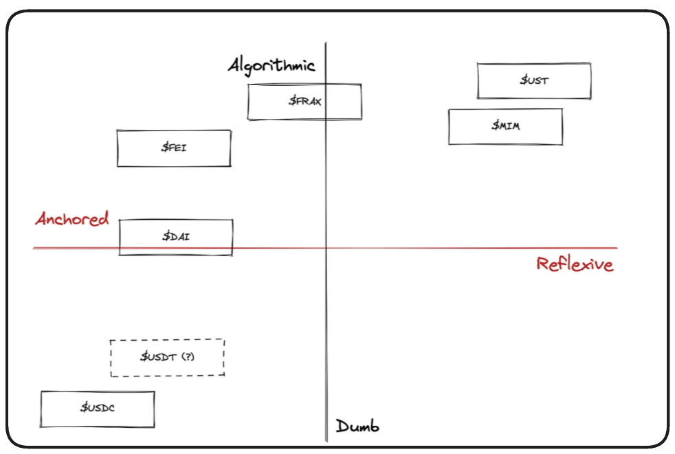

> ❗ **NOTE** <br />
> Dirt Roads uses `Dumb` as the opposite of algorithmic, instead of governed.

Most Fiat-Collateralized assets are more governed, as you'll often need a centralized entity to onramp the fiat into the blockchain ecosystem.

In summary:

-   Algorithmic Stablecoins use a transparent math equation or autonomously executed code to mint and burn tokens
-   Governed Stablecoins mint and burn tokens via human interaction/decision

**Collateral Type:** When we refer to collateral, we're referring to the asset backing the token, giving it its value. USDC is collateralized by the US Dollar, making one USDC worth one USD. DAI is collateralized by many different assets, you can deposit ETH to mint DAI, among many currencies. UST .. In a round about way was collateralized by LUNA.

These are examples of exogenous and endogenous types of collateral.

-   **Exogenous:** Collateral which originates from outside of a protocol.
-   **Endogenous:** Collateral which originates from within a protocol

The easiest way to determine in which category a stablecoin's collateral falls is the ask this question:

_**If the stablecoin fails, does the underlying collateral also fail?**_

Yes == Endogenous

No == Exogenous

If USDC Fails, the US Dollar isn't going to be affected. USDC is an example of Exogenous collateral. DAI is another example of this, the value of ETH won't be affected by the failure of the DAI protocol.

UST/LUNA on the other hand is an example of Endogenous collateral. When UST failed, LUNA also failed causing the protocol to bleed \$40 billion dollars.

Other good questions to ask include:

_**What the collateral created for the purpose of being collateral?**_

or

_**Does the protocol own the issuance of the underlying collateral?**_

What's misleading about how this is covered by traditional media is that they will point to algorithmic stablecoins as being to blame, but I think this is wrong. The risk exists with endogenously collateralized protocols because their value essentially comes from .. nothing or is self-determined at some point in development.

Endogenously collateralized stablecoins don't have a great track record - TerraLUNA and UST was a catastrophic event that wiped billions out of DeFi. So, why would anyone want to develop a stablecoin like this?

Generally the response is Scale/Capital Efficiency.

When a protocol is entirely exogenously collateralized, its marketcap is limited by the collateral it can onboard into the ecosystem. If no collateral needs to be onboarded into the protocol, scaling becomes easier much faster.

ءany endogenous stablecoins can be traced back to a single **[paper by Robert Sams](https://blog.bitmex.com/wp-content/uploads/2018/06/A-Note-on-Cryptocurrency-Stabilisation-Seigniorage-Shares.pdf)**. In this paper he discusses how to build an endogenously collateralized stablecoin using a seigniorage shares model.

### Thought Experiment

Imagine we had a stablecoin, issued by a bank, backed by gold. Our stablecoin is worth the same as its value in gold because at any point we can swap the coin back to the bank in exchange for gold.

Now, what happens if the bank isn't open weekends? What if the bank is closed for a month? At what point does a lack of access to the underlying collateral cease to matter and the asset becomes valued with respect to itself?

In the Dirt Roads image above, this is what is represented by `reflexive`


### Top Stablecoins

**DAI**

DAI is:

-   Pegged
-   Algorithmic
-   Exogenously Collateralized

Effectively how DAI works is, a user deposits some form of crypto collateral, such as ETH, and based on the current value of that collateral in US Dollars, some value of DAI is minted the user. It's only possible to mint _less_ DAI than the value of collateral a user has deposited. In this way the stablecoin is said to be over-collateralized.

> ❗ **NOTE** <br />
> DAI also has an annual stability fee on deposited collateral \~2%

When a user wants to redeem their collateral, DAI must be deposited back into the protocol, which then burns the deposited DAI and released the appropriate amount of collateral.

The combination of a stability fee and over-collateralization is often referred to as a `collateralized debt position`.

_**What happens if stability fees can't be paid, or the value of our collateral decreases?**_

If this happens, a user is at risk of liquidation. This is the mechanism through which the system avoids becoming under-collateralized.

**USDC**

USDC is:

-   Pegged
-   Governed
-   Exogenous

USDC is backed by real-world dollars.

**Terra USD(UST)/Terra LUNA**

This situation has become infamous now, but there's lots we can learn from this disaster to prevent it in the future.

UST was:

-   Pegged
-   Algorithmic
-   Endogenous

What we know about stablecoins now should shed some light on what happened to UST/LUNA. Because UST was backed by LUNA, when UST lost it's peg (usually through a massive influx of trading), it's underlying collateral (LUNA) became less attractive to hold .. which caused UST to lose more value. And thus the circling of the drain began until the asset was all but wiped out.

**FRAX**

FRAX is:

-   Pegged
-   Algorithmic
-   Hybrid

Endogenously collateralize stablecoins are so attractive because they _do_ scale quickly. More recent projects, like FRAX, have tried to thread this needle of hybrid collateralization to find an optimal balance.

**RAI**

RAI is:

-   Floating
-   Algorithmic
-   Exogenous

RAI is one of the few examples of a floating stablecoin. The protocol focuses on 3 things

-   minimal governance, achieved through algorithmic mechanisms of stabilization
-   Being Floating, such that it's value isn't derived by being tied to another asset
-   Only using ETH as collateral

You can read more about the mechanisms of RAI **[here](https://medium.com/intotheblock/rai-a-free-floating-stablecoin-that-actually-works-d9efbbca94c0)**.

### What do stablecoins really do?

Maybe we start with asking: **Which is the** _**best**_ **stablecoin?**

The answer to this may come down to about whom we're speaking.

Stablecoins, which are centralized, such as USDC, Tether etc, may not really fit the ethos of decentralization in Web3, it might be preferred to have a degree of decentrality.

By the same token (pun intended), algorithmic stablecoins may be intimidating to the average user and the associated fees may be non-starters.

At the end of the day every stablecoin protocol has it's trade-offs and what's right for one person or circumstance may not be right for another.

Now, here's something that may give you whiplash:

_**The stablecoin preferred by the average user, is likely much less important than those preferred by the 'rich whales' in the space**_


### Thought Experiment 2

Say you want to accumulate a tonne of ETH, you've solve everything you own and put it all into ETH, but you want more. How do you accomplish this?

By depositing ETH as collateral into a stablecoin protocol, you're able to mint the stablecoin, and sell it for more ETH. This becomes beneficial when you consider leveraged trading.

**Leveraged Trading:** Leveraged trading involves using borrowed capital to increase the potential return on investment. This strategy can magnify both gains and losses, allowing for potentially higher profits but also increased risk.

This usecase for high-value investing is so pervasive that it's often outlined by platforms as a primary reason to mint, to maximize your position on a crypto asset.

So, to summarize a bit:

_**Why are stablecoins used?**_

-   To execute the 3 functions of money.

_**Why are stablecoins minted?**_

-   Investors like to make leveraged bets.

## DecentralizedStableCoin.sol

Initialize a new Foundry project in our directory useing `forge init`. and remove the placeholder example contracts.

Our stablecoin is going to be:

1. Relative Stability: Anchored or Pegged to the US Dollar
    1. Chainlink Pricefeed
    2. Function to convert ETH & BTC to USD
2. Stability Mechanism (Minting/Burning): Algorithmicly Decentralized
    1. Users may only mint the stablecoin with enough collateral
3. Collateral: Exogenous (Crypto)
    1. wETH
    2. wBTC

To add some context to the above, we hope to create our stablecoin in such a way that it is pegged to the US Dollar. We'll achieve this by leveraging chainlink pricefeeds to determine the USD value of deposited collateral when calculating the value of collateral underlying minted tokens.

The token should be kept stable through this collateralization stability mechanism.

For collateral, the protocol will accept wrapped Bitcoin and wrapped Ether, the ERC20 equivalents of these tokens.

See the audit results of the codebase  **[here](https://www.codehawks.com/contests/cljx3b9390009liqwuedkn0m0)**. 

Start by creating the file `src/DecentralizedStableCoin.sol`.

```solidity
pragma solidity ^0.8.18;

/*
    * @title: DecentralizedStableCoin
    * @author: MRAlirad
    * Collateral: Exogenous (ETH & BTC)
    * Minting: Algorithmic
    * Relative Stability: Pegged to USD
    *
    * This is the contract meant to be governed by DSCEngine. This contract is just the ERC20 implementation of our stablecoin system.
    */
contract DecentralizedStableCoin {}
```

This contract is effectively just going to be a fairly standard ERC20 to function as the asset for our stablecoin protocol. All of the logic for the protocol will be handled by DSCEngine.sol. We'll need OpenZeppelin to get started.

```bash
forge install openzeppelin/openzeppelin-contracts@v4.8.3 --no-commit
```

And of course, we can add our remappings to our
`foundry.toml`.

```toml
[profile.default]
src = "src"
out = "out"
libs = ["lib"]
remappings = ["@openzeppelin/contracts/=lib/openzeppelin-contracts/contracts"]
```

Rather than importing a standard ERC20 contract, we'll be leveraging the ERC20Burnable extension of this standard. ERC20Burnable includes `burn` functionality for our tokens which will be important when we need to take the asset out of circulation to support stability.

```solidity
// SPDX-License-Identifier: MIT
pragma solidity ^0.8.18;

import {ERC20Burnable, ERC20} from "@openzeppelin/contracts/token/ERC20/extensions/ERC20Burnable.sol";

contract DecentralizedStableCoin is ERC20Burnable {
    constructor() ERC20("DecentralizedStableCoin", "DSC"){}
}
```

Because we're inheriting ERC20Burnable, and it inherits ERC20, we need to satisfy the standard ERC20 constructor parameters within our contracts constructor. We've set the name `DecentralizedStableCoin` and the symbol `DSC`.

All of the properties of our protocol are going to be governed ultimately by the `DSCEngine.sol` contract. Functionality like the stability mechanism, including minting and burning, need to be controlled by the DSCEngine to maintain the integrity of the stablecoin.

In order to accomplish this, we're going to also inherit `Ownable` with DecentralizedStableCoin.sol. This will allow us to configure access control, assuring only our DSCEngine contract is authorized to call these functions.

> ❗ **NOTE** <br />
> For version 5 of OpenZeppelin's Ownable contract, we need to pass an address
> in the constructor. We have to modify our code to account for this when
> running `forge build` so that our project will not error. Like this:
> `constructor(address initialOwner) ERC20("DecentralizedStableCoin", "DSC")
Ownable(initialOwner) {}`

```solidity
import {Ownable} from "@openzeppelin/contracts/access/Ownable.sol";

...

contract DecentralizedStableCoin is ERC20Burnable, Ownable {
    constructor() ERC20("DecentralizedStableCoin", "DSC"){}
}
```

The two major functions we're going to want the DSCEngine to control are of course the `mint` and `burn` functions. We can override the standard ERC20 functions with our own to assure this access control is in place.

### Burn

```solidity
function burn(uint256 _amount) external override onlyOwner{}
```

We're going to want to check for two things when this function is called.

1. The amount burnt must not be less than zero
2. The amount burnt must not be more than the user's balance

We'll configure two custom errors for when these checks fail.

```solidity
contract DecentralizedStableCoin is ERC20Burnable, Ownable {
    error DecentralizedStableCoin__AmountMustBeMoreThanZero();
    error DecentralizedStableCoin__BurnAmountExceedsBalance();

    constructor() ERC20("DecentralizedStableCoin", "DSC"){}

    function burn(uint256 _amount) external override onlyOwner{
        uint256 balance = balanceOf(msg.sender);

        if(_amount <= 0) revert DecentralizedStableCoin__AmountMustBeMoreThanZero();
        if(balance < _amount) revert DecentralizedStableCoin__BurnAmountExceedsBalance();
    }
}
```

The last thing we're going to do, assuming these checks pass, is burn the passed amount of tokens. We're going to do this by using the `super` keyword. This tells solidity to use the burn function of the parent class.

```solidity
function burn(uint256 _amount) external override onlyOwner{
    uint256 balance = balanceOf(msg.sender);

    if(_amount <= 0) revert DecentralizedStableCoin__AmountMustBeMoreThanZero();
    if(balance < _amount) revert DecentralizedStableCoin__BurnAmountExceedsBalance();

    super.burn(_amount);
}
```

### Mint

```solidity
function mint(address _to, uint256 _amount) external overrides onlyOwner returns(bool){
}
```

So, in this function we want to configure a boolean return value which is going to represent if the mint/transfer was successful. Something we'll want to check is if the `_to` argument being passed is address(0), in addition to assuring the amount minted is greater than zero.

We'll of course want to revert with custom errors if these conditional checks fail.

```solidity
contract DecentralizedStableCoin is ERC20Burnable, Ownable {
    error DecentralizedStableCoin__AmountMustBeMoreThanZero();
    error DecentralizedStableCoin__BurnAmountExceedsBalance();
    error DecentralizedStableCoin__NotZeroAddress();

    ...

    function mint(address _to, uint256 _amount) external onlyOwner returns(bool){
        if(_to == address(0)) revert DecentralizedStableCoin__NotZeroAddress();
        if(_amount <= 0) revert DecentralizedStableCoin__AmountMustBeMoreThanZero();

        _mint(_to, _amount);
        return true;
    }
}
```

> ❗ **NOTE** <br />
> We don't need to override the mint function, we're just calling the `mint` function within DecentralizedStableCoin.sol.

## DSCEngine.sol Setup

Alright! It's time to build out the engine to this car. `DSCEngine` will be the heart of the protocol which manages all aspects of `minting`, `burning`, `collateralizing` and `liquidating` within our protocol.

We're going to build this a little differently than usual, as we'll likely be writing tests as we go. As a codebase becomes more and more complex, it's often important to perform sanity checks along the way to assure you're still on track.

Begin with creating a new file, `src/DSCEngine.sol`. I'll bring over my contract and function layout reference and we can se up our boilerplate.

```solidity
// SPDX-License-Identifier: MIT
pragma solidity ^0.8.18;

contract DSCEngine {}
```

Time for NATSPEC:

```solidity
/*
    * @title DSCEngine
    * @author MRAlirad
    *
    * The system is designed to be as minimal as possible, and have the tokens maintain a 1 token == $1 peg at all times.
    * This is a stablecoin with the properties:
    * - Exogenously Collateralized
    * - Dollar Pegged
    * - Algorithmically Stable
    *
    * It is similar to DAI if DAI had no governance, no fees, and was backed by only WETH and WBTC.
    *
    * Our DSC system should always be "overcollateralized". At no point, should the value of all collateral < the $ backed value of all the DSC.
    *
    * @notice This contract is the core of the Decentralized Stablecoin system. It handles all the logic for minting and redeeming DSC, as well as depositing and withdrawing collateral.
    * @notice This contract is based on the MakerDAO DSS system
*/
contract DSCEngine {}
```

`Your code will be written once, and read thousands of times.` Clarity and cleanliness in code is important to provide context and understanding to those reading the codebase later.

### Functions

At this point in writing a contract, some will actually start by creating an interface. This can serve as a clear, itemized list of methods and functionality which you expect to be included within your contract. We'll just add our function "shells" into our contract directly for now.

Let's consider what functions will be required for DSC.
  
We will need:

-   Deposit collateral and mint the `DSC` token
    -   This is how users acquire the stablecoin, they deposit collateral greater than the value of the `DSC` minted
-   Redeem their collateral for `DSC`
    -   Users will need to be able to return DSC to the protocol in exchange for their underlying collateral
-   Burn `DSC`
    -   If the value of a user's collateral quickly falls, users will need a way to quickly rectify the collateralization of their `DSC`.
-   The ability to `liquidate` an account
    -   Because our protocol must always be over-collateralized (more collateral must be deposited then `DSC` is minted), if a user's collateral value falls below what's required to support their minted `DSC`, they can be `liquidated`. Liquidation allows other users to close an under-collateralized position
-   View an account's `healthFactor`
    -   `healthFactor` will be defined as a certain ratio of collateralization a user has for the DSC they've minted. As the value of a user's collateral falls, as will their `healthFactor`, if no changes to `DSC` held are made. If a user's `healthFactor` falls below a defined threshold, the user will be at risk of liquidation.
        -   eg. If the threshold to `liquidate` is 150% collateralization, an account with $75 in ETH can support $50 in `DSC`. If the value of ETH falls to \$74, the `healthFactor` is broken and the account can be `liquidated`

To summarize how we expect the protocol to function a bit:

Users will deposit collateral greater in value than the `DSC` they mint. If their collateral value falls such that their position becomes `under-collateralized`, another user can liquidate the position, by paying back/burning the `DSC` in exchange for the positions collateral. This will net the liquidator the difference in the `DSC` value and the collateral value in profit as incentive for securing the protocol.

In addition to what's outlined above, we'll need some basic functions like `mint/deposit` etc to give users more granular control over their position and account `healthFactor`.

```solidity
contract DSCEngine {

///////////////////
//   Functions   //
///////////////////

///////////////////////////
//   External Functions  //
///////////////////////////
    function depositCollateralAndMintDsc() external {}

    function depositCollateral() external {}

    function redeemCollateralForDsc() external {}

    function redeemCollateral() external {}

    function mintDsc() external {}

    function burnDsc() external {}

    function liquidate() external {}

    function getHealthFactor() external view {}
}
```

## Create the deposit collateral function

To deposit collateral, users are going to need the address for the type of collateral they're depositing (wETH or wBTC), and the amount they want to deposit. Easy enough.

```solidity
///////////////////
//   Functions   //
///////////////////

///////////////////////////
//   External Functions  //
///////////////////////////

/*
 * @param tokenCollateralAddress: The ERC20 token address of the collateral you're depositing
 * @param amountCollateral: The amount of collateral you're depositing
 */
function depositCollateral(address tokenCollateralAddress, uint256 amountCollateral) external {}
```

We need a modifire assure that the amount of collateral passed to our depositCollateral function is greater than zero.

```solidity
contract DSCEngine {
    error DSCEngine__NeedsMoreThanZero();

    modifier moreThanZero(uint256 amount){
        if(amount <=0){
            revert DSCEngine__NeedsMoreThanZero();
        }
        _;
    }
}
```

We need to create a mapping as a state variable to track the tokens which are compatible with our protocol.

We know we're going to be using chainlink pricefeeds, so what we can do is have this mapping be a token address, to it's associated pricefeed.

```solidity
mapping(address token => address priceFeed) private s_priceFeeds;
```

We'll probably want to initialize this mapping in our contract's constructor. To do this, we'll have our constructor take a list of token addresses and a list of priceFeed addresses, each index of one list will be mapped to the respective index of the other on deployment. We also know that the DSCEngine is going to need to know about the DecentralizeStablecoin contract. With all this in mind, let's set up our constructor.

```solidity
constructor(address[] memory tokenAddresses, address[] memory priceFeedAddresses, address dscAddress){}
```

Here's where we should definitely perform a sanity check, since a contract is only constructed once. If the indexes of our lists are meant to be mapped to each other, we should assure the lengths of the lists match, and if they don't we can revert with another custom error.

```solidity
error DSCEngine__NeedsMoreThanZero();
error DSCEngine__TokenAddressesAndPriceFeedAddressesMustBeSameLength();

...

constructor(address[] memory tokenAddresses, address[] memory priceFeedAddresses, address dscAddress){
    if(tokenAddresses.length != priceFeedAddresses.length){
        revert DSCEngine__TokenAddressesAndPriceFeedAddressesMustBeSameLength();
    }
}
```

Now we can add our for loop which will map our two lists of addresses to each other.

```solidity
constructor(address[] memory tokenAddresses, address[] memory priceFeedAddresses, address dscAddress){
    if(tokenAddresses.length != priceFeedAddresses.length){
        revert DSCEngine__TokenAddressesAndPriceFeedAddressesMustBeSameLength();
    }

    for(uint256 i=0; i < tokenAddresses.length; i++){
        s_priceFeeds[tokenAddresses[i]] = priceFeedAddresses[i];
    }
}
```

We're going to be doing lots with our `dscEngine`. We should declare this as an immutable variable and then assign it in our constructor.

```solidity
import {DecentralizedStableCoin} from "DecentralizedStableCoin.sol";

...

mapping(address token => address priceFeed) private s_priceFeeds;
DecentralizedStableCoin private immutable i_dsc;

...

constructor(address[] memory tokenAddresses, address[] memory priceFeedAddresses, address dscAddress){
    if(tokenAddresses.length != priceFeedAddresses.length){
        revert DSCEngine__TokenAddressesAndPriceFeedAddressesMustBeSameLength();
    }

    for(uint256 i=0; i < tokenAddresses.length; i++){
        s_priceFeeds[tokenAddresses[i]] = priceFeedAddresses[i];
    }
    i_dsc = DecentralizedStableCoin(dscAddress);
}
```

We were doing all this because we need a new modifier that checks our token addresses! Since we're only meaning to support wETH and wBTC, we should make a modifier to assure only these allowed tokens are deposited as collateral.
In our modifier, if a pricefeed isn't found for the passed token address, it'll revert!

```solidity

contract DSCEngine {
    ...
    error DSCEngine__TokenNotAllowed(address token);

    ...

    modifier isAllowedToken(address token) {
        if (s_priceFeeds[token] == address(0)) {
            revert DSCEngine__TokenNotAllowed(token);
        }
        _;
    }
}
```

We can add these newly created modifiers to `depositCollateral`.

```solidity
function depositCollateral(address tokenCollateralAddress, uint256 amountCollateral) external moreThanZero(amountCollateral) isAllowedToken(tokenCollateralAddress) nonReentrant{}
```

I've additionally included the nonReentrant modifier, which we'll need to import from OpenZeppelin. When interacting with external contracts it's often good to consider the implications of reentrancy. Reentrancy is one of the most common and damaging attacks in all of Web3, and sometimes I'll throw this modifier on as a _**better safe than sorry**_ methodology. It may not explicitly be required, but we'll find out when this code goes to audit! The trade off to include it is an expense of gas required to perform these extra checks.

Let's add the import to our contract.

> ❗ **NOTE**
> In version 5 of OpenZeppelin's contracts library, `ReentrancyGuard.sol` is in a different location. Edit the filepath from `/security/` to `/utils/` will work.

```solidity
pragma solidity ^0.8.18;

import {DecentralizedStableCoin} from "DecentralizedStableCoin.sol";
import {ReentrancyGuard} from "@openzeppelin/contracts/security/ReentrancyGuard.sol";

...

contract DSCEngine is ReentrancyGuard {
    ...
}
```

We'll need a way to keep track of the collateral deposited by each user. This sounds like a mapping to me.

```solidity
mapping(address token => address priceFeed) private s_priceFeeds;
DecentralizedStableCoin private immutable i_dsc;
mapping(address user => mapping(address token => uint256 amount)) private s_collateralDeposited;
```

Now we can finally add the deposited collateral to our user's balance within our depositCollateral function.

```solidity
function depositCollateral(address tokenCollateralAddress, uint256 amountCollateral) external moreThanZero(amountCollateral) isAllowedToken(tokenCollateralAddress) nonReentrant{
    s_collateralDeposited[msg.sender][tokenCollateralAddress] += amountCollateral;
}
```

We're updating our contract state! Any time state is changed, we should absolutely emit an event.

```solidity
event CollateralDeposited(address indexed user, address indexed token, uint256 indexed amount);

...

function depositCollateral(address tokenCollateralAddress, uint256 amountCollateral) external moreThanZero(amountCollateral) isAllowedToken(tokenCollateralAddress) nonReentrant{
    s_collateralDeposited[msg.sender][tokenCollateralAddress] += amountCollateral;
    emit CollateralDeposited(msg.sender, tokenCollateralAddress, amountCollateral);
}
```

Our function so far is doing a great job adhering to CEI (Checks, Effects, Interactions). The checks we're performing are being executed by our modifiers, our effects are any changes to do with internal accounting or state changes, and effects will be our external interacts (transferring the tokens). Following this design pattern is the best way to protect yourself from reentrancy.

Let's add our interactions to the function now, we'll need to call transferFrom on wBTC or wETH. These are ERC20s remember, so let's import an interface to use.

```solidity
pragma solidity ^0.8.18;

import {DecentralizedStableCoin} from "DecentralizedStableCoin.sol";
import {ReentrancyGuard} from "@openzeppelin/contracts/security/ReentrancyGuard.sol";
import {IERC20} from "@openzeppelin/contracts/token/ERC20/IERC20.sol";

...

function depositCollateral(address tokenCollateralAddress, uint256 amountCollateral) external moreThanZero(amountCollateral) isAllowedToken(tokenCollateralAddress) nonReentrant{
    s_collateralDeposited[msg.sender][tokenCollateralAddress] += amountCollateral;
    emit CollateralDeposited(msg.sender, tokenCollateralAddress, amountCollateral);

    IERC20(tokenCollateralAddress).transferFrom(msg.sender, address(this), amountCollateral);
}
```

One last thing to note in this function - our transferFrom call actually returns a boolean. We want to assure this transfer is successful, otherwise revert this function call. One last conditional to add...

```solidity
contract DSCEngine {
    error DSCEngine__TransferFailed();

    ...

    function depositCollateral(address tokenCollateralAddress, uint256 amountCollateral) external moreThanZero(amountCollateral) isAllowedToken(tokenCollateralAddress) nonReentrant{
        s_collateralDeposited[msg.sender][tokenCollateralAddress] += amountCollateral;
        emit CollateralDeposited(msg.sender, tokenCollateralAddress, amountCollateral);

        bool success = IERC20(tokenCollateralAddress).transferFrom(msg.sender, address(this), amountCollateral);

        if(!success){
            revert DSCEngine__TransferFailed();
        }
    }
}
```

DSCEngine.sol contract so far:

```solidity
// SPDX-License-Identifier: MIT
pragma solidity 0.8.18;

import { ReentrancyGuard } from "@openzeppelin/contracts/security/ReentrancyGuard.sol";
import { IERC20 } from "@openzeppelin/contracts/token/ERC20/IERC20.sol";
import { DecentralizedStableCoin } from "./DecentralizedStableCoin.sol";

/*
    * @title DSCEngine
    * @author Patrick Collins
    *
    * The system is designed to be as minimal as possible, and have the tokens maintain a 1 token == $1 peg at all times.
    * This is a stablecoin with the properties:
    * - Exogenously Collateralized
    * - Dollar Pegged
    * - Algorithmically Stable
    *
    * It is similar to DAI if DAI had no governance, no fees, and was backed by only WETH and WBTC.
    *
    * Our DSC system should always be "overcollateralized". At no point, should the value of
    * all collateral < the $ backed value of all the DSC.
    *
    * @notice This contract is the core of the Decentralized Stablecoin system. It handles all the logic
    * for minting and redeeming DSC, as well as depositing and withdrawing collateral.
    * @notice This contract is based on the MakerDAO DSS system
*/
contract DSCEngine is ReentrancyGuard {

    ///////////////////
    //     Errors    //
    ///////////////////

    error DSCEngine__TokenAddressesAndPriceFeedAddressesAmountsDontMatch();
    error DSCEngine__NeedsMoreThanZero();
    error DSCEngine__TokenNotAllowed(address token);
    error DSCEngine__TransferFailed();

    /////////////////////////
    //   State Variables   //
    /////////////////////////

    mapping(address token => address priceFeed) private s_priceFeeds;
    DecentralizedStableCoin private immutable i_dsc;
    mapping(address user => mapping(address token => uint256 amount)) private s_collateralDeposited;

    ////////////////
    //   Events   //
    ////////////////

    event CollateralDeposited(address indexed user, address indexed token, uint256 indexed amount);

    ///////////////////
    //   Modifiers   //
    ///////////////////

    modifier moreThanZero(uint256 amount){
        if(amount <=0){
            revert DSCEngine__NeedsMoreThanZero();
        }
        _;
    }

    modifier isAllowedToken(address token) {
        if (s_priceFeeds[token] == address(0)) {
            revert DSCEngine__TokenNotAllowed(token);
        }
        _;
    }

    ///////////////////
    //   Functions   //
    ///////////////////
    constructor(address[] memory tokenAddresses, address[] memory priceFeedAddresses, address dscAddress){
        if(tokenAddresses.length != priceFeedAddresses.length){
            revert DSCEngine__TokenAddressesAndPriceFeedAddressesMustBeSameLength();
        }

        for(uint256 i=0; i < tokenAddresses.length; i++){
            s_priceFeeds[tokenAddresses[i]] = priceFeedAddresses[i];
        }
        i_dsc = DecentralizedStableCoin(dscAddress);
    }


    ///////////////////////////
    //   External Functions  //
    ///////////////////////////

    /*
     * @param tokenCollateralAddress: The ERC20 token address of the collateral you're depositing
     * @param amountCollateral: The amount of collateral you're depositing
     */
    function depositCollateral(
        address tokenCollateralAddress,
        uint256 amountCollateral
    )
        external
        moreThanZero(amountCollateral)
        nonReentrant
        isAllowedToken(tokenCollateralAddress)
    {
        s_collateralDeposited[msg.sender][tokenCollateralAddress] += amountCollateral;
        emit CollateralDeposited(msg.sender, tokenCollateralAddress, amountCollateral);
        bool success = IERC20(tokenCollateralAddress).transferFrom(msg.sender, address(this), amountCollateral);
        if (!success) {
            revert DSCEngine__TransferFailed();
        }
    }

    function depositCollateralAndMintDsc() external {}

    function redeemCollateralForDsc() external {}

    function redeemCollateral() external {}

    function mintDsc() external {}

    function burnDsc() external {}

    function liquidate() external {}

    function getHealthFactor() external view {}
}
```

## Creating the mint function

There are a number of things we'll need to accomplish when minting our stablecoin. Primarily we'll need to check if the account's collateral value supports the amount of `DSC` being minted. To do this we'll need to engage `Chainlink` price feeds, do value conversions and more.

```solidity
/*
    * @param amountDscToMint: The amount of DSC you want to mint
    * You can only mint DSC if you hav enough collateral
*/
function mintDsc(uint256 amountDscToMint) public moreThanZero(amountDscToMint) nonReentrant {}
```

We've added our modifiers to protect against reentrancy and constrain the `amountDscToMint` to being above zero. Much like we track the collateral a user has deposited, we'll also have to track the `DSC` which has been minted. Sounds like another mapping!

```solidity

mapping(address token => address priceFeed) private s_priceFeeds;
DecentralizedStableCoin private immutable i_dsc;
mapping(address user => mapping(address token => uint256 amount)) private s_collateralDeposited;
mapping(address user => uint256 amountDscMinted) private s_DSCMinted;
```

And now, in following `CEI (Checks, Effects, Interactions)`, we'll want to update the user's mapped balance to reflect the amount being minted in our function.

```solidity
function mintDsc(uint256 amountDscToMint) public moreThanZero(amountDscToMint) nonReentrant {
    s_DSCMinted[msg.sender] += amountDscToMint;
}
```

Our next step is something that will warrant it's own function, this is going to be something we check in a few placed in our protocol. We'll name the function `_revertIfHealthFactorIsBroken`. The purpose of this will be to assure that changes in a user's DSC or collateral balances don't result in the user's position being `under-collateralized`.

```solidity
function _revertIfHealthFactorIsBroken(address user){}
```

`Health Factor` is a concept borrowed from Aave.

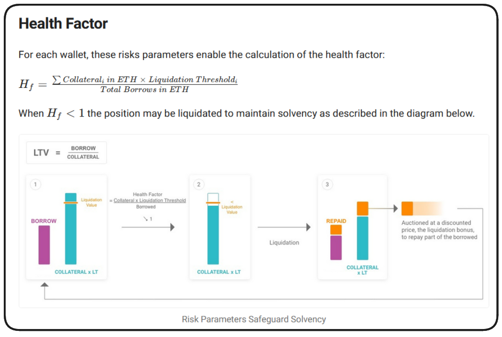

In addition to the above, we'll need a function which checks an account's `Health Factor`. Let's write that now.

```solidity
function _revertIfHealthFactorIsBroken(address user) internal view {}

/*
    * Returns how close to liquidation a user is
    * If a user goes below 1, then they can be liquidated.
*/
function _healthFactor(address user) private view returns(uint256){}
```

So, how are we going to determine an account's `Health Factor`? What will we need?

1. Total DSC minted
2. Total Collateral _**value**_

In order to do this, we're actually going to create _another_ function, Our next function will return some basic details of the user's account including their `DSC` minted and the collateral value.

```solidity
function _healthFactor(address user) private view returns(uint256){
    (uint256 totalDscMinted, uint256 collateralValueInUsd) = _getAccountInformation(user);
}

function _getAccountInformation(address user) private view returns(uint256 totalDscMinted,uint256 collateralValueInUsd){
    totalDscMinted = s_DSCMinted[user];
    collateralValueInUsd = getAccountCollateralValue(user);
}
```

A user's total minted `DSC` is easy enough to acquire by referencing our protocol's mapping of this, but a user's collateral value is going to take some math and a price feed. This logic will be held by a new function, `getAccountCollateralValue`. This function we'll make public, so anyone can call it. Private and view functions are the very last thing in our contract layout, so we'll add our new function to the bottom!

```solidity
function getAccountCollateralValue(address user) public pure {}
```

So, how do we determine the total USD value of a user's collateral? Since the user may have multiple types of collateral (wETH and wBTC in our case), we'll need a way to loop through the collateral a user has, acquire the amount of each collateral token and map those amounts to USD values of those amounts.

Since we're only using wETH and wBTC in our protocol, we _could_ hardcode these tokens into the contract, but let's make the protocol a little more agnostic. This will allow someone to deploy their own fork, which accepts their own types of collateral. We'll accomplish this by declaring a new state variable:

```solidity
mapping(address token => address priceFeed) private s_priceFeeds;
DecentralizedStableCoin private immutable i_dsc;
mapping(address user => mapping(address token => uint256 amount)) private s_collateralDeposited;
mapping(address user => uint256 amountDscMinted) private s_DSCMinted;
address[] private s_collateralTokens;
```

We'll assign an array of compatible token addresses in our constructor:

```solidity
constructor(address[] memory tokenAddresses, address[] memory priceFeedAddresses, address dscAddress){
    if(tokenAddresses.length != priceFeedAddresses.length){
        revert DSCEngine__TokenAddressesAndPriceFeedAddressesMustBeSameLength();
    }

    for(uint256 i=0; i < tokenAddresses.length; i++){
        s_priceFeeds[tokenAddresses[i]] = priceFeedAddresses[i];
        s_collateralTokens.push(tokenAddresses[i]);
    }
    i_dsc = DecentralizedStableCoin(dscAddress);
}
```

With this array set up, we can now loop through this in our `getAccountCollateral` function to calculate it's total value in USD.

```solidity
function getAccountCollateralValue(address user) public view returns (uint256 totalCollateralValueInUsd) {
    for(uint256 i = 0; i < s_collateralTokens.length; i++){
        address token = s_collateralTokens[i];
        uint256 amount = s_collateralDeposited[user][token];
        totalCollateralValueInUsd += ...
    }
    return totalCollateralValueInUsd;
}
```

Hmm... We've hit the point where we need to know the USD value of our collateral tokens in order to calculate our totals. This is probably _another_ function we're going to want.

```solidity
function getUsdValue(address token, uint256 amount) public view returns(uint256){}
```

This is where our `Chainlink` price feeds come into play. We're going to need to import the `AggregatorV3Interface`, like we did in previous sections.

```solidity
import { ReentrancyGuard } from '@openzeppelin/contracts/security/ReentrancyGuard.sol';
import { IERC20 } from '@openzeppelin/contracts/token/ERC20/IERC20.sol';
import { DecentralizedStableCoin } from './DecentralizedStableCoin.sol';
import { AggregatorV3Interface } from '@chainlink/contracts/src/v0.8/interfaces/AggregatorV3Interface.sol';
```

If you haven't installed the `Chainlink` contract kit yet, let's do that now.

```bash
forge install smartcontractkit/chainlink-brownie-contracts@0.6.1 --no-commit
```

And, we'll append this to our remappings within `foundry.toml`.

```toml
remappings = [
  "@chainlink/contracts/=lib/chainlink-brownie-contracts/contracts",
  "@openzeppelin/contracts/=lib/openzeppelin-contracts/contracts",
]
```

```solidity
function getUsdValue(address token, uint256 amount) public view returns(uint256){
    AggregatorV3Interface priceFeed = AggregatorV3Interface(s_priceFeeds[token]);
    (,int256 price,,,) = priceFeed.latestRoundData();
}
```

This should return the latest price of our token, to 8 decimal places. We can verify the decimals returned by any given price feed by referencing the **[Chainlink Price Feed Contract Addresses](https://docs.chain.link/data-feeds/price-feeds/addresses?network=ethereum&page=1)** page.

Now, we're unable to simply take this returned price and multiply it by our amount, the precision of both these values is going to be different, the amount passed to this function is expected to have 18 decimal places where as our price has only 8. To resolve this we'll need to multiple our price by `1e10`. Once our precision matches, we can multiple this by our amount, then divide by `1e18` to return a reasonably formatted number for USD units.

```solidity
function getUsdValue(address token, uint256 amount) public view returns(uint256){
    AggregatorV3Interface priceFeed = AggregatorV3Interface(s_priceFeeds[token]);
    (,int256 price,,,) = priceFeed.latestRoundData();

    return ((uint256(price * 1e10) * amount) / 1e18);
}
```

Let's declare constants for `1e10` and `1e18` and replace these in our function.

```solidity

mapping(address token => address priceFeed) private s_priceFeeds;
uint256 private constant ADDITIONAL_FEED_PRECISION = 1e10;
uint256 private constant PRECISION = 1e18;

...

function getUsdValue(address token, uint256 amount) public view returns(uint256){
    AggregatorV3Interface priceFeed = AggregatorV3Interface(s_priceFeeds[token]);
    (,int256 price,,,) = priceFeed.latestRoundData();

    return ((uint256(price) * ADDITIONAL_FEED_PRECISION) * amount) / PRECISION;
}
```

The last thing we need to return to, to finish up, is our `getAccountCollateralValue` function. We can now call `getUsdValue` in our loop to calculate a user's `totalCollateralValue`.

```solidity
function getAccountCollateralValue(address user) public view returns (uint256 totalCollateralValueInUsd) {
    for(uint256 i = 0; i < s_collateralTokens.length; i++){
        address token = s_collateralTokens[i];
        uint256 amount = s_collateralDeposited[user][token];
        totalCollateralValueInUsd += getUsdValue(token, amount);
    }
    return totalCollateralValueInUsd;
}
```

DSCEngine.sol contract so far:

```solidity
// SPDX-License-Identifier: MIT
pragma solidity 0.8.18;

import { ReentrancyGuard } from "@openzeppelin/contracts/security/ReentrancyGuard.sol";
import { IERC20 } from "@openzeppelin/contracts/token/ERC20/IERC20.sol";
import { DecentralizedStableCoin } from "./DecentralizedStableCoin.sol";
import { AggregatorV3Interface } from "@chainlink/contracts/src/v0.8/shared/interfaces/AggregatorV3Interface.sol";

/*
    * @title DSCEngine
    * @author Patrick Collins
    *
    * The system is designed to be as minimal as possible, and have the tokens maintain a 1 token == $1 peg at all times.
    * This is a stablecoin with the properties:
    * - Exogenously Collateralized
    * - Dollar Pegged
    * - Algorithmically Stable
    *
    * It is similar to DAI if DAI had no governance, no fees, and was backed by only WETH and WBTC.
    *
    * Our DSC system should always be "overcollateralized". At no point, should the value of
    * all collateral < the $ backed value of all the DSC.
    *
    * @notice This contract is the core of the Decentralized Stablecoin system. It handles all the logic
    * for minting and redeeming DSC, as well as depositing and withdrawing collateral.
    * @notice This contract is based on the MakerDAO DSS system
*/
contract DSCEngine is ReentrancyGuard {

    ///////////////////
    //     Errors    //
    ///////////////////

    error DSCEngine__TokenAddressesAndPriceFeedAddressesAmountsDontMatch();
    error DSCEngine__NeedsMoreThanZero();
    error DSCEngine__TokenNotAllowed(address token);
    error DSCEngine__TransferFailed();

    /////////////////////////
    //   State Variables   //
    /////////////////////////

    mapping(address token => address priceFeed) private s_priceFeeds;
    DecentralizedStableCoin private immutable i_dsc;
    mapping(address user => mapping(address token => uint256 amount)) private s_collateralDeposited;
    mapping(address user => uint256 amountDscMinted) private s_DSCMinted;
    address[] private s_collateralTokens;

    uint256 private constant ADDITIONAL_FEED_PRECISION = 1e10;
    uint256 private constant PRECISION = 1e18;

    ////////////////
    //   Events   //
    ////////////////

    event CollateralDeposited(address indexed user, address indexed token, uint256 indexed amount);

    ///////////////////
    //   Modifiers   //
    ///////////////////

    modifier moreThanZero(uint256 amount){
        if(amount <=0){
            revert DSCEngine__NeedsMoreThanZero();
        }
        _;
    }

    modifier isAllowedToken(address token) {
        if (s_priceFeeds[token] == address(0)) {
            revert DSCEngine__TokenNotAllowed(token);
        }
        _;
    }

    ///////////////////
    //   Functions   //
    ///////////////////

    constructor(address[] memory tokenAddresses, address[] memory priceFeedAddresses, address dscAddress){
        if(tokenAddresses.length != priceFeedAddresses.length){
            revert DSCEngine__TokenAddressesAndPriceFeedAddressesMustBeSameLength();
        }

        for(uint256 i=0; i < tokenAddresses.length; i++){
            s_priceFeeds[tokenAddresses[i]] = priceFeedAddresses[i];
            s_collateralTokens.push(tokenAddresses[i]);
        }
        i_dsc = DecentralizedStableCoin(dscAddress);
    }


    ///////////////////////////
    //   External Functions  //
    ///////////////////////////

    /*
     * @param tokenCollateralAddress: The ERC20 token address of the collateral you're depositing
     * @param amountCollateral: The amount of collateral you're depositing
     */
    function depositCollateral(
        address tokenCollateralAddress,
        uint256 amountCollateral
    )
        external
        moreThanZero(amountCollateral)
        nonReentrant
        isAllowedToken(tokenCollateralAddress)
    {
        s_collateralDeposited[msg.sender][tokenCollateralAddress] += amountCollateral;
        emit CollateralDeposited(msg.sender, tokenCollateralAddress, amountCollateral);
        bool success = IERC20(tokenCollateralAddress).transferFrom(msg.sender, address(this), amountCollateral);
        if (!success) {
            revert DSCEngine__TransferFailed();
        }
    }

    /*
    * @param amountDscToMint: The amount of DSC you want to mint
    * You can only mint DSC if you hav enough collateral
    */
    function mintDsc(uint256 amountDscToMint) public moreThanZero(amountDscToMint) nonReentrant {
        s_DSCMinted[msg.sender] += amountDscToMint;
    }

    ///////////////////////////////////////////
    //   Private & Internal View Functions   //
    ///////////////////////////////////////////

    /*
    * Returns how close to liquidation a user is
    * If a user goes below 1, then they can be liquidated.
    */
    function _healthFactor(address user) private view returns(uint256){
        (uint256 totalDscMinted, uint256 collateralValueInUsd) = _getAccountInformation(user);
    }

    function _getAccountInformation(address user) private view returns(uint256 totalDscMinted,uint256 collateralValueInUsd){
        totalDscMinted = s_DSCMinted[user];
        collateralValueInUsd = getAccountCollateralValue(user);
    }

    function revertIfHealthFactorIsBroken(address user){}

    //////////////////////////////////////////
    //   Public & External View Functions   //
    //////////////////////////////////////////

    function getAccountCollateralValue(address user) public view returns (uint256 totalCollateralValueInUsd) {
        for(uint256 i = 0; i < s_collateralTokens.length; i++){
            address token = s_collateralTokens[i];
            uint256 amount = s_collateralDeposited[user][token];
            totalCollateralValueInUsd += getUsdValue(token, amount);
        }
        return totalCollateralValueInUsd;
    }

    function getUsdValue(address token, uint256 amount) public view returns(uint256){
        AggregatorV3Interface priceFeed = AggregatorV3Interface(s_priceFeeds[token]);
        (,int256 price,,,) = priceFeed.latestRoundData();

        return ((uint256(price) * ADDITIONAL_FEED_PRECISION) * amount) / PRECISION;
    }

    function depositCollateralAndMintDsc() external {}

    function redeemCollateralForDsc() external {}

    function redeemCollateral() external {}

    function burnDsc() external {}

    function liquidate() external {}

    function getHealthFactor() external view {}
}
```

## Health Factor

our `_healthFactor` function is only acquiring the user's `totalDscMinted` and the `collateralValueInUsd`.

An account's `Health Factor` will be a bit more complex to consider than simply `collateralValueInUsd / totalDscMinted`. We want to assure the protocol is always `over-collateralized`, and to do this, there needs to be a threshold determined that this ratio needs to adhere to, 200% for example. We can set this threshold via a constant state variable.

```solidity
mapping(address token => address priceFeed) private s_priceFeeds;
DecentralizedStableCoin private immutable i_dsc;
mapping(address user => mapping(address token => uint256 amount)) private s_collateralDeposited;
mapping(address user => uint256 amountDscMinted) private s_DSCMinted;
address[] private s_collateralTokens;

uint256 private constant ADDITIONAL_FEED_PRECISION = 1e10;
uint256 private constant PRECISION = 1e18;
uint256 private constant LIQUIDATION_THRESHOLD = 50;
uint256 private constant LIQUIDATION_PRECISION = 100;
```

The threshold above, set at `50`, will assure a user's position is `200%` `over-collateralized`. We've also declared a `LIQUIDATION_PRECISION` constant for use in our calculation. We can apply this to our function's calculation now.

```solidity
/*
    * Returns how close to liquidation a user is
    * If a user goes below 1, then they can be liquidated.
*/
function _healthFactor(address user) private view returns(uint256){
    (uint256 totalDscMinted, uint256 collateralValueInUsd) = _getAccountInformation(user);

    uint256 collateralAdjustedForThreshold = (collateralValueInUsd * LIQUIDATION_THRESHOLD) / LIQUIDATION_PRECISION;
}
```

Say a user deposits $150 worth of ETH and goes to mint $100 worth of DSC.

```Solidity
(150 * 50) / 100 = 75
75/100 = 0.75
0.75 < 1
```

In the above example, a user who has deposited $150 worth of ETH would not be able to mint $100 worth of DSC as it results in their `Health Factor` breaking. $100 in DSC requires $200 in collateral to be deposited for the `Health Factor` to remain above 1.

```Solidity
(200 * 50) / 100 = 100
100/100 = 1
1 >= 1
```

With a `LIQUIDATION_THRESHOLD` of 50, a user requires 200% over-collateralization of their position, or the risk liquidation. Now that we've adjusted our collateral amount to account for a position's `LIQUIDATION_THRESHOLD`, we can use this adjust value to calculate a user's true `Health Factor`.

```solidity
function _healthFactor(address user) private view returns(uint256){
    (uint256 totalDscMinted, uint256 collateralValueInUsd) = _getAccountInformation(user);

    uint256 collateralAdjustedForThreshold = (collateralValueInUsd * LIQUIDATION_THRESHOLD) / LIQUIDATION_PRECISION;

    return (collateralAdjustedForThreshold * PRECISION) / totalDscMinted;
}
```

To apply our new return calculation to our above examples:

```Solidity
(150 * 50) / 100 = 75
return (75 * 1e18) / 100e18
return (0.75)
```

Now, we've been talking about `Health Factors` which are `< 1` as being at risk of liquidation. We should set this constant officially with a state variable before moving on. We'll need it in our `_revertIfHealthFactorIsBroken` function.

```solidity
/////////////////////////
//   State Variables   //
/////////////////////////

mapping(address token => address priceFeed) private s_priceFeeds;
DecentralizedStableCoin private immutable i_dsc;
mapping(address user => mapping(address token => uint256 amount)) private s_collateralDeposited;
mapping(address user => uint256 amountDscMinted) private s_DSCMinted;
address[] private s_collateralTokens;

uint256 private constant ADDITIONAL_FEED_PRECISION = 1e10;
uint256 private constant PRECISION = 1e18;
uint256 private constant LIQUIDATION_THRESHOLD = 50;
uint256 private constant LIQUIDATION_PRECISION = 100;
uint256 private constant MIN_HEALTH_FACTOR = 1e18;
```

We're ready to put our `_healthFactor` function and our `MIN_HEALTH_FACTOR` constant to work. We can use these to declare a conditional statement within `_revertIfHealthFactorIsBroken`, which will revert with a custom error if the conditional fails to pass.

```solidity
error DSCEngine__BreaksHealthFactor(uint256 healthFactor);

...

function _revertIfHealthFactorIsBroken(address user) internal view {
    uint256 userHealthFactor = _healthFactor(user);

    if(userHealthFactor < MIN_HEALTH_FACTOR){
        revert DSCEngine__BreaksHealthFactor(userHealthFactor);
    }
}
```

DSCEngine.sol contract so far:

```solidity
// SPDX-License-Identifier: MIT
pragma solidity 0.8.18;

import { ReentrancyGuard } from "@openzeppelin/contracts/security/ReentrancyGuard.sol";
import { IERC20 } from "@openzeppelin/contracts/token/ERC20/IERC20.sol";
import { DecentralizedStableCoin } from "./DecentralizedStableCoin.sol";
import { AggregatorV3Interface } from "@chainlink/contracts/src/v0.8/shared/interfaces/AggregatorV3Interface.sol";

/*
    * @title DSCEngine
    * @author Patrick Collins
    *
    * The system is designed to be as minimal as possible, and have the tokens maintain a 1 token == $1 peg at all times.
    * This is a stablecoin with the properties:
    * - Exogenously Collateralized
    * - Dollar Pegged
    * - Algorithmically Stable
    *
    * It is similar to DAI if DAI had no governance, no fees, and was backed by only WETH and WBTC.
    *
    * Our DSC system should always be "overcollateralized". At no point, should the value of
    * all collateral < the $ backed value of all the DSC.
    *
    * @notice This contract is the core of the Decentralized Stablecoin system. It handles all the logic
    * for minting and redeeming DSC, as well as depositing and withdrawing collateral.
    * @notice This contract is based on the MakerDAO DSS system
*/
contract DSCEngine is ReentrancyGuard {

    ///////////////////
    //     Errors    //
    ///////////////////

    error DSCEngine__TokenAddressesAndPriceFeedAddressesAmountsDontMatch();
    error DSCEngine__NeedsMoreThanZero();
    error DSCEngine__TokenNotAllowed(address token);
    error DSCEngine__TransferFailed();
    error DSCEngine__BreaksHealthFactor(uint256 healthFactor);

    /////////////////////////
    //   State Variables   //
    /////////////////////////

    mapping(address token => address priceFeed) private s_priceFeeds;
    DecentralizedStableCoin private immutable i_dsc;
    mapping(address user => mapping(address token => uint256 amount)) private s_collateralDeposited;
    mapping(address user => uint256 amountDscMinted) private s_DSCMinted;
    address[] private s_collateralTokens;

    uint256 private constant ADDITIONAL_FEED_PRECISION = 1e10;
    uint256 private constant PRECISION = 1e18;
    uint256 private constant LIQUIDATION_THRESHOLD = 50;
    uint256 private constant LIQUIDATION_PRECISION = 100;
    uint256 private constant MIN_HEALTH_FACTOR = 1e18;

    ////////////////
    //   Events   //
    ////////////////

    event CollateralDeposited(address indexed user, address indexed token, uint256 indexed amount);

    ///////////////////
    //   Modifiers   //
    ///////////////////

    modifier moreThanZero(uint256 amount){
        if(amount <=0){
            revert DSCEngine__NeedsMoreThanZero();
        }
        _;
    }

    modifier isAllowedToken(address token) {
        if (s_priceFeeds[token] == address(0)) {
            revert DSCEngine__TokenNotAllowed(token);
        }
        _;
    }

    ///////////////////
    //   Functions   //
    ///////////////////

    constructor(address[] memory tokenAddresses, address[] memory priceFeedAddresses, address dscAddress){
        if(tokenAddresses.length != priceFeedAddresses.length){
            revert DSCEngine__TokenAddressesAndPriceFeedAddressesMustBeSameLength();
        }

        for(uint256 i=0; i < tokenAddresses.length; i++){
            s_priceFeeds[tokenAddresses[i]] = priceFeedAddresses[i];
            s_collateralTokens.push(tokenAddresses[i]);
        }
        i_dsc = DecentralizedStableCoin(dscAddress);
    }


    ///////////////////////////
    //   External Functions  //
    ///////////////////////////

    /*
     * @param tokenCollateralAddress: The ERC20 token address of the collateral you're depositing
     * @param amountCollateral: The amount of collateral you're depositing
     */
    function depositCollateral(
        address tokenCollateralAddress,
        uint256 amountCollateral
    )
        external
        moreThanZero(amountCollateral)
        nonReentrant
        isAllowedToken(tokenCollateralAddress)
    {
        s_collateralDeposited[msg.sender][tokenCollateralAddress] += amountCollateral;
        emit CollateralDeposited(msg.sender, tokenCollateralAddress, amountCollateral);
        bool success = IERC20(tokenCollateralAddress).transferFrom(msg.sender, address(this), amountCollateral);
        if (!success) {
            revert DSCEngine__TransferFailed();
        }
    }

    /*
    * @param amountDscToMint: The amount of DSC you want to mint
    * You can only mint DSC if you hav enough collateral
    */
    function mintDsc(uint256 amountDscToMint) public moreThanZero(amountDscToMint) nonReentrant {
        s_DSCMinted[msg.sender] += amountDscToMint;
    }

    ///////////////////////////////////////////
    //   Private & Internal View Functions   //
    ///////////////////////////////////////////

    /*
    * Returns how close to liquidation a user is
    * If a user goes below 1, then they can be liquidated.
    */
    function _healthFactor(address user) private view returns(uint256){
        (uint256 totalDscMinted, uint256 collateralValueInUsd) = _getAccountInformation(user);

        uint256 collateralAdjustedForThreshold = (collateralValueInUsd * LIQUIDATION_THRESHOLD) / LIQUIDATION_PRECISION;

        return (collateralAdjustedForThreshold * PRECISION) / totalDscMinted;
    }

    function _getAccountInformation(address user) private view returns(uint256 totalDscMinted,uint256 collateralValueInUsd){
        totalDscMinted = s_DSCMinted[user];
        collateralValueInUsd = getAccountCollateralValue(user);
    }

    function _revertIfHealthFactorIsBroken(address user) internal view {
        uint256 userHealthFactor = _healthFactor(user);
        if(userHealthFactor < MIN_HEALTH_FACTOR){
            revert DSCEngine__BreaksHealthFactor(userHealthFactor);
        }
    }

    //////////////////////////////////////////
    //   Public & External View Functions   //
    //////////////////////////////////////////

    function getAccountCollateralValue(address user) public view returns (uint256 totalCollateralValueInUsd) {
        for(uint256 i = 0; i < s_collateralTokens.length; i++){
            address token = s_collateralTokens[i];
            uint256 amount = s_collateralDeposited[user][token];
            totalCollateralValueInUsd += getUsdValue(token, amount);
        }
        return totalCollateralValueInUsd;
    }

    function getUsdValue(address token, uint256 amount) public view returns(uint256){
        AggregatorV3Interface priceFeed = AggregatorV3Interface(s_priceFeeds[token]);
        (,int256 price,,,) = priceFeed.latestRoundData();

        return ((uint256(price) * ADDITIONAL_FEED_PRECISION) * amount) / PRECISION;
    }

    function depositCollateralAndMintDsc() external {}

    function redeemCollateralForDsc() external {}

    function redeemCollateral() external {}

    function burnDsc() external {}

    function liquidate() external {}

    function getHealthFactor() external view {}
}
```

## Finishing mintDsc

We're checking if this new balance is breaking the user's `Health Factor`, and if so, we're reverting. If this function _doesn't_ revert - it's time to mint!

Our `mint` function returns a bool and takes `_to` and `_amount` parameters. We can use this bool to revert if minting our DSC fails for some reason.

```solidity
error DSCEngine__MintFailed();

...

function mintDsc(uint256 amountDscToMint) external moreThanZero(amountDscToMint) nonReentrant {
    s_DSCMinted[msg.sender] += amountDscToMint;
    _revertIfHealthFactorIsBroken(msg.sender);
    bool minted = i_dsc.mint(msg.sender, amountDscToMint);

    if(!minted){
        revert DSCEngine__MintFailed();
    }
}
```

## Deploy Script

Create the file `script/DeployDSC.s.sol` as well.

```solidity
// SPDX-License-Identifier: MIT
pragma solidity ^0.8.19;

import { Script } from "forge-std/Script.sol";
import { DecentralizedStableCoin } from "../src/DecentralizedStableCoin.sol";
import { DSCEngine } from "../src/DSCEngine.sol";

contract DeployDSC is Script {
    function run() external returns (DecentralizedStableCoin, DSCEngine) {}
}
```

Beautiful, clean setup. In our run function we'll need to deploy both DecentralizedStableCoin.sol and DSCEngine.sol. DecentralizedStableCoin doesn't take any constructor parameters, so it's fairly straightforward, however DSCEngine requires `tokenAddresses[]`, `priceFeedAddresses[]` and the address of our DecentralizedStableCoin deployment. In order to provide these address arrays to our DSCEngine constructor, we're going to leverage a `HelperConfig`!

### HelperConfig

Create a new file `script/HelperConfig.s.sol`.

```solidity
// SPDX-License-Identifier: MIT
pragma solidity ^0.8.18;

import { Script } from "forge-std/Script.sol";

contract HelperConfig is Script {}
```

We'll declare a NetworkConfig struct which contains a number of properties which will be determined by the network the transaction is placed on.

```solidity
contract HelperConfig is Script {

    struct NetworkConfig{
        address wethUsdPriceFeed;
        address wbtcUsdPriceFeed;
        address weth;
        address wbtc;
        uint256 deployerKey;
    }

    NetworkConfig public activeNetworkConfig;

    constructor() {}
}
```

We can now start by writing the configuration for Sepolia.

```solidity
function getSepoliaEthConfig() public view returns (NetworkConfig memory sepoliaNetworkConfig) {
    sepoliaNetworkConfig = NetworkConfig({
        wethUsdPriceFeed: 0x694AA1769357215DE4FAC081bf1f309aDC325306, // ETH / USD
        wbtcUsdPriceFeed: 0x1b44F3514812d835EB1BDB0acB33d3fA3351Ee43,
        weth: 0xdd13E55209Fd76AfE204dBda4007C227904f0a81,
        wbtc: 0x8f3Cf7ad23Cd3CaDbD9735AFf958023239c6A063,
        deployerKey: vm.envUint("PRIVATE_KEY")
    });
}
```

Next we'll be setting up a configuration function for our local Anvil chain. We'll have additional considerations such as the need for mocks.

What we can do, is start this function by checking if the activeNetworkConfig has one of our token price feeds, and if not, we'll assume we're on anvil and deploy our mocks.

```solidity
constract HelperConfig is Script {
    uint8 public constant DECIMALS = 8;
    int256 public constant ETH_USD_PRICE = 2000e8;
    int256 public constant BTC_USD_PRICE = 1000e8;

    ...

    function getOrCreateAnvilEthConfig() public returns (NetworkConfig memory anvilNetworkConfig) {
        // Check to see if we set an active network config
        if (activeNetworkConfig.wethUsdPriceFeed != address(0)) {
            return activeNetworkConfig;
        }

        vm.startBroadcast();
        MockV3Aggregator ethUsdPriceFeed = new MockV3Aggregator(DECIMALS, ETH_USD_PRICE);
        ERC20Mock wethMock = new ERC20Mock("WETH", "WETH", msg.sender, 1000e8);

        MockV3Aggregator btcUsdPriceFeed = new MockV3Aggregator(DECIMALS, BTC_USD_PRICE);
        ERC20Mock wbtcMock = new ERC20Mock("WBTC", "WBTC", msg.sender, 1000e8);
        vm.stopBroadcast();
    }
}
```

Additionally, notice that we're employing the `MockV3Aggregator` as well as some `ERC20Mock`s in this function. Be sure to create the file `test/mocks/MockV3Aggregator.sol` and import it and the ERC20Mock library from OpenZeppelin into our deploy script. You can copy the version of this mock I've provided below, into your file.

```solidity
import { MockV3Aggregator } from '../test/mocks/MockV3Aggregator.sol';
import { ERC20Mock } from '@openzeppelin/contracts/mocks/ERC20Mock.sol';
```

```solidity
// SPDX-License-Identifier: MIT
pragma solidity ^0.8.0;

/**
    * @title MockV3Aggregator
    * @notice Based on the FluxAggregator contract
    * @notice Use this contract when you need to test
    * other contract's ability to read data from an
    * aggregator contract, but how the aggregator got
    * its answer is unimportant
*/
contract MockV3Aggregator {
    uint256 public constant version = 0;

    uint8 public decimals;
    int256 public latestAnswer;
    uint256 public latestTimestamp;
    uint256 public latestRound;

    mapping(uint256 => int256) public getAnswer;
    mapping(uint256 => uint256) public getTimestamp;
    mapping(uint256 => uint256) private getStartedAt;

    constructor(uint8 _decimals, int256 _initialAnswer) {
        decimals = _decimals;
        updateAnswer(_initialAnswer);
    }

    function updateAnswer(int256 _answer) public {
        latestAnswer = _answer;
        latestTimestamp = block.timestamp;
        latestRound++;
        getAnswer[latestRound] = _answer;
        getTimestamp[latestRound] = block.timestamp;
        getStartedAt[latestRound] = block.timestamp;
    }

    function updateRoundData(uint80 _roundId, int256 _answer, uint256 _timestamp, uint256 _startedAt) public {
        latestRound = _roundId;
        latestAnswer = _answer;
        latestTimestamp = _timestamp;
        getAnswer[latestRound] = _answer;
        getTimestamp[latestRound] = _timestamp;
        getStartedAt[latestRound] = _startedAt;
    }

    function getRoundData(uint80 _roundId)
        external
        view
        returns (uint80 roundId, int256 answer, uint256 startedAt, uint256 updatedAt, uint80 answeredInRound)
    {
        return (_roundId, getAnswer[_roundId], getStartedAt[_roundId], getTimestamp[_roundId], _roundId);
    }

    function latestRoundData()
        external
        view
        returns (uint80 roundId, int256 answer, uint256 startedAt, uint256 updatedAt, uint80 answeredInRound)
    {
        return (
            uint80(latestRound),
            getAnswer[latestRound],
            getStartedAt[latestRound],
            getTimestamp[latestRound],
            uint80(latestRound)
        );
    }

    function description() external pure returns (string memory) {
        return "v0.6/tests/MockV3Aggregator.sol";
    }
}
```

Once mocks are deployed, we can configure the anvilNetworkConfig with those deployed addresses, and return this struct.

```solidity
anvilNetworkConfig = NetworkConfig({
	wethUsdPriceFeed: address(ethUsdPriceFeed), // ETH / USD
	weth: address(wethMock),
	wbtcUsdPriceFeed: address(btcUsdPriceFeed),
	wbtc: address(wbtcMock),
	deployerKey: DEFAULT_ANVIL_PRIVATE_KEY,
});
```

Assure you add the `DEFAULT_ANVIL_PRIVATE_KEY` to our growing list of constant state variables.

```solidity
uint8 public constant DECIMALS = 8;
int256 public constant ETH_USD_PRICE = 2000e8;
int256 public constant BTC_USD_PRICE = 1000e8;
uint256 public constant DEFAULT_ANVIL_PRIVATE_KEY = 0xac0974bec39a17e36ba4a6b4d238ff944bacb478cbed5efcae784d7bf4f2ff80;
```

With both of these functions written we can update our constructor to determine which function to call based on the block.chainid of our deployment.

```solidity
constructor() {
    if(block.chainid == 11155111){
        activeNetworkConfig = getSepoliaEthConfig();
    } else{
        activeNetworkConfig = getOfCreateAnvilEthConfig();
    }
}
```

### Back to DeployDSC

Returning to `DeployDSC.s.sol`, we can now import our HelperConfig and use it to acquire the the parameters for our deployments.

```solidity
// SPDX-License-Identifier: UNLICENSED
pragma solidity ^0.8.19;

import { Script } from "forge-std/Script.sol";
import { DecentralizedStableCoin } from "../src/DecentralizedStableCoin.sol";
import { DSCEngine } from "../src/DSCEngine.sol";
import { HelperConfig } from "./HelperConfig.s.sol";

contract DeployDSC is Script {

    function run() external returns (DecentralizedStableCoin, DSCEngine) {
        HelperConfig config = new HelperConfig();

        (address wethUsdPriceFeed, address wbtcUsdPriceFeed, address weth, address wbtc, uint256 deployerKey) = config.activeNetworkConfig();
    }
}
```

With these values, we can now declare and assign our tokenAddresses and priceFeedAddresses arrays, and finally pass them to our deployments.

```solidity
address[] public tokenAddresses;
address[] public priceFeedAddresses;

function run() external returns (DecentralizedStableCoin, DSCEngine) {
    HelperConfig config = new HelperConfig();

    (address wethUsdPriceFeed, address wbtcUsdPriceFeed, address weth, address wbtc, uint256 deployerKey) = config.activeNetworkConfig();

    tokenAddresses = [weth, wbtc];
    priceFeedAddresses = [wethUsdPriceFeed, wbtcUsdPriceFeed];

    vm.startBroadcast();
    DecentralizedStableCoin dsc = new DecentralizedStableCoin();
    DSCEngine engine = new DSCEngine(tokenAddresses, priceFeedAddresses, address(dsc));
    vm.stopBroadcast();
}
```

DecentralizedStableCoin.sol is Ownable, and by deploying it this way, our msg.sender is going to be the owner by default. Fortunately, the Ownable library comes with the function `transferOwnership`. We'll just need to assure this is called in our deploy script.

```solidity
function run() external returns (DecentralizedStableCoin, DSCEngine) {
    HelperConfig config = new HelperConfig();

    (address wethUsdPriceFeed, address wbtcUsdPriceFeed, address weth, address wbtc, uint256 deployerKey) = config.activeNetworkConfig();

    tokenAddresses = [weth, wbtc];
    priceFeedAddresses = [wethUsdPriceFeed, wbtcUsdPriceFeed];

    vm.startBroadcast(deployerKey);
    DecentralizedStableCoin dsc = new DecentralizedStableCoin();
    DSCEngine engine = new DSCEngine(tokenAddresses, priceFeedAddresses, address(dsc));
    dsc.transferOwnership(address(engine));
    vm.stopBroadcast();
    return (dsc, engine);
}
```

## Test the DSCEngine smart contract
Create `test/unit/DSCEngineTest.t.sol` and begin with the boilerplate we're used to.

```solidity
// SPDX-License-Identifier: MIT
pragma solidity ^0.8.18;

import { DeployDSC } from "../../script/DeployDSC.s.sol";
import { DSCEngine } from "../../src/DSCEngine.sol";
import { DecentralizedStableCoin } from "../../src/DecentralizedStableCoin.sol";
import { Test, console } from "forge-std/Test.sol";

contract DSCEngineTest is Test {

}
```

Declare our contract/script variables, then in our `setUp` function, we're going to need to deploy our contracts using our `DeployDSC` script.

```solidity
contract DSCEngineTest is Test {
    DeployDSC deployer;
    DecentralizedStableCoin dsc;
    DSCEngine dsce;

    function setUp public {
        deployer = new DeployDSC();
        (dsc, dsce) = deployer.run();
    }
}
```

I think a good place to start will be checking some of our math in `DSCEngine`. We should verify that we're pulling data from our price feeds properly and that our USD calculations are correct.

```solidity
function testGetUsdValue() public {}
```

The `getUsdValue` function takes a token address and an amount as a parameter. We could import our mocks for reference here, but instead, let's adjust our `DeployDSC` script to also return our `HelperConfig`. We can acquire these token addresses from this in our test.

```solidity
contract DeployDSC is Script {
    ...

    function run() external returns (DecentralizedStableCoin, DSCEngine, HelperConfig) {
        HelperConfig config = new HelperConfig();

        (address wethUsdPriceFeed, address wbtcUsdPriceFeed, address weth, address wbtc, uint256 deployerKey) = config.activeNetworkConfig();

        tokenAddresses = [weth, wbtc];
        priceFeedAddresses = [wethUsdPriceFeed, wbtcUsdPriceFeed];

        vm.startBroadcast();
        DecentralizedStableCoin dsc = new DecentralizedStableCoin();
        DSCEngine engine = new DSCEngine(tokenAddresses, priceFeedAddresses, address(dsc));
        dsc.transferOwnership(address(engine));
        vm.stopBroadcast();
        return (dsc, engine, config);
    }
}
```

We'll need to do a few things in `DSCEngineTest.t.sol`.

-   Import our `HelperConfig`
-   Declare state variables for `HelperConfig`, weth and `ethUsdPriceFeed`
-   Acquire the imported config from our `deployer.run` call
-   Acquire `ethUsdPriceFeed` and weth from our `config`'s `activeNetworkConfig`

```solidity
// SPDX-License-Identifier: MIT
pragma solidity ^0.8.18;

import { DeployDSC } from "../../script/DeployDSC.s.sol";
import { DSCEngine } from "../../src/DSCEngine.sol";
import { DecentralizedStableCoin } from "../../src/DecentralizedStableCoin.sol";
import { HelperConfig } from "../../script/HelperConfig.s.sol";
import { Test, console } from "forge-std/Test.sol";

contract DSCEngineTest is Test {
    DeployDSC deployer;
    DecentralizedStableCoin dsc;
    DSCEngine dsce;
    HelperConfig config;
    address weth;
    address ethUsdPriceFeed;

    function setUp public {
        deployer = new DeployDSC();
        (dsc, dsce, config) = deployer.run();
        (ethUsdPriceFeed, , weth, , ) = config.activeNetworkConfig();
    }
}
```

We're now ready to use some of these values in our test function. For our unit test, we'll be requesting the value of `15ETH`, or `15e18`. Our HelperConfig has the ETH/USD price configured at `$2000`. Thus we should expect `30000e18` as a return value from our getUsdValue function. Let's see if that's true.

```solidity
function testGetUsdValue() public {
    // 15e18 * 2,000/ETH = 30,000e18
    uint256 ethAmount = 15e18;
    uint256 expectedUsd = 30000e18;
    uint256 actualUsd = dsce.getUsdValue(weth, ethAmount);
    assertEq(expectedUsd, actualUsd);
}
```

Let see how we've done!

```bash
forge test --mt testGetUsdValue
```

We should write a test for our `depositCollateral` function as well. We'll need to import our `ERC20Mock` in order to test deposits. We'll also need to declare a `USER` to call these functions with and amount for them to deposit.

```solidity
import {ERC20Mock} from "@openzeppelin/contracts/mocks/ERC20Mock.sol";

...

contract DSCEngineTest is Test {

    ...

    address public USER = makeAddr("user");
    uint256 public constant AMOUNT_COLLATERAL = 10 ether;

    ...

    function testRevertsIfCollateralZero() public {}
}
```

Let's make sure our `USER` has some tokens minted to them in our `setUp`, they'll need them for several tests in our future.

```solidity
address public USER = makeAddr("user");
uint256 public constant AMOUNT_COLLATERAL = 10 ether;
uint256 public constant STARTING_ERC20_BALANCE = 10 ether;

function setUp public {
    deployer = new DeployDSC();
    (dsc, dsce, config) = deployer.run();
    (ethUsdPriceFeed, , weth, , ) = config.activeNetworkConfig();

    ERC20Mock(weth).mint(USER, STARTING_ERC20_BALANCE);
}
```

Our user is going to need to approve the `DSCEngine` contract to call `depositCollateral`. Despite this, we're going to deposit `0`. This _should_ cause our function call to revert with our custom error `DSCEngine__NeedsMoreThanZero`, which we'll account for with `vm.expectRevert`.

```solidity
function testRevertsIfCollateralZero() public {
    vm.startPrank(USER);
    ERC20Mock(weth).approve(address(dsce), AMOUNT_COLLATERAL);

    vm.expectRevert(DSCEngine.DSCEngine__NeedsMoreThanZero.selector);
    dsce.depositCollateral(weth, 0);
    vm.stopPrank();
}
```

```bash
forge test --mt testRevertsIfCollateralZero
```

## Create the depositAndMint function

The parameters for our depositCollateralAndMintDsc function are going to be similar to what we've seen in depositCollateral. All we really need to do, in this function, is call our depositCollateral and mintDsc functions in sequence.

> ❗ **NOTE** <br />
> Both `depositCollateral` and `mintDsc` are current `external` functions. Set them to `public` before proceeding!

Because this is one of our main functions, we're absolutely going to add some NATSPEC.

```solidity
/*
 * @param tokenCollateralAddress: the address of the token to deposit as collateral
 * @param amountCollateral: The amount of collateral to deposit
 * @param amountDscToMint: The amount of DecentralizedStableCoin to mint
 * @notice: This function will deposit your collateral and mint DSC in one transaction
 */
function depositCollateralAndMintDsc(address tokenCollateralAddress, uint256 amountCollateral, uint256 amountDscToMint) external {
    depositCollateral(tokenCollateralAddress, amountCollateral);
    mintDsc(amountDscToMint);
}
```

## redeemCollateral

Let's work through `redeemCollateral` next.

1. Check that withdrawing the requested amount doesn't cause the account's `Health Factor` to break (fall below 1)
2. transfer the requested tokens from the protocol to the user

```solidity
function redeemCollateral(address tokenCollateralAddress, uint256 amountCollateral) public moreThanZero(amountCollateral) nonReentrant{}
```

> ❗ **PROTIP** <br />
> DRY: Don't Repeat Yourself.

We append the `moreThanZero` and `nonReentrant` modifiers to our function to prevent zero value transactions and as a safeguard for reentrancy.

We'll want to update the internal accounting of the contract to reflect the withdrawal. This updates contract state, so of course we'll want to emit a new event.

```solidity
event CollateralRedeemed(address indexed user, address indexed token, uint256 indexed amount);
...

function redeemCollateral(address tokenCollateralAddress, uint256 amountCollateral) public moreThanZero(amountCollateral) nonReentrant{
    s_collateralDeposited[msg.sender][tokenCollateralAddress] -= amountCollateral;
    emit CollateralRedeemed(msg.sender, tokenCollateralAddress, amountCollateral);
}
```

> ❗ **NOTE** <br />
> We're relying on the Solidity compiler to revert if a user attempts to redeem an amount greater than their balance. More recent versions of the Solidity compiler protect against unsafe math.

At this point in our function, we'll want to transfer the redeemed tokens to the user, but we're caught in a trap of sorts. Part of our requirements for this function is that the user's `Health Factor` mustn't be broken after the transfer as occurred. In situations like these, you may see the `CEI (Checks, Effects, Interactions)` pattern broken sometimes. A protocol _could_ call a function prior to the transfer to calculate changes and determine if the `Health Factor` is broken, before a transfer occurs, but this is often quite gas intensive. For this reason protocols will often sacrifice `CEI` for efficiency.

```solidity
function redeemCollateral(address tokenCollateralAddress, uint256 amountCollateral) public moreThanZero(amountCollateral) nonReentrant{
    s_collateralDeposited[msg.sender][tokenCollateralAddress] -= amountCollateral;
    emit CollateralRedeemed(msg.sender, tokenCollateralAddress, amountCollateral);

    bool success = IERC20(tokenCollateralAddress).transfer(msg.sender, amountCollateral);
    if(!success){
        revert DSCEngine__TransferFailed();
    }

    _revertIfHealthFactorIsBroken(msg.sender);
}
```

What does a user do when they want to exit the protocol entirely though? Redeeming all of their collateral through this function will revert due to the user's `Health Factor` breaking. The user would first need to burn their `DSC` to release their collateral. This two step process would be cumbersome (much liked `depositCollateral` and `mintDsc` was), so let's write the `burnDsc` function, then combine the two.

### burnDsc function

In order for a user to burn their `DSC`, the tokens will need to be transferred to `address(0)`, and their balance within our `s_DSCMinted` mapping will need to be updated. Rather than transferring to `address(0)` ourselves, our function will take the tokens from the user and then call the inherent burn function on the token. We'll apply the `moreThanZero` modifier for our usual reasons (non-zero transactions only!).

```solidity
function burnDsc(uint256 amount) external moreThanZero(amount){
    s_DSCMinted[msg.sender] -= amount;
    bool success = i_dsc.transferFrom(msg.sender, address(this), amount);
    if(!success){
        revert DSCEngine__TransferFailed();
    }
}
```

The conditional above, should technically never hit, since transferFrom will revert with its own error if it fails, but we've a backstop, just in case.

We'll need to call burn on our `DSC` now.

```solidity
function burnDsc(uint256 amount) public moreThanZero(amount){
    s_DSCMinted[msg.sender] -= amount;
    bool success = i_dsc.transferFrom(msg.sender, address(this), amount);
    if(!success){
        revert DSCEngine__TransferFailed();
    }
    i_dsc.burn(amount);
    _revertIfHealthFactorIsBroken(msg.sender);
}
```

> ❗ **NOTE** <br />
> We've added `_revertIfHealthFactorIsBroken`, but realistically, it should never hit, the user is burning "debt" and this should only improve the `Health Factor` of the account. A gas audit may remove this line.

### redeemCollateralForDsc

With both `redeemCollateral` and `burnDsc` written, we can now combine the functionality into one transaction.

```solidity
/*
    * @param tokenCollateralAddress: the collateral address to redeem
    * @param amountCollateral: amount of collateral to redeem
    * @param amountDscToBurn: amount of DSC to burn
    * This function burns DSC and redeems underlying collateral in one transaction
*/
function redeemCollateralForDsc(address tokenCollateralAddress, uint256 amountCollateral, uint256 amountDscToBurn) external {
    burnDsc(amountDscToBurn);
    redeemCollateral(tokenCollateralAddress, amountCollateral);
}
```

## Liquidation

Now that users are able to deposit collateral and mint, we need to protect against the protocol becoming `under-collateralized`. If the value of deposited collateral falls, such that users' `Health Factors` are broken, we need a method by which another user can `liquidate` those unhealthy positions to secure the value of the stablecoin.

Users who assist the protocol by liquidating unhealthy positions will be rewarded with the collateral for the position they've closed, which will exceed the value of the `DSC` burnt by virtue of our liquidation threshold.

To illustrate:

-   User deposited $100 in collateral and mints $50 in `DSC`
-   Collateral value falls to \$75, breaking the user's `Health Factor` (0.75)
-   A `liquidator` burns \$50 in `DSC` to close the position
-   The `liquidator` is rewarded \$75 in collateral
-   The `liquidator` has profited \$25

Let's write this out.

```solidity
/*
    * @param collateral: The ERC20 token address of the collateral you're using to make the protocol solvent again.
    * This is collateral that you're going to take from the user who is insolvent.
    * In return, you have to burn your DSC to pay off their debt, but you don't pay off your own.
    * @param user: The user who is insolvent. They have to have a _healthFactor below MIN_HEALTH_FACTOR
    * @param debtToCover: The amount of DSC you want to burn to cover the user's debt.
    *
    * @notice: You can partially liquidate a user.
    * @notice: You will get a 10% LIQUIDATION_BONUS for taking the users funds.
    * @notice: This function working assumes that the protocol will be roughly 150% overcollateralized in order for this
    to work.
    * @notice: A known bug would be if the protocol was only 100% collateralized, we wouldn't be able to liquidate
    anyone.
    * For example, if the price of the collateral plummeted before anyone could be liquidated.
*/
function liquidate(address collateral, address user, uint256 debtToCover) external moreThanZero(debtToCover) nonReentrant {}
```

The first thing we'll want to do in `liquidate` is verify that the passed user is eligible for liquidation. Someone being liquidated should have a `Health Factor` below `1`, otherwise this function should revert.

```solidity
error DSCEngine__HealthFactorOk();

...

function liquidate(address collateral, address user, uint256 debtToCover) external moreThanZero(debtToCover) nonReentrant {
    uint256 startingUserHealthFactor = _healthFactor(user);
    if(startingUserHealthFactor > MIN_HEALTH_FACTOR){
        revert DSCEngine__HealthFactorOk();
    }
}
```

Our next step in the `liquidate` function is to remove the unhealthy position from the protocol, to do this we'll have to:

-   burn the `DSC` debt being covered by the `liquidator` (not all of a position needs to be liquidated)
-   calculate how much of the passes collateral type equates to the USD value of the debt being covered
-   transfer the calculated amount of the passed collateral type to the `liquidator`
-   updated internal accounting/balances

We'll need a new function to calculate this token amount, but we'll get to that next.

```solidity
function liquidate(address collateral, address user, uint256 debtToCover) external moreThanZero(debtToCover) nonReentrant {
    uint256 startingUserHealthFactor = _healthFactor(user);
    if(startingUserHealthFactor > MIN_HEALTH_FACTOR){
        revert DSCEngine__HealthFactorOk();
    }

    uint256 tokenAmountFromDebtCovered = getTokenAmountFromUsd(collateral, debtToCover);
}
```

We're passing the `getTokenAmountFromUsd` function the type of collateral, and the amount of debt we're covering. From this we'll be able to use price feeds to determine how much of the given collateral should be redeemed. This will be another public/external view function.

```solidity

function getTokenAmountFromUsd(address token, uint256 usdAmountInWei) public view returns (uint256) {
    AggregatorV3Interface priceFeed = AggregatorV3Interface(s_priceFeeds[token]);
    (, int256 price,,,) = priceFeed.latestRoundData();

    return (usdAmountInWei * PRECISION) / (uint256(price) * ADDITIONAL_FEED_PRECISION);
}
```

Remember, we multiply by `PRECISION(1e18)` and `ADDITIONAL_FEED_PRECISION (1e10)` to assure our decimal precision is aligned in our numerator and denominator.

Next, let's ensure the `liquidator` is being incentivized for securing the protocol, we'll configure a `10%` bonus to the collateral awarded to the `liquidator`. Be sure to declare our new constant state variable, `LIQUIDATION_BONUS`. By setting this to `10` and dividing by our `LIQUIDATION_PRECISION` of `100`, we're setting a `10%` collateral bonus.


```solidity
uint256 private constant LIQUIDATION_BONUS = 10;

...

function liquidate(address collateral, address user, uint256 debtToCover) external moreThanZero(debtToCover) nonReentrant {
    uint256 startingUserHealthFactor = _healthFactor(user);
    if(startingUserHealthFactor > MIN_HEALTH_FACTOR){
        revert DSCEngine__HealthFactorOk();
    }

    uint256 tokenAmountFromDebtCovered = getTokenAmountFromUsd(collateral, debtToCover);

    uint256 bonusCollateral = (tokenAmountFromDebtCovered * LIQUIDATION_BONUS) / LIQUIDATION_PRECISION;
}
```

We then of course add this bonus to our current `tokenAmountFromDebtCovered`, to acquire the total collateral being redeemed.

```solidity
function liquidate(address collateral, address user, uint256 debtToCover) external moreThanZero(debtToCover) nonReentrant {
    uint256 startingUserHealthFactor = _healthFactor(user);
    if(startingUserHealthFactor > MIN_HEALTH_FACTOR){
        revert DSCEngine__HealthFactorOk();
    }

    uint256 tokenAmountFromDebtCovered = getTokenAmountFromUsd(collateral, debtToCover);

    uint256 bonusCollateral = (tokenAmountFromDebtCovered * LIQUIDATION_BONUS) / LIQUIDATION_PRECISION;

    uint256 totalCollateralRedeemed = tokenAmountFromDebtCovered + bonusCollateral;
}
```

## Liquidation/Refactoring

Currently `redeemCollateral` function has `msg.sender` hardcoded as the user for which collateral is redeemed _and_ sent to. This isn't the case when someone is being `liquidated`, the `msg.sender` is a third party.

What we'll do is refactor the contract to include an _internal_ `_redeemCollateral` function which is only callable by permissioned methods within the protocol. This will allow our liquidate function to redeem the collateral of an arbitrary user when appropriate conditions are met.

```solidity
event CollateralRedeemed(address indexed redeemedFrom, address indexed redeemedTo, address indexed token, uint256 amount);

...

function _redeemCollateral(address from, address to, address tokenCollateralAddress, uint256 amountCollateral) private {
    s_collateralDeposited[from][tokenCollateralAddress] -= amountCollateral;
    emit CollateralRedeemed(from, to, tokenCollateralAddress, amountCollateral);

    bool success = IERC20(tokenCollateralAddress).transfer(to, amountCollateral);
    if (!success) revert DSCEngine__TransferFailed();
}
```

The above internal version of `redeemCollateral` contains the same logic as our public one currently, but we've changed the collateral balance change and transfer to reflect the `from` and `to` addresses respectively.

At this point let's adjust our `CollateralRedeemed` event. We're going to adjust the emission and the declaration of the event to handle this new from/to structure. We'll adjust this in our public `redeemCollateral` function soon.

Now, back in our public `redeemCollateral` function, we can simply call this internal version and hardcode the appropriate `msg.sender` values.

```solidity
function redeemCollateral(address tokenCollateralAddress, uint256 amountCollateral) public moreThanZero(amountCollateral) nonReentrant{
    _redeemCollateral(msg.sender, msg.sender, tokenCollateralAddress, amountCollateral);
    _revertIfHealthFactorIsBroken(msg.sender);
}
```

### Back to Liquidate

Now that we've written this internal `_redeemCollateral` function, we can leverage this within our `liquidate` function.

```solidity
function liquidate(address collateral, address user, uint256 debtToCover) external moreThanZero(debtToCover) nonReentrant {
    uint256 startingUserHealthFactor = _healthFactor(user);
    if(startingUserHealthFactor > MIN_HEALTH_FACTOR){
        revert DSCEngine__HealthFactorOk();
    }
    uint256 tokenAmountFromDebtCovered = getTokenAmountFromUsd(collateral, debtToCover);

    uint256 bonusCollateral = (tokenAmountFromDebtCovered * LIQUIDATION_BONUS) / LIQUIDATION_PRECISION;

    uint256 totalCollateralRedeemed = tokenAmountFromDebtCovered + bonusCollateral;

    _redeemCollateral(user, msg.sender, collateral, totalCollateralToRedeem);
}
```

With the refactoring we've just done, we can be sure that the `liquidator` will be awarded the collateral. We're going to need to do the same thing with our `burnDsc` function, which is currently public and hardcoded with `msg.sender` as well.

```solidity
function burnDsc(uint256 amount) public moreThanZero(amount){
    _burnDsc(amount, msg.sender, msg.sender);
    _revertIfHealthFactorIsBroken(msg.sender);
}

...

function _burnDsc(uint256 amountDscToBurn, address onBehalfOf, address dscFrom) private {
    s_DSCMinted[onBehalfOf] -= amountDscToBurn;

    bool success = i_dsc.transferFrom(dscFrom, address(this), amountDscToBurn);
    // This conditional is hypothetically unreachable
    if (!success) {
        revert DSCEngine__TransferFailed();
    }
    i_dsc.burn(amountDscToBurn);
}
```

And, just like before, we can go back to our `liquidate` function and leverage this internal `_burnDsc`.

```solidity
function liquidate(address collateral, address user, uint256 debtToCover) external moreThanZero(debtToCover) nonReentrant {
    uint256 startingUserHealthFactor = _healthFactor(user);
    if(startingUserHealthFactor > MIN_HEALTH_FACTOR){
        revert DSCEngine__HealthFactorOk();
    }
    uint256 tokenAmountFromDebtCovered = getTokenAmountFromUsd(collateral, debtToCover);

    uint256 bonusCollateral = (tokenAmountFromDebtCovered * LIQUIDATION_BONUS) / LIQUIDATION_PRECISION;

    uint256 totalCollateralRedeemed = tokenAmountFromDebtCovered + bonusCollateral;

    _redeemCollateral(user, msg.sender, collateral, totalCollateralToRedeem);

    _burnDsc(debtToCover, user, msg.sender);
}
```

Importantly, we're calling these low level internal calls, so we've going to want to check some `Health Factors` here. If the `liquidation` somehow doesn't result in the user's `Health Factor` improving, we should revert. This will come with a new custom error.

```solidity
error DSCEngine__HealthFactorNotImproved();

...

function liquidate(address collateral, address user, uint256 debtToCover) external moreThanZero(debtToCover) nonReentrant {
...
uint256 endingUserHealthFactor = _healthFactor(user);

...

if(endingUserHealthFactor <= startingUserHealthFactor){
    revert DSCEngine__HealthFactorNotImproved();
}
}

```

The last thing we'll want to do is also ensure that our `liquidator`'s `Health Factor` hasn't been broken. Our final `liquidate` function should look like this:

```solidity
function liquidate(address collateral, address user, uint256 debtToCover) external moreThanZero(debtToCover) nonReentrant {
    uint256 startingUserHealthFactor = _healthFactor(user);
    if(startingUserHealthFactor > MIN_HEALTH_FACTOR){
        revert DSCEngine__HealthFactorOk();
    }
    uint256 tokenAmountFromDebtCovered = getTokenAmountFromUsd(collateral, debtToCover);

    uint256 bonusCollateral = (tokenAmountFromDebtCovered * LIQUIDATION_BONUS) / LIQUIDATION_PRECISION;

    uint256 totalCollateralRedeemed = tokenAmountFromDebtCovered + bonusCollateral;

    _redeemCollateral(collateral, totalCollateralRedeemed, user, msg.sender);

    _burnDsc(debtToCover, user, msg.sender);

    uint256 endingUserHealthFactor = _healthFactor(user);
    if(endingUserHealthFactor <= startingUserHealthFactor){
        revert DSCEngine__HealthFactorNotImproved();
    }

    _revertIfHealthFactorIsBroken(msg.sender);
}
```

## DSCEngine advanced testing

It's important to make sure that everything is being initialized correctly. we should make sure we revert correctly when the lengths aren't the same with


```solidity
address[] public tokenAddresses;
address[] public priceFeedAddresses;

function testRevertsIfTokenLengthDoesntMatchPriceFeeds() public {
    tokenAddresses.push(weth);
    priceFeedAddresses.push(ethUsdPriceFeed);
    priceFeedAddresses.push(btcUsdPriceFeed);

    vm.expectRevert(DSCEngine.DSCEngine__TokenAddressesAndPriceFeedAddressesMustBeSameLength.selector);
    new DSCEngine(tokenAddresses, priceFeedAddresses, address(dsc));
}
```

To test the getter TokenAmountFromUsd do the following:

```solidity
function testGetTokenAmountFromUsd() public {
    uint256 usdAmount = 100 ether;
    uint256 expectedWeth = 0.05 ether;
    uint256 actualWeth = dsce.getTokenAmountFromUsd(weth, usdAmount);
    assertEq(expectedWeth, actualWeth);
}
```

you need to have a getter function to get account information in your DSCEngine.sol contract:

```solidity
function getAccountInformation(address user)
    external
    view
    returns (uint256 totalDscMinted, uint256 collateralValueInUsd)
{
    (totalDscMinted, collateralValueInUsd) = _getAccountInformation(user);
}
```

Next we create a deposittedCollateral modifier. A modifier allows us to centralize our testing:

```solidity
modifier depositedCollateral() {
    vm.startPrank(USER);
    ERC20Mock(weth).approve(address(dsce), AMOUNT_COLLATERAL);
    dsce.depositCollateral(weth, AMOUNT_COLLATERAL);
    vm.stopPrank();
    _;
}
```

you also need to test the collateral and get account info:

```solidity
function testCanDepositCollateralAndGetAccountInfo() public depositeCollateral {
    (uint256 totalDscMinted, uint256 collateralValueInUsd) = dsce.getAccountInformation(USER);

    uint256 expectedTotalDscMinted = 0;
    uint256 expectedDepositAmount = dsce.getTokenAmountFromUsd(weth, collateralValueInUsd);

    assertEq(totalDscMinted, expectedTotalDscMinted);
    assertEq(expectedDepositAmount, AMOUNT_COLLATERAL);
}
```

## Create the fuzz tests handler pt.1

One example of an addition made is the internal \_calculateHealthFactor function and the public equivalent calculateHealthFactor. These functions allow us to access expected Health Factors in our tests.

```Solidity
uint256 expectedHealthFactor =
dsce.calculateHealthFactor(amountToMint, dsce.getUsdValue(weth, amountCollateral));
vm.expectRevert(abi.encodeWithSelector(DSCEngine.DSCEngine__BreaksHealthFactor.selector, expectedHealthFactor));
```

### The Bug

The issue was in how we calculated our Health Factor originally.

```solidity
function _healthFactor(address user) private view returns(uint256){
    (uint256 totalDscMinted, uint256 collateralValueInUsd) = _getAccountInformation(user);

    uint256 collateralAdjustedForThreshold = (collateralValueInUsd * LIQUIDATION_THRESHOLD) / LIQUIDATION_PRECISION;

    return (collateralAdjustedForThreshold * PRECISION) / totalDscMinted;
}
```

In the above, we need to account for when a user has deposited collateral, but hasn't minted DSC. In this circumstance our return value is going to be dividing by zero! Obviously not good, so what we do is account for this with a conditional, if a user's minted DSC == 0, we just set their Health Factor to a massive positive number and return that.

```solidity
function _calculateHealthFactor(uint256 totalDscMinted, uint256 collateralValueInUsd)
    internal
    pure
    returns (uint256)
{
    if (totalDscMinted == 0) return type(uint256).max;
    uint256 collateralAdjustedForThreshold = (collateralValueInUsd * LIQUIDATION_THRESHOLD) / LIQUIDATION_PRECISION;
    return (collateralAdjustedForThreshold * PRECISION) / totalDscMinted;
}
```

### Change 3

The last major change in the repo since our last lesson is the addition to a number of view/getter functions in DSCEngine.sol. This is just to make it easier to interact with the protocol overall.

```solidity
function getPrecision() external pure returns (uint256) {
    return PRECISION;
}

function getAdditionalFeedPrecision() external pure returns (uint256) {
    return ADDITIONAL_FEED_PRECISION;
}

function getLiquidationThreshold() external pure returns (uint256) {
    return LIQUIDATION_THRESHOLD;
}

function getLiquidationBonus() external pure returns (uint256) {
    return LIQUIDATION_BONUS;
}

function getLiquidationPrecision() external pure returns (uint256) {
    return LIQUIDATION_PRECISION;
}

function getMinHealthFactor() external pure returns (uint256) {
    return MIN_HEALTH_FACTOR;
}

function getCollateralTokens() external view returns (address[] memory) {
    return s_collateralTokens;
}

function getDsc() external view returns (address) {
    return address(i_dsc);
}

function getCollateralTokenPriceFeed(address token) external view returns (address) {
    return s_priceFeeds[token];
}

function getHealthFactor(address user) external view returns (uint256) {
    return _healthFactor(user);
}
```

If you managed to improve your coverage, even if not to this extent, you should be proud of getting this far. This code base is hard to write tests for and a lot of it comes with experience, practice and familiarity.

### Fuzzing

With all this being said, we're not done yet. We're going to really take a security minded focus and build out a thorough fuzz testing suite as well. While developing a protocol and writing tests, we should always be thinking **"What are my protocol invariants?"**. Having these clearly defined will make advanced testing easier for us to configure.

Let's detail Fuzz Testing at a high-level before diving into it's application.

Fuzz Testing is when you supply random data to a system in an attempt to break it. If you recall the example used in a previous lesson:

```solidity
//SPDX-License-Identifier: MIT
pragma solidity ^0.8.0;

contract MyContract {
    uint256 public shouldAlwaysBeZero = 0;
    uint256 hiddenValue = 0;

    function doStuff(uint256 data) public {
        if (data == 2){
            shouldAlwaysBeZero = 1;
        }
    }
}
```

In the above `shouldAlwaysBeZero` == 0 is our `invariant`, the property of our system that should always hold. By fuzz testing this code, our test supplies our function with random data until it finds a way to break the function, in this case if 2 was passed as an argument our invariant would break. This is a very simple example, but you could imagine the complexity scaling quickly.

Simple unit test for the above might look something like:

```solidity
function testIAlwaysGetZero() public {
    uint256 data = 0;
    myContract.doStuff(data);
    assert(myContract.shouldAlwaysBeZero() == 0);
}
```

The limitation of the above should be clear, we would have the assign data to every value of uin256 in order to assure our invariant is broken... That's too much.

Instead we invoke fuzz testing by making a few small changes to the test syntax.

```solidity
function testIAlwaysGetZero(uint256 data) public {
    myContract.doStuff(data);
    assert(myContract.shouldAlwaysBeZero() == 0);
}
```

That's it. Now, if we run this test with Foundry, it'll throw random data at our function as many times as we tell it to (we'll discuss runs soon), until it breaks our assertion.

I'll mention now that the fuzzer isn't using _truly_ random data, it's pseudo-random, and how your fuzzing tool chooses its data matters! Echidna and Foundry are both solid choices in this regard, but I encourage you to research the differences on your own.

Important properties of the fuzz tests we configure are its `runs` and `depth`.

**Runs:** How many random inputs are provided to our test

In our example, the fuzz tester took 18 random inputs to find our edge case.

However, we can customize how many attempts the fuzzer makes within our foundry.toml by adding a section like:

```toml
[fuzz]
runs = 1000
```

Now, if we adjust our example function...

```solidity
function doStuff(uint256 data) public {
    // if (data == 2){
    //     shouldAlwaysBeZero = 1;
    // }
}
```

... and run the fuzzer again...

We can see it will run all .. 1001 runs (I guess zero counts 😅).

Let's look at an example where the fuzz testing we've discussed so far will fail to catch our issue.

### Stateful Fuzz Testing

Take the following contract for example:

```solidity
// SPDX-License-Identifier: MIT
pragma solidity ^0.8.18;

contract CaughtWithTest {
    uint256 public shouldAlwaysBeZero = 0;
    uint256 private hiddenValue = 0;

    function doStuff(uint256 data) public {
        // if (data == 2) {
        //     shouldAlwaysBeZero = 1;
        // }
        if (hiddenValue == 7) {
            shouldAlwaysBeZero = 1;
        }
        hiddenValue = data;
    }
}
```

In this situation, even if we mitigate the previous issue spotted by our fuzz tester, another remains. We can see in this simple example that if hiddenValue == 7, then our invariant is going to be broken. The problem however is that two subsequent function calls must be made for this to be the case. First, the function must be called wherein data == 7, this will assign 7 to hiddenValue. Then the function must be called again in order for the conditional to break our invariant.

What this is describing is the need for our test to account for changes in the state of our contract. This is known as `Stateful Fuzzing`. Our fuzz tests til now have been `Stateless`, which means the state of a run is discarded with each new run.

Stateful Fuzzing allows us to configure tests wherein the ending state of one run is the starting state of the next.

### Stateful Fuzz Test Setup

In order to run stateful fuzz testing in Foundry, it requires a little bit of setup. First, we need to import StdInvariant.sol and have our contract inherit this.

```solidity
// SPDX-License-Identifier: None
pragma solidity ^0.8.13;

import {CaughtWithTest} from "src/MyContract.sol";
import {console, Test} from "forge-std/Test.sol";
import{StdInvariant} from "forge-std/StdInvariant.sol";

contract MyContractTest is StdInvariant, Test {
    CaughtWithTest myContract;

    function setUp() public {
        myContract = new CaughtWithTest();
    }
}
```

The next step is, we need to set a target contract. This will be the contract Foundry calls random functions on. We can do this by calling targetContract in our setUp function.

```solidity
contract NFT721Test is StdInvariant, Test {
    CaughtWithTest myContract;

    function setUp() public {
        myContract = new CaughtWithTest();
        targetContract(address(myContract));
    }
}
```

Finally, we just need to write our invariant, we must use the keywords invariant, or fuzz to begin this function name, but otherwise, we only need to declare our assertion, super simple.

```solidity
function invariant_testAlwaysReturnsZero() public view {
    assert(myContract.shouldAlwaysBeZero() == 0);
}
```

Now, if our fuzzer ever calls our doStuff function with a value of 7, hiddenValue will be assigned 7 and the next time doStuff is called, our invariant should break. Let's run it.

We can see in the output the two subsequent function calls that lead to our invariant breaking. First doStuff was called with the argument of `7`, then it was called with `429288169336124586202452331323751966569421912`, but it doesn't matter what it was called with next, we knew our invariant was going to break.

### Wrap Up

In a real smart contract scenario, the invariant may actually be the most difficult thing to determine. It's unlikely to be something as simple as x shouldn't be zero, it might be something like

-   `newTokensMinted < inflation rate`
-   A lottery should only have 1 winner
-   A user can only withdraw what they deposit

Practice and experience will lend themselves to identifying protocol invariants in time, but this is something you should keep in the back of your mind throughout development.

Stateful/Invariant testing should be the new bare minimum in Web3 security.

## Create the fuzz tests handler pt.2

Now that we've spent time investigating the types of tests available to us, and the strength of methodologies like fuzzing for protocols, we're going to build out our own `Stateful Fuzz Testing` suite for `DecentralizedStableCoin`.

Navigate to the **[Fuzz Testing section](https://book.getfoundry.sh/forge/fuzz-testing)** in the Foundry Docs to read more on advanced fuzz testing within this framework.

In our previous fuzz testing examples, we were demonstrating "open testing". This kinda gives control to the framework and allows it to call any functions in a contract randomly, in a random order.

More advanced fuzz tests implement [`handler based testing`](https://book.getfoundry.sh/forge/invariant-testing#handler-based-testing).

Larger protocols will have so many functions available to them that it's important to narrow the focus of our tests for a better chance to find our bugs. This is where handlers come in. They allow us to configure aspects of a contract's state before our tests are run, as well as set targets for the test functions to focus on.

In the example provided by the Foundry Docs, we can see how the functionality of the deposit function can be fine tuned to assure that approvals and mints always occur before deposit is actually called.

```solidity
function deposit(uint256 assets) public virtual {
    asset.mint(address(this), assets);

    asset.approve(address(token), assets);

    uint256 shares = token.deposit(assets, address(this));
}

```

To illustrate, as show in the Foundry Docs as well, open testing has our framework calling functions directly as defined in the contracts within scope.

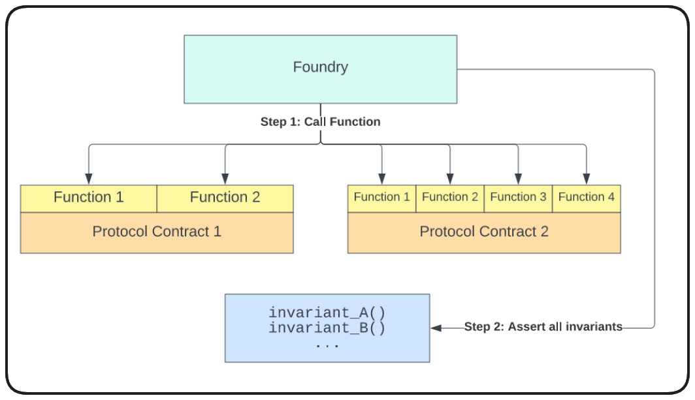

Conversely, handler based tests route our frameworks function calls through our handler, allowing us to configure only the functions/behaviour we want it to perform, filtering out bad runs from our tests.

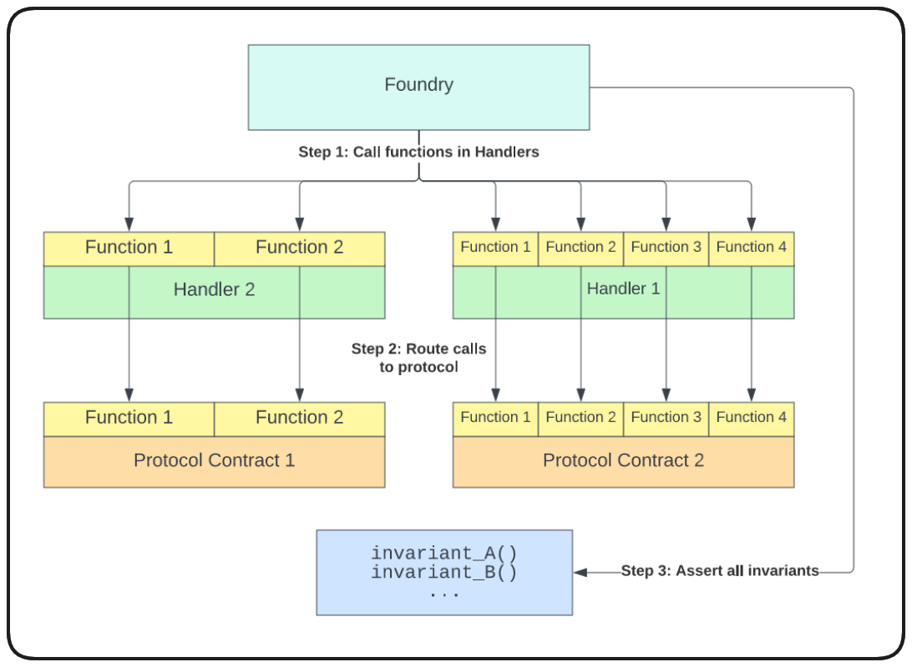

Let's finally start applying this methodology to our code base.

### Setup

The first thing we want to do to prepare our stateful fuzzing suite is to configure some of the fuzzer options in our `foundry.toml`.

```toml
[invariant]
runs = 128
depth = 128
fail_on_revert = false
```

Adding the above to our foundry.toml will configure our fuzz tests to attempt `128 runs` and make `128 calls` in each run (depth). We'll go over `fail_on_revert` in more detail soon.

Next, create the directory `test/fuzz`. We'll need to create 2 files within this folder, `InvariantsTest.t.sol` and `Handler.t.sol`.

`InvariantsTest.t.sol` will ultimately hold the tests and the invariants that we assert, while the handler will determine how the protocol functions are called. If our fuzzer makes a call to `depositCollateral` without having minted any collateral, it's kind of a wasted run. We can filter these with an adequate handler configuration.

Before writing a single line of our invariant tests we need to ask the question:

_**What are the invariants of my protocol?**_

We need to ascertain which properties of our system must always hold. What are some for `DecentralizedStableCoin`?

1. The total supply of DSC should be less than the total value of collateral
2. Getter view functions should never revert

I challenge you to think of more, but these are going to be the two simple invariants we work with here.

### InvariantsTest.t.sol

This file will be setup like any other test file to start, we've lots of practice here.

```solidity
// SPDX-License-Identifier: MIT

pragma solidity 0.8.18;

import {Test} from "forge-std/Test.sol";
import {StdInvariant} from "forge-std/StdInvariant.sol";

contract InvariantsTest is StdInvariant, Test {}
```

StdInvariant is quite important for our purposes, this is where we derive the ability to set a `targetContract` which we point to our Handler.

Again, just like the tests we've written so far, we're going to begin with a `setUp` function. In this setUp we'll perform our usual deployments of our needed contracts via our deployment script. We'll import our `HelperConfig` as well.

```solidity
// SPDX-License-Identifier: MIT

pragma solidity 0.8.18;

import {Test} from "forge-std/Test.sol";
import {StdInvariant} from "forge-std/StdInvariant.sol";
import {DeployDSC} from "../../script/DeployDSC.s.sol";
import {DSCEngine} from "../../src/DSCEngine.sol";
import {DecentralizedStableCoin} from "../../src/DecentralizedStableCoin.sol";
import {HelperConfig} from "../../script/HelperConfig.s.sol";

contract InvariantsTest is StdInvariant, Test {
    DeployDSC deployer;
    DSCEngine dsce;
    DecentralizedStableCoin dsc;
    HelperConfig config;

    function setUp() external {
        deployer = new DeployDSC();
        (dsc, dsce, config) = deployer.run();
    }
}
```

From this point, it's very easy for us to wrap this up quickly with an Open Testing methodology. All we would need to do is set our `targetContract` to our `DSCEngine (dsce)`, and then declare an invariant in our test function.

In order to test the invariant that our collateral value must always be more than our total supply, we can leverage our `HelperConfig` to acquire the collateral addresses, and check the total balance of each collateral type within the protocol. That would look something like this (don't forget to import your `IERC20 interface` for these tokens):

```solidity
...
import {IERC20} from "@openzeppelin/contracts/token/ERC20/IERC20.sol";
...
contract InvariantsTest is StdInvariant, Test {
    DeployDSC deployer;
    DSCEngine dsce;
    DecentralizedStableCoin dsc;
    HelperConfig config;
    address weth;
    address wbtc;

    function setUp() external {
        deployer = new DeployDSC();
        (dsc, dsce, config) = deployer.run();
        (,,weth, wbtc, ) = config.activeNetworkConfig();
        targetContract(address(dsce));
    }

    function invariant_protocolMustHaveMoreValueThanTotalSupply() public view {
        uint256 totalSupply = dsc.totalSupply();
        uint256 totalWethDeposited = IERC20(weth).balanceOf(address(dsce));
        uint256 totalWbtcDeposited = IERC20(wbtc).balanceOf(address(dsce));
    }
}
```

To this point our test function is only acquiring the balanced of our collateral tokens, we'll need to convert this to it's USD value for a sound comparison to our DSC total supply. We can do this with our `getUsdValue` function!

```solidity
function invariant_protocolMustHaveMoreValueThanTotalSupply() public view {
    uint256 totalSupply = dsc.totalSupply();
    uint256 totalWethDeposited = IERC20(weth).balanceOf(address(dsce));
    uint256 totalWbtcDeposited = IERC20(wbtc).balanceOf(address(dsce));

    uint256 wethValue = dsce.getUsdValue(weth, totalWethDeposited);
    uint256 wbtcValue = dsce.getUsdValue(wbtc, totalWbtcDeposited);
}
```

And now, all we would need to do is add our assertion.

```solidity
assert(wethValue + wbtcValue > totalSupply);
```

With this in place our open invariant test is ready! Try to run it.

> ❗ **PROTIP**
> Import `console` and add `console.log("Weth Value: ", wethValue)`, `console.log("Wbtc Value: ", wbtcValue)`, `console.log("Total Supply: ", totalSupply)` for more clear readouts from your test.

```bash
forge test --mt invariant_protocolMustHaveMoreValueThanTotalSupply -vvvv
```

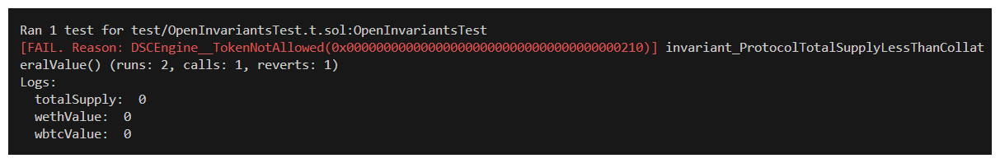

Our test identified a break in our assertion immediately.. but it's because we have no tokens or collateral. We can adjust our assertion to be `>=`, but it's a little bit cheaty.

```solidity
assert(wethValue + wbtcValue >= totalSupply);
```

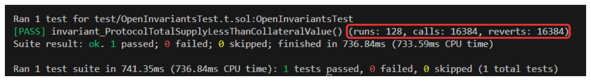

Things pass! We didn't find any issues. This is where we may want to bump up the number of runs we're performing, you can see in the image above our fuzzer executed `128 runs` and `16,384 function calls`. If we bump this up to `1000 runs`, our fuzz test will be more thorough, but will take much longer to run. Try it out!

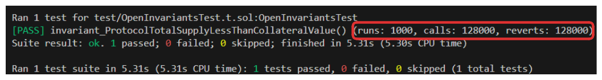

Things pass again, but you can see how much more intense the test process was. There's a catch, however. In the image above, notice how many calls were made vs how many times a function call reverted. Every single call is reverting! This in essence means that our test wasn't able to _do_ anything. This is not a very reassuring test.

The reason our test is still passing, despite all these reverts is related to the `fail_on_revert` option we touched on in our `foundry.toml`. If we adjust this to `true` we'll see that our test fails right away.

_**Why are all the calls reverting?**_

Without any guidance, Foundry is going to throw truly random data at the function calls. For example, our `depositCollateral` function is only configured to accept the two authorized tokens for our protocol, wbtc and weth, the fuzzer could be calling this function with thousands of invalid addresses.

fail_on_revert can be great for quick testing and keeping things simple, but it can be difficult to narrow the validity of our runs when this is set to `false`.

Let's set this option to `true` and run our test once more.

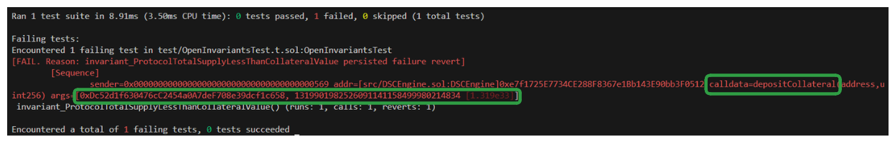

We can see the first function being called by the fuzzer is `depositCollateral` and its passing a random `tokenAddress` argument causing our revert immediately.

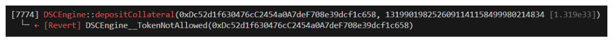

## Defi Handler Deposit Collateral

Ok! In this lesson we're going to adjust the code in our Invariants.t.sol such that our tests are more focused by being routed through a handler contract. In so doing, our tests will have a more sensible order of functions to call and more contextually relevant random data.

We'll start by creating the Handler.t.sol contract.

```solidity
// SPDX-License-Identifier: MIT

pragma solidity 0.8.18;

import {Test} from "forge-std/Test.sol";

contract Handler is Test {}
```

So, what's one of the first things we want to ensure in our handler? How about we tell our framework not to call redeemCollateral unless there's collateral available to redeem. Sounds like a sensible condition.

Because our test function calls are being routed through our Handler, the first thing we should do is make sure our Handler has access to the contracts it'll need to call functions on. Let's import DSCEngine and DecentralizedStableCoin then set these up in our Handler's constructor

```solidity
// SPDX-License-Identifier: MIT

pragma solidity 0.8.18;

import {Test} from "forge-std/Test.sol";
import {DSCEngine} from "../../src/DSCEngine.sol";
import {DecentralizedStableCoin} from "../../src/DecentralizedStableCoin.sol";

contract Handler is Test {
    DSCEngine dsce;
    DecentralizedStableCoin dsc;

    constructor(DSCEngine _engine, DecentralizedStableCoin _dsc) {
        dsce = _engine;
        dsc = _dsc;
    }
}
```

We know that before `redeemCollateral` is a valid function call, collateral would need to be deposited, so let's begin with writing a `depositCollateral` function. This will work a little differently from our previous fuzz tests, but we're still able to pass arguments to this function which will be randomized by the fuzzer.

```solidity
function depositCollateral(uint256 collateral, uint256 amountCollateral) public {
    dsce.depositCollateral(collateral, amountCollateral);
}
```

Now, the function above is going to fail, and it's going to fail for the same reason our last fuzzing test failed, the `collateral` argument is going to be randomized to a bunch of unauthorized token addresses! In addition to this, `amountCollateral` could _also_ break, because `depositCollateral` reverts on zero!

Despite these issues, let's adjust our Invariants.t.sol and try this out.

Within Invariants.t.sol, import our new Handler contract, declare it, and then set our target to `address(handler)`. Now, if we run our test again, it's going to call only the functions available to our handler.

```solidity
// SPDX-License-Identifier: MIT

pragma solidity 0.8.18;

import {Test, console} from "forge-std/Test.sol";
import {StdInvariant} from "forge-std/StdInvariant.sol";
import {DeployDSC} from "../../script/DeployDSC.s.sol";
import {DSCEngine} from "../../src/DSCEngine.sol";
import {DecentralizedStableCoin} from "../../src/DecentralizedStableCoin.sol";
import {HelperConfig} from "../../script/HelperConfig.s.sol";
import {IERC20} from "@openzeppelin/contracts/token/ERC20/IERC20.sol";

contract InvariantsTest is StdInvariant Test {
    DeployDSC deployer;
    DSCEngine dsce;
    DecentralizedStableCoin dsc;
    HelperConfig config;
    address weth;
    address wbtc;

    function setUp() external {
        deployer = new DeployDSC();
        (dsc, dsce, config) = deployer.run();
        (,,weth, wbtc, ) = config.activeNetworkConfig();
        targetContract(address(dsce));
    }

    function invariant_protocolMustHaveMoreValueThanTotalSupply() public view {
        uint256 totalSupply = dsc.totalSupply();
        uint256 totalWethDeposited = IERC20(weth).balanceOf(address(dsce));
        uint256 totalWbtcDeposited = IERC20(wbtc).balanceOf(address(dsce));

        uint256 wethValue = dsce.getUsdValue(weth, totalWethDeposited);
        uint256 wbtcValue = dsce.getUsdValue(wbtc, totalWbtcDeposited);

        console.log("totalSupply: ", totalSupply);
        console.log("wethValue: ", wethValue);
        console.log("wbtcValue: ", wbtcValue);

        assert(wethValue + wbtcValue >= totalSupply);
    }
}
```

We can see this fails for the expected reasons below.

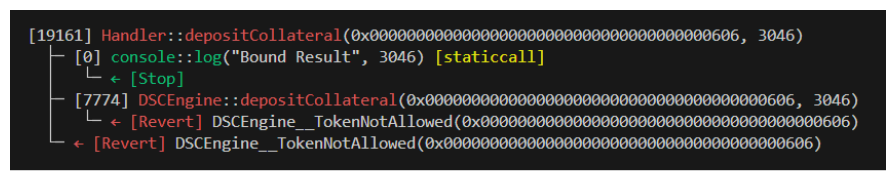

Let's use our Handler to ensure that only _valid_ collateral is deposited. Begin by importing ERC20Mock as we'll need this for our collateral types. In our constructor, we can leverage the getCollateralTokens function added to DSCEngine.sol.

```solidity
...
import {ERC20Mock} from "@openzeppelin/contracts/mocks/ERC20Mock.sol";

contract Handler is Test {
    DSCEngine dsce;
    DecentralizedStableCount dsc;

    ERC20Mock weth;
    ERC20Mock wbtc;

    constructor(DSCEngine _engine, DecentralizedStableCoin _dsc) {
        dsce = _engine;
        dsc = _dsc;

        address[] memory collateralTokens = dsce.getCollateralTokens();
        weth = ERC20Mock(collateralTokens[0]);
        wbtc = ERC20Mock(collateralTokens[1]);
    }
```

With these, instead of passing any address as collateral to our depositCollateral functional, we can instead pass a uint256 collateralSeed. We'll next write a function which picks a collateral to deposit from our valid options based on the seed our framework supplies.

```solidity
// Helper Functions
function _getCollateralFromSeed(uint256 collateralSeed) private view returns (ERC20Mock){
    if(collateralSeed % 2 == 0){
        return weth;
    }
    return wbtc;
}
```

Now, in our depositCollateral function, we can derive which collateral token should be used by calling this function and passing the random seed our framework supplies the test.

```solidity
function depositCollateral (uint256 collateralSeed, uint256 amountCollateral) public {
    ERC20Mock collateral = _getCollateralFromSeed(collateralSeed);
    dsce.depositCollateral(address(collateral), amountCollateral);
}
```

Now our test should only call this Handler function with valid collateral addresses! Let's run it and see what happens.

```bash
forge test --mt invariant_ProtocolTotalSupplyLessThanCollateralValue -vvvv
```

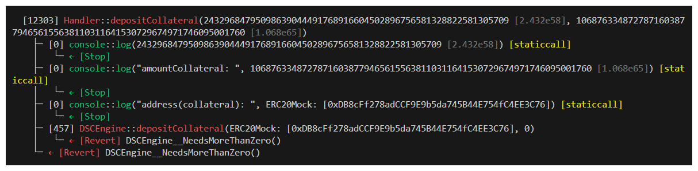

Look! Our address passed is valid, but we're getting a different error `DSCEngine__NeedsMoreThanZero()`. This is actually great progress and shows we've accounted for at least some of the causes of our reverts.

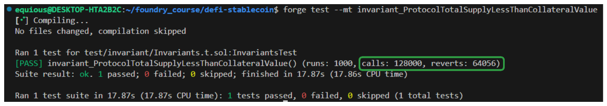

Let's keep narrowing the focus of our tests and the validity of our data.

> ❗ **IMPORTANT**
> Be careful when configuring fail*on_revert to be true \_or* false. Sometimes we risk narrowing our tests too much with our Handler that we miss edge cases.

In the same way we narrowed our test to provide a valid collateral type, we can bind the `amountCollateral` being passed to our function in order to ensure this is greater than 0 and avoid this error. StdUtils has a function we can use called `bound`.

```solidity
function depositCollateral (uint256 collateralSeed, uint256 amountCollateral) public {
    amountCollateral = bound(amountCollateral, 1, MAX_DEPOSIT_SIZE);
    ERC20Mock collateral = _getCollateralFromSeed(collateralSeed);
    dsce.depositCollateral(address(collateral), amountCollateral);
}
```

We can declare a MAX_DEPOSIT_SIZE constant at the top of our contract. I like to set this to something like type(uint96).max. This will provide a huge number without risking the overflow possible with uint256.

```solidity
uint256 MAX_DEPOSIT_SIZE = type(uint96).max;
```

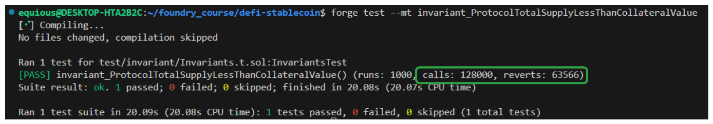

Not a massive change, but we _have_ made progress on the number of reverts our function it hitting. Running the test again with `fail_on_revert` set to true should reveal what's causing our reverts now.

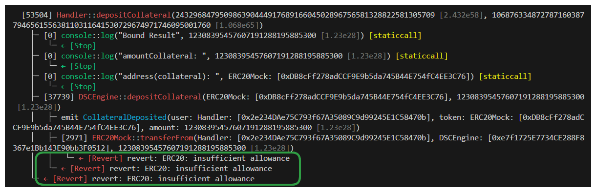

Well, of course this is going to revert! We haven't set an allowance on our tokens! Let's remedy this by leveraging vm.prank in our Handler to ensure appropriate addresses are approved for our deposit function.

```solidity
function depositCollateral(uint256 collateralSeed, uint256 amountCollateral) public {
    amountCollateral = bound(amountCollateral, 1, MAX_DEPOSIT_SIZE);
    ERC20Mock collateral = _getCollateralFromSeed(collateralSeed);

    // mint and approve!
    vm.startPrank(msg.sender);
    collateral.mint(msg.sender, amountCollateral);
    collateral.approve(address(engine), amountCollateral);

    engine.depositCollateral(address(collateral), amountCollateral);
    vm.stopPrank();
}
```

If we run our test now\...

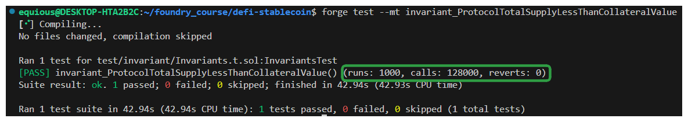

## Create the mint handler

In the last lesson our stateful fuzz tests were looking great, _but_ the validity of our tests was a little questionable because we haven't configured a way to mint any DSC during our tests. Because our totalSupply was always zero, changes to our collateral value were never going to violate our invariant.

Let's change that now by writing a mintDsc function for our Handler.

```solidity
function mintDsc(uint256 amount) public {}
```

To constrain our tests, there are a couple things to consider. Namely, we know the `amount` argument needs to be greater than zero or this function will revert with `DSCEngine__NeedsMoreThanZero`. So let's account for that by binding this value.

```solidity
function mintDsc(uint256 amount) public {
    amount = bound(amount, 1, MAX_DEPOSIT_SIZE);
    vm.startPrank(msg.sender);
    dcse.mintDsc(amount);
    vm.stopPrank();
}
```

Another consideration for this function is that it will revert if the Health Factor of the user is broken. We _could_ account for this in our function by assuring that's never the case, but this is an example of a situation you may want to avoid over-narrowing your test focus. We _want_ this function to revert if the Health Factor is broken, so in this case we'd likely just set `fail_on_revert` to `false`.

Situations like this will often lead developers to split their test suite into scenarios where `fail_on_revert` is appropriately false, and scenarios where `fail_on_revert` should be true. This allows them to cover all their bases.

Let's run our function and see how things look.

```bash
forge test --mt invariant_ProtocolTotalSupplyLessThanCollateralValue
```

> ❗ **NOTE**
> The `totalSupply = 0` here because of a mistake we made, we'll fix it soon!

Ok, so things work when we have `fail_on_revert` set to `false`. We want our tests to be quite focused, so moving forward we'll leave `fail_on_revert` to `true`. What happens when we run it now?

As expected, our user's Health Factor is breaking. This is because we haven't considered _who_ is minting our DSC with respect to who has deposited collateral. We can account for this in our test by ensuring that the user doesn't attempt to mint more than the collateral they have deposited, otherwise we'll return out of the function. We'll determine the user's amount to mint by calling our `getAccountInformation` function.

```solidity
function mintDsc(uint256 amount) public {
    (uint256 totalDscMinted, uint256 collateralValueInUsd) = dsce.getAccountInformation(msg.sender);

    uint256 maxDscToMint = (collateralValueInUsd / 2) - totalDscMinted;
    if(maxDscToMint < 0){
        return;
    }

    amount = bound(amount, 0, maxDscToMint);
    if(amount < 0){
        return;
    }

    vm.startPrank(msg.sender);
    dsce.mintDsc(amount);
    vm.stopPrank();
}
```

## Debugging the fuzz tests handler

In the last lesson, we left off with a small issue in our tests. For some reason our totalSupply was never increasing, which implies that our new mintDsc function is never being called.

Let's start by debugging this issue. One way we attempt to figure out what's happening is through the use of **[Ghost Variables](https://book.getfoundry.sh/forge/invariant-testing?highlight=ghost%20v#handler-ghost-variables)**.

Ghost variables are declared in our handler and essentially function like state variables for our tests. Something we can do then, is declare `timesMintIsCalled` and have this increment within our mintDsc function.

```solidity
contract Handler is Test {
    ...
    uint256 public timesMintIsCalled;
    ...
    function mintDsc(uint256 amount) public {
        (uint256 totalDscMinted, uint256 collateralValueInUsd) = engine.getAccountInformation(msg.sender);

        uint256 maxDscToMint = (collateralValueInUsd / 2) - totalDscMinted;
        if (maxDscToMint < 0) {
            return;
        }

        amount = bound(amount, 0, maxDscToMint);
        if (amount <= 0) {
            return;
        }

        vm.startPrank(msg.sender);
        engine.mintDsc(amount);
        vm.stopPrank();

        timesMintIsCalled++;
    }
}
```

With our ghost variable in place, we can now access this in our invariant test and console it out to glean some insight.

```solidity
function invariant_ProtocolTotalSupplyLessThanCollateralValue() external view returns (bool) {
    uint256 totalSupply = dsc.totalSupply();
    uint256 totalWethDeposited = IERC20(weth).balanceOf(address(dsce));
    uint256 totalWbtcDeposited = IERC20(wbtc).balanceOf(address(dsce));

    uint256 wethValue = dsce.getUsdValue(weth, totalWethDeposited);
    uint256 wbtcValue = dsce.getUsdValue(wbtc, totalWbtcDeposited);

    console.log("totalSupply: ", totalSupply);
    console.log("wethValue: ", wethValue);
    console.log("wbtcValue: ", wbtcValue);
    console.log("Times Mint Called: ", handler.timesMintIsCalled());

    assert(totalSupply <= wethValue + wbtcValue);
}
```

Well, at least we've confirmed that mintDsc isn't being called. It's _likely_ because one of our conditionals in our function are catching. What I would suggest is moving our Ghost Variable up this function to determine why things revert.

Before moving on, I challenge you to determine what the bug here is. Work through the mintDsc function and challenge yourself!

<details>
<summary>The Bug</summary>

PSYCHE! Don't cheat. Try to find the bug!

<details>
<summary> The Bug For Real</summary>

Alright, my approach to finding this bug was by using the ghost variable described above, when I determined which line the mintDsc function was reverting on, I console logged the associated variables in that area of the function.

One of the variables I ended up checking was `msg.sender`.

When our fuzzer is running, it's going to make random function calls, but it also calls those function with random addresses. What's happening in our test is that the address that was minting DSC was always different from the addresses which had deposited collateral!

In order to mitigate this issue, we'll need to track the address which deposit collateral, and then have the address calling mintDsc derived from those tracked addresses. Let's declare an address array to which addresses that have deposited collateral can be added.

```solidity
contract Handler is Test {
    ...
    uint256 public timesMintIsCalled;
    address[] usersWithCollateralDeposited;
    ...
    function depositCollateral(uint256 collateralSeed, uint256 amountCollateral) public {
        amountCollateral = bound(amountCollateral, 1, MAX_DEPOSIT_SIZE);
        ERC20Mock collateral = _getCollateralFromSeed(collateralSeed);

        vm.startPrank(msg.sender);
        collateral.mint(msg.sender, amountCollateral);
        collateral.approve(address(dsce), amountCollateral);
        dsce.depositCollateral(address(collateral), amountCollateral);
        vm.stopPrank();

        usersWithCollateralDeposited.push(msg.sender);
    }
}
```

This new array of addresses with collateral can now be used as a seed within our mintDsc function, much like the collateralSeed in depositCollateral.

```solidity
function mintDsc(uint256 amount, uint256 addressSeed) public {
    address sender = usersWithCollateralDeposited[addressSeed % usersWithCollateralDeposited.length]
    (uint256 totalDscMinted, uint256 collateralValueInUsd) = engine.getAccountInformation(sender);

    uint256 maxDscToMint = (collateralValueInUsd / 2) - totalDscMinted;
    if (maxDscToMint < 0) {
        return;
    }

    amount = bound(amount, 0, maxDscToMint);
    if (amount <= 0) {
        return;
    }

    vm.startPrank(sender);
    engine.mintDsc(amount);
    vm.stopPrank();

    timesMintIsCalled++;
}
```

Let's give our tests a shot now.

```bash
forge test --mt invariant_ProtocolTotalSupplyLessThanCollateralValue -vvvv
```

A new error! New errors mean progress. It seems as though our mintDsc function is causing a `division or modulo by 0`. Ah, this is because our new array of usersWithCollateralDeposited may be empty. Let's account for this with a conditional.

```solidity
function mintDsc(uint256 amount, uint256 addressSeed) public {

    if(usersWithCollateralDeposited.length == 0){
        return;
    }

    address sender = usersWithCollateralDeposited[addressSeed % usersWithCollateralDeposited.length]
    (uint256 totalDscMinted, uint256 collateralValueInUsd) = engine.getAccountInformation(sender);

    uint256 maxDscToMint = (collateralValueInUsd / 2) - totalDscMinted;
    if (maxDscToMint < 0) {
        return;
    }

    amount = bound(amount, 0, maxDscToMint);
    if (amount <= 0) {
        return;
    }

    vm.startPrank(sender);
    engine.mintDsc(amount);
    vm.stopPrank();

    timesMintIsCalled++;
}
```

## Create the price feed handler

Our handler looks great at this point, but it doesn't reflect everything. Another powerful feature of this methodology is that we're able to leverage our handler to guide not only our target contract, but any contract we want!

Take price feeds for example. These are external references that our protocol depends upon to function properly. We can use our handler to more realistically emulate how price feeds would behave in real-world scenarios.

Our project should already contain a MockV3Aggregator within the mocks folder, so let's begin by importing it into Handler.t.sol. This file mimics the behaviour of a price feed.

```solidity
import { MockV3Aggregator } from "../mocks/MockV3Aggregator.sol";
```

Then, we can declare a state variable, and in our constructor, we can employ another getter function to acquire the price feed for that token.

```solidity
contract Handler is Test {
    ...
    MockV3Aggregator public ethUsdPriceFeed;
    ...
    constructor(DSCEngine _dscEngine, DecentralizedStableCoin _dsc) {
        dsce = _dscEngine;
        dsc = _dsc;

        address[] memory collateralTokens = dsce.getCollateralTokens();
        weth = ERC20Mock(collateralTokens[0]);
        wbtc = ERC20Mock(collateralTokens[1]);

        ethUsdPriceFeed = MockV3Aggregator(dsce.getCollateralTokenPriceFeed(address(weth)));
    }
    ...
}
```

With this price feed, we can not write a new function which, when called, will update the collateral price, making the calls to our protocol much more dynamic.

```solidity
function updateCollateralPrice(uint96 newPrice) public {
    int256 newPriceInt = int256(uint256(newPrice));
    ethUsdPriceFeed.updateAnswer(newPriceInt);
}
```

With this new function, our test runs will intermittently change the price of our weth collateral as functions are randomly called. Let's run it!

```bash
forge test --mt invariant_ProtocolTotalSupplyLessThanCollateralValue -vvvv
```

Our assertion is breaking! If we look more closely at the trace of executions we can obtain a clearer understanding of what actually happened:

When updateCollateralPrice was called, the price was updated to a number so low as to break our invariant! The minted DSC was not longer collateralized by the weth which had been deposited.

This is legitimately a concerning vulnerability of this protocol. Effectively, if the USD value of our deposited collateral tanks too quickly, the protocol will become under-collateralized.

Because we've declared our thresholds as a LIQUIDATION_THRESHOLD of 50 and a LIQUIDATION_BONUS of 10, we're defining our protocol's safe operational parameters as being between 200% and 110% over-collateralization. Too rapid a change in the value of our collateral jeopardizes this range.

### Wrap Up

So, we've uncovered a potentially critical vulnerability in this protocol. Either we would go back and adjust the code to account for this, or a developer would accept this as a known bug in hopes that prices are more stable than what our tests imply.

These are the types of scenarios that invariant tests are incredible at spotting.

For now, I'm going to comment out our updateCollateralPrice function. So that it won't affect our future tests.

```solidity
// THIS BREAKS OUR INVARIANT TEST SUITE!!!
// function updateCollateralPrice(uint96 newPrice) public {
//     int256 newPriceInt = int256(uint256(newPrice));
//     ethUsdPriceFeed.updateAnswer(newPriceInt);
// }
```

We're almost done with this section! There are 3 more things we should cover:

1. Proper oracle use
2. Writing more tests
3. Smart Contract Audit Preparation

The finish line is close, let's keep going!

There are a few assumptions that the `DecentralizedStableCoin` protocol is making that may lead to unexpected vulnerabilities. One of which is our use of an oracle for price feeds.

Much of our protocol relies on `Chainlink price feeds` for accurate value calculations. While a very dependable service, we would still want to protect against the impact of issues that could arise from the reliance on this system. We're going to do this by writing our own `library`!

Create the file `src/libraries/OracleLib.sol`.

Taking a look at the **[Chainlink price feeds](https://docs.chain.link/data-feeds/price-feeds/addresses)** available, we can see that each of these feeds as a configured `heartbeat`. The `heartbeat` of a price feed represents the maximum amount of time that can pass before the feed is meant to update, otherwise the price is said to be come `stale`.

In our `OracleLib`, let's write some checks to ensure the prices `DSCEngine` are using aren't `stale`. If prices being received by our protocol become stale, we hope to pause the functionality of our contract.

```solidity
//SPDX-License-Identifier: MIT

pragma solidity ^0.8.18;

/**
 * @title OracleLib
 * @author Patrick Collins
 * @notice This library is used to check the Chainlink Oracle for stale data.
 * If a price is stale, functions will revert, and render the DSCEngine unusable - this is by design.
 * We want the DSCEngine to freeze if prices become stale.
 *
 * So if the Chainlink network explodes and you have a lot of money locked in the protocol... too bad.
 */
library OracleLib {
    function staleCheckLatestRoundData() public view returns () {}
```

With our _beautiful_ `NATSPEC` in place detailing the `library` and its purposes, our main function here is going to be `stalePriceCheck`. Since we'll be checking `Chainlink's price feeds`, we know we'll need the `AggregatorV3Interface`, lets be sure to import that. The return types of our function are going to be those of the `latestRoundData` function within `AggregatorV3Interface`. Let's start by getting those values.

```solidity
...
import {AggregatorV3Interface} from "@chainlink/contracts/src/v0.8/interfaces/AggregatorV3Interface.sol";
...
library OracleLib {
    function staleCheckLatestRoundData(AggregatorV3Interface pricefeed) public view returns (uint80, int256, uint256, uint256, uint80) {
        (uint80 roundId, int256 answer, uint256 startedAt, uint256 updatedAt, uint80 answeredInRound) = pricefeed.latestRoundData();
    }
}
```

Now, we just need to calculate the time since the last update, and if it's over a threshold, we'll revert and return our variables. `Chainlink` sets a `heartbeat` of `3600 seconds for the ETH/USD` price feed, we'll give it even more time and set a `TIMEOUT` of `3 hours`. We can add a custom error to handle timeouts at this step as well.

> ❗ **PROTIP** > `hours` is a keyword in solidity that is effectively `*60*60 seconds` .
>
> `3 hours` == `3 * 60 * 60` == `10800 seconds`.

```solidity
...
import {AggregatorV3Interface} from "@chainlink/contracts/src/v0.8/interfaces/AggregatorV3Interface.sol";
...
library OracleLib {

    error OracleLib__StalePrice();
    uint256 private constant TIMEOUT = 3 hours;

    function staleCheckLatestRoundData(AggregatorV3Interface pricefeed) public view returns (uint80, int256, uint256, uint256, uint80) {
        (uint80 roundId, int256 answer, uint256 startedAt, uint256 updatedAt, uint80 answeredInRound) = pricefeed.latestRoundData();

        uint256 secondsSince = block.timestamp - updatedAt;
        if (secondsSince > TIMEOUT) revert OracleLib__StalePrice();

        return (roundId, answer, startedAt, updatedAt, answeredInRound);
    }
}
```

We should now be able to use this `library` for `AggregatorV3Interfaces` to automatically check if the price being supplied is stale.

In `DSCEngine.sol`, we can import `OracleLib`, as our using statement under a new types header, and then replace all our calls to `latestRoundData` with `staleCheckLatestRoundData`.

```solidity
...
import {OracleLib} from "./libraries/OracleLib.sol";
...

contract DSCEngine is Reentrancy Guard {

    ///////////
    // Types //
    ///////////

    using OracleLib for AggregatorV3Interface;

    function _getUsdValue(address token, uint256 amount) private view returns (uint256) {
        AggregatorV3Interface priceFeed = AggregatorV3Interface(s_priceFeeds[token]);
        (, int256 price,,,) = priceFeed.staleCheckLatestRoundData();
        // 1 ETH = 1000 USD
        // The returned value from Chainlink will be 1000 * 1e8
        // Most USD pairs have 8 decimals, so we will just pretend they all do
        // We want to have everything in terms of WEI, so we add 10 zeros at the end
        return ((uint256(price) * ADDITIONAL_FEED_PRECISION) * amount) / PRECISION;
    }
    ...
    function getTokenAmountFromUsd(address token, uint256 usdAmountInWei) public view returns (uint256) {
        AggregatorV3Interface priceFeed = AggregatorV3Interface(s_priceFeeds[token]);
        (, int256 price,,,) = priceFeed.staleCheckLatestRoundData();
        // $100e18 USD Debt
        // 1 ETH = 2000 USD
        // The returned value from Chainlink will be 2000 * 1e8
        // Most USD pairs have 8 decimals, so we will just pretend they all do
        return ((usdAmountInWei * PRECISION) / (uint256(price) * ADDITIONAL_FEED_PRECISION));
    }
}
```

## Manage your oracles connections

There are a few assumptions that the `DecentralizedStableCoin` protocol is making that may lead to unexpected vulnerabilities. One of which is our use of an oracle for price feeds.

Much of our protocol relies on `Chainlink price feeds` for accurate value calculations. While a very dependable service, we would still want to protect against the impact of issues that could arise from the reliance on this system. We're going to do this by writing our own `library`!

Create the file `src/libraries/OracleLib.sol`.

Taking a look at the **[Chainlink price feeds](https://docs.chain.link/data-feeds/price-feeds/addresses)** available, we can see that each of these feeds as a configured `heartbeat`. The `heartbeat` of a price feed represents the maximum amount of time that can pass before the feed is meant to update, otherwise the price is said to be come `stale`.

In our `OracleLib`, let's write some checks to ensure the prices `DSCEngine` are using aren't `stale`. If prices being received by our protocol become stale, we hope to pause the functionality of our contract.

```solidity
//SPDX-License-Identifier: MIT

pragma solidity ^0.8.18;

/**
 * @title OracleLib
 * @author Patrick Collins
 * @notice This library is used to check the Chainlink Oracle for stale data.
 * If a price is stale, functions will revert, and render the DSCEngine unusable - this is by design.
 * We want the DSCEngine to freeze if prices become stale.
 *
 * So if the Chainlink network explodes and you have a lot of money locked in the protocol... too bad.
 */
library OracleLib {
    function staleCheckLatestRoundData() public view returns () {}
```

With our _beautiful_ `NATSPEC` in place detailing the `library` and its purposes, our main function here is going to be `stalePriceCheck`. Since we'll be checking `Chainlink's price feeds`, we know we'll need the `AggregatorV3Interface`, lets be sure to import that. The return types of our function are going to be those of the `latestRoundData` function within `AggregatorV3Interface`. Let's start by getting those values.

```solidity
...
import {AggregatorV3Interface} from "@chainlink/contracts/src/v0.8/interfaces/AggregatorV3Interface.sol";
...
library OracleLib {
    function staleCheckLatestRoundData(AggregatorV3Interface pricefeed) public view returns (uint80, int256, uint256, uint256, uint80) {
        (uint80 roundId, int256 answer, uint256 startedAt, uint256 updatedAt, uint80 answeredInRound) = pricefeed.latestRoundData();
    }
}
```

Now, we just need to calculate the time since the last update, and if it's over a threshold, we'll revert and return our variables. `Chainlink` sets a `heartbeat` of `3600 seconds for the ETH/USD` price feed, we'll give it even more time and set a `TIMEOUT` of `3 hours`. We can add a custom error to handle timeouts at this step as well.

> ❗ **PROTIP** > `hours` is a keyword in solidity that is effectively `*60*60 seconds` .
>
> `3 hours` == `3 * 60 * 60` == `10800 seconds`.

```solidity
...
import {AggregatorV3Interface} from "@chainlink/contracts/src/v0.8/interfaces/AggregatorV3Interface.sol";
...
library OracleLib {

    error OracleLib__StalePrice();
    uint256 private constant TIMEOUT = 3 hours;

    function staleCheckLatestRoundData(AggregatorV3Interface pricefeed) public view returns (uint80, int256, uint256, uint256, uint80) {
        (uint80 roundId, int256 answer, uint256 startedAt, uint256 updatedAt, uint80 answeredInRound) = pricefeed.latestRoundData();

        uint256 secondsSince = block.timestamp - updatedAt;
        if (secondsSince > TIMEOUT) revert OracleLib__StalePrice();

        return (roundId, answer, startedAt, updatedAt, answeredInRound);
    }
}
```

We should now be able to use this `library` for `AggregatorV3Interfaces` to automatically check if the price being supplied is stale.

In `DSCEngine.sol`, we can import `OracleLib`, as our using statement under a new types header, and then replace all our calls to `latestRoundData` with `staleCheckLatestRoundData`.

```solidity
...
import {OracleLib} from "./libraries/OracleLib.sol";
...

contract DSCEngine is Reentrancy Guard {

    ///////////
    // Types //
    ///////////

    using OracleLib for AggregatorV3Interface;

    function _getUsdValue(address token, uint256 amount) private view returns (uint256) {
        AggregatorV3Interface priceFeed = AggregatorV3Interface(s_priceFeeds[token]);
        (, int256 price,,,) = priceFeed.staleCheckLatestRoundData();
        // 1 ETH = 1000 USD
        // The returned value from Chainlink will be 1000 * 1e8
        // Most USD pairs have 8 decimals, so we will just pretend they all do
        // We want to have everything in terms of WEI, so we add 10 zeros at the end
        return ((uint256(price) * ADDITIONAL_FEED_PRECISION) * amount) / PRECISION;
    }
    ...
    function getTokenAmountFromUsd(address token, uint256 usdAmountInWei) public view returns (uint256) {
        AggregatorV3Interface priceFeed = AggregatorV3Interface(s_priceFeeds[token]);
        (, int256 price,,,) = priceFeed.staleCheckLatestRoundData();
        // $100e18 USD Debt
        // 1 ETH = 2000 USD
        // The returned value from Chainlink will be 2000 * 1e8
        // Most USD pairs have 8 decimals, so we will just pretend they all do
        return ((usdAmountInWei * PRECISION) / (uint256(price) * ADDITIONAL_FEED_PRECISION));
    }
}
```

## Preparing your protocol for an audit

We talked a little bit earlier about what a `smart contract audit` is, but we haven't gone into much detail. This is saved largely for the **[Security Course](https://updraft.cyfrin.io/courses/security)** we've releases since this course, and I encourage you to jump into it next now that you're a Foundry Master!

However, in brief, a great place you can look to get a sense of a protocol's audit readiness is this **[Audit Readiness Checklist](https://github.com/nascentxyz/simple-security-toolkit/blob/main/audit-readiness-checklist.md)** from Nascentxyz.

Beyond this, those who are really serious about launching a protocol, be sure to reach the final lesson of this section on `Smart Contract Security`. It's there we will go a little more low-level from a developer perspective and delve into how we can protect ourselves from common attack vectors.

With that said, let's recap everything we've gone over in the next lesson!

## DeFi Recap

Wow, we've done it. This project was enormous, advanced and frankly intense. You should 1000% push this to your GitHub repo and be incredibly proud of yourself for completing this journey.

This is one of the hardest and most complicated projects you'll find in educational content in Web3. We've learnt about:

-   DeFi
-   State of the art fuzz testing methodologies
-   Safe use of oracles
-   multifaceted test suites
-   integration and deployment through scripts
    ...and more!

Since the filming of this course I've had the `DecentralizedStableCoin` protocol audited on `CodeHawks`. You can find the **[audit report for the contest here](https://www.codehawks.com/contests/cljx3b9390009liqwuedkn0m0)**.

I encourage you to dive into the findings submitted by the Hawks, if security or auditing is your end goal, this kind of review and research will be invaluable.

After all of this, you know what time it is: **BREAK TIME**. You deserve it, and when you come back there'll be a tonne more content to move onto next.

We have 3 lessons remaining in this section, and they'll be a breeze compared to this one.

See you soon!

### Exercises

**[Arbitrum NFT Challenge](https://arbiscan.io/address/0x3DbBF2F9AcFB9Aac8E0b31563dd75a2D69148D64#code)**

**[Sepolia NFT Challenge](https://sepolia.etherscan.io/address/0xe5760847db2f10A74Fc575B4803df5fe129811C1#code)**

Additional DeFi Learnings:

-   **[DeFi-Minimal](https://github.com/smartcontractkit/defi-minimal/tree/main/contracts)**
-   **[DeFi Dad](https://www.youtube.com/channel/UCatItl6C7wJp9txFMbXbSTg)**

## Lens Protocol

As a _**bonus**_ bit of content I wanted to take a minute to express my support for the `Aave protocol` and the `Aave team` by highlighting one of the amazing products/services they're bringing to the Web3 space.

`Lens Protocols` is a decentralized social layer/platform which empowers users to create social applications, or implement social features into their existing applications.

You can imagine the already widely adopted features and functionality of contemporary social media platforms merged seamlessly with the features of Web3 such as native payments and composability.

At it's core, `Lens` allows developers to extend smart contract functionality in ways similar to API requests on popular social platforms in Web2.

If you're interested in getting started with `Lens` or deploying a protocol on `Lens` on your own, take a look at the **[Lens Documentation](https://www.lens.xyz/docs)** for further information and how to get started.
